# **AI SDLC Methodology Document**

*A Unified Intent-Driven Software Development Framework for AI-Augmented Delivery*

---

# **1.0 Introduction**

## **1.1 Purpose**

### **1.1.1 Definition**
This document defines the **AI-Augmented Software Development Lifecycle (AI SDLC)**: a unified, intent-driven methodology for designing, building, validating, and deploying digital assets with **human-in-the-loop AI**.

### **1.1.2 Goals**
The methodology aims to preserve:

* **Traceability** – from real-world intent through to deployed system state.
* **Iterability** – every stage can be revisited and refined.
* **Context preservation** – across personas, artifacts, and tools.
* **Governance & safety** – through continuous observation, evaluation, and feedback.

## **1.2 Core Principles**

### **1.2.1 Intent First**
All change originates in **intent**, triggered when observed reality diverges from an internal mental model.

### **1.2.2 Requirements as the Intent Store and Signal Source**
Requirements are the **single source of truth** for system intent. Every gap, discovery, or refinement is fed back into Requirements. Requirements contain the **full signal** of what needs to be built - they drive all subsequent stages.

Each downstream stage transforms this signal through the lens of **stage-specific context**:
- **Requirements** → Pure intent signal (the "what" and "why")
- **Design** → Intent + Architecture context (technical constraints, patterns, platforms)
- **Tasks** → Intent + Workload context (capacity, priorities, dependencies)
- **Code** → Intent + Standards context (coding standards, templates, libraries)
- **System Test** → Intent + Quality context (test strategies, coverage requirements)
- **UAT** → Intent + Business context (user expectations, acceptance criteria)
- **Deployment** → Intent + Operations context (release windows, rollback procedures)

### **1.2.3 Persona-Centric Stages**
Each stage has clear **personas**, **artifacts**, and **responsibilities**, ensuring that context is explicit and reproducible.

### **1.2.4 AI as an Augmenter, Not a Replacement**
AI agents (LLMs, tools, etc.) accelerate and enrich human workflows but do not remove accountability.

### **1.2.5 Continuous Feedback**
Runtime behaviour, incidents, and metrics continuously generate new intent, closing the loop.

## **1.3 Scope and Diagrams**

### **1.3.1 Diagram Structure**
The methodology is described using three tiers of diagrams:

* **Figure 2.1 – End-to-End Intent Lifecycle with CRUD and Builder.CRUD**
* **Figure 3.1 – AI SDLC Builder Pipeline (Requirements → UAT)**
* **Stage-specific sub-diagrams** (Requirements, Design, Tasks, Code, Test, UAT, Deployment)

### **1.3.2 Intended Use**
These diagrams are intended to be embedded in:

* Architecture manuals
* Operating model references
* Engineering methodology guides
* Governance and audit documentation

---

# **2.0 End-to-End Intent Lifecycle (Macro View)**

## **2.1 Overview**

### **2.1.1 Scope**
This section describes the **full lifecycle from Real-World Observations to Runtime Execution and back into Intent**.

### **2.1.2 Key Concepts**
It introduces:

* How **intent** is formed.
* How intent is **classified into CRUD-style work types**.
* How all work types flow into a single **Builder.CRUD** engine.
* How certified assets are **deployed** and **governed** via continuous feedback.

---

## **2.2 Figure 2.1 – Full Intent → CRUD → Builder.CRUD → Runtime**

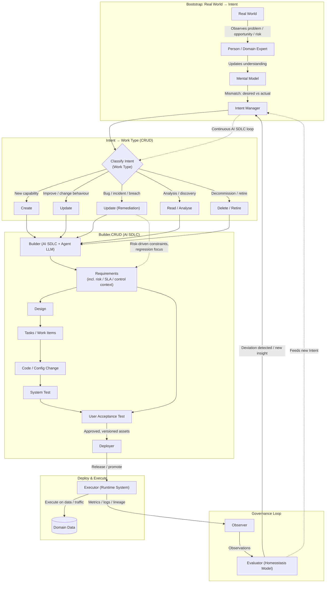

---

## **2.3 Bootstrap: Real World → Intent**

### **2.3.1 What is Bootstrap**

* A **Person / Domain Expert** observes events in the **Real World**.
* Their **Mental Model** compares "expected" vs "actual" outcomes.
* Mismatch generates **Intent** and flows into the **Intent Manager (IM)**.

### **2.3.2 Why Bootstrap Matters**

* Establishes a clear origin story for all change.
* Anchors the system in reality, not in tooling.
* Provides an explicit interface between human judgement and the AI SDLC.

---

## **2.4 Intent Classification into CRUD Work Types**

### **2.4.1 What is Intent Classification**

Intent is classified into five work types:

* **Create** – build something new.
* **Update** – change existing behaviour/functionality.
* **Update (Remediation)** – specific form of Update driven by risk/incident.
* **Read / Analyse** – understand, document, or explore the current state.
* **Delete / Retire** – decommission or consolidate assets.

### **2.4.2 Why Classification Matters**

* Allows different control regimes (e.g. remediation = higher scrutiny).
* Keeps the **Builder stage generic**, with intent type expressed as metadata.
* Makes it easier to reason about portfolio health and lifecycle states.

---

## **2.5 Builder.CRUD (AI SDLC)**

### **2.5.1 What is Builder.CRUD**

All work types are fed into a **single Builder engine** that:

* Uses AI + humans to execute the internal SDLC stages:
  **Requirements → Design → Tasks → Code → System Test → UAT**.
* Applies extra risk controls where necessary (e.g. remediation).

### **2.5.2 Why Builder.CRUD Matters**

* Avoids duplicating SDLC for different work types.
* Keeps governance consistent while still allowing risk-based variation.
* Makes intent classification orthogonal to how we build.

---

## **2.6 Deploy & Execute**

### **2.6.1 What is Deploy & Execute**

* **Deployer** promotes assets to live environments.
* **Executor** runs these assets against **Domain Data**.

### **2.6.2 Why Deploy & Execute Matters**

* Provides a clear separation between building and running.
* Supports multiple runtime targets (batch, streaming, services, UIs).

---

## **2.7 Governance Loop**

### **2.7.1 What is Governance Loop**

* **Observer** collects metrics, logs, lineage, and incidents.
* **Evaluator** compares behaviour against a **Homeostasis Model** (target behaviour, SLAs, risk thresholds).
* Deviations emit **new or refined Intent** back into the Intent Manager.

### **2.7.2 Why Governance Loop Matters**

* Creates a **homeostatic system** – always correcting towards desired state.
* Governance is not a one-off gate; it is continuous.

---

# **3.0 AI SDLC Builder Pipeline (Micro View)**

## **3.1 Overview**

### **3.1.1 Scope**
This section zooms into the **Builder.CRUD** box from Figure 2.1 and fully elaborates the AI SDLC stages:

* Requirements
* Design
* Tasks / Work Items
* Code
* System Test
* User Acceptance Test
* Deployment handoff
* Feedback loops into Requirements

---

## **3.2 Figure 3.1 – AI SDLC Builder Pipeline**

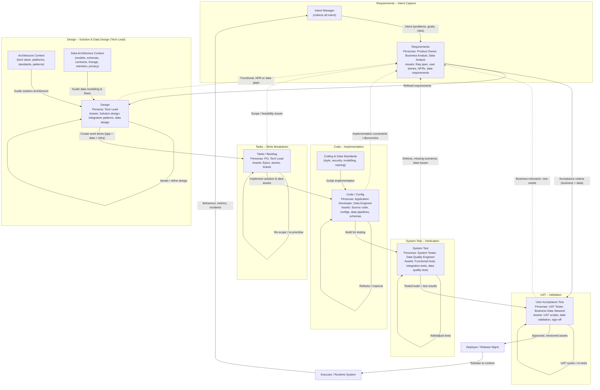

---

# **3.5 Stage Context Framework**

## **3.5.1 Context as Stage Constraints**

Each AI SDLC stage operates on the **requirement signal** but applies **stage-specific context** that constrains and guides the transformation:

| Stage Component | Description | Examples |
|----------------|-------------|----------|
| **Persona** | Who performs the work | Product Owner, Tech Lead, Coder, Tester |
| **Input** | Requirement signal + context from prior stages | Requirements + Design docs + Architecture context |
| **Context Constraints** | Rules, standards, patterns, governance that shape the work | Architecture patterns, coding standards, test strategies |
| **Templates** | Reusable structures and formats | Design patterns, code templates, test frameworks |
| **Assets Produced** | Tangible outputs tagged with requirement keys | Design docs, code files, test suites, reports |
| **Governance** | Quality gates, reviews, approvals | Code reviews, test coverage thresholds, sign-offs |

---

## **3.5.2 Context Integration with AI_SDLC_Context**

The **AI_SDLC_Context configuration system** manages these stage-specific contexts:

```yaml
# Example: contexts/stages/design.yml
design_stage:
  architecture_context:
    tech_stack: "file://architecture/tech_stack.md"
    patterns: "file://architecture/patterns/"
    platform_constraints: "file://architecture/platforms/"

  data_architecture_context:
    data_models: "file://data/models/"
    schemas: "file://data/schemas/"
    governance: "file://data/governance.md"

  templates:
    component_design: "file://templates/design/component_template.md"
    data_flow_diagram: "file://templates/design/data_flow.md"

  governance:
    review_required: true
    reviewers: ["senior-architect", "data-architect"]
    approval_threshold: 2
```

Each stage loads its context via URI references, ensuring consistency and version control.

---

# **4.0 Requirements Stage**

## **4.1 Requirements – Overview**

### **4.1.1 What is Requirements**
The Requirements stage is the **intent store**. It translates raw intent into structured requirements, constraints, and acceptance criteria. **Each requirement is assigned a unique, immutable key** that provides end-to-end traceability throughout the entire lifecycle.

### **4.1.2 Why Requirements Matter**

* Provides a **canonical representation** of what the system should do.
* Acts as the nexus for **all feedback loops**.
* Ensures that every iteration is anchored in an updated understanding of intent.
* **Unique requirement keys** enable full traceability from intent → requirements → design → code → tests → deployment → runtime behavior.

---

## **4.2 Requirements – Sub-Diagram**

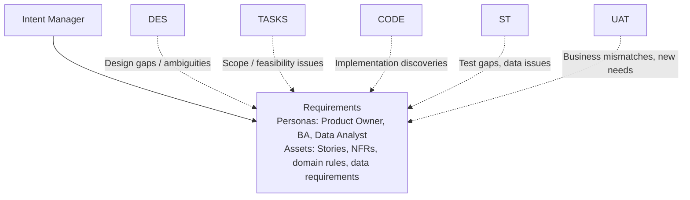

---

## **4.3 Requirements – Detailed Explanation**

### **4.3.1 Personas**

* **Product Owner (PO)** – owns business value, prioritisation, and acceptance criteria.
* **Business Analyst (BA)** – formalises business rules, scenarios, and domain constraints.
* **Data Analyst / Data Steward** – identifies data requirements, quality expectations, and governance constraints.

### **4.3.2 Inputs**

* Intent from **Intent Manager** (problems, goals, risks).
* Discovery results (from “Read / Analyse” work type).
* Changes from governance, regulatory, or risk teams.

### **4.3.3 Outputs**

* **User stories & features** – each with a unique requirement key (e.g., `REQ-001`, `REQ-F-AUTH-001`).
* **Non-functional requirements (NFRs)** – each with unique keys (e.g., `REQ-NFR-PERF-001`).
* **Domain rules and invariants** – each with unique keys (e.g., `REQ-BR-001`).
* **Acceptance criteria for UAT** – linked to parent requirement keys.
* **Data requirements** – each with unique keys (e.g., `REQ-DATA-001`):
  - Data sources and acquisition needs
  - Data quality expectations (completeness, accuracy, timeliness, consistency)
  - Data retention and archival policies
  - Privacy and sensitivity classifications (PII, PHI, etc.)
  - Data lineage and traceability requirements
  - Master data and reference data needs

### **4.3.4 Requirement Key Structure**

Requirements use a **unique, immutable key system** for traceability.

> **Note**: The key structure shown below is an **example for this document**. Organizations can use any identifier system that meets their needs:
> - **Hierarchical keys** (e.g., `REQ-F-AUTH-001`)
> - **GUIDs** (e.g., `550e8400-e29b-41d4-a716-446655440000`)
> - **Jira keys** (e.g., `PROJ-1234`)
> - **Sequential IDs** (e.g., `REQ-001`, `REQ-002`)
> - **Custom naming conventions** specific to your organization
>
> The critical requirement is that each key is **unique and immutable** to enable traceability throughout the lifecycle.

**Example Structure** (used throughout this document):

```
REQ-{TYPE}-{DOMAIN}-{SEQUENCE}

Examples:
- REQ-F-AUTH-001     (Functional: Authentication, sequence 001)
- REQ-NFR-PERF-001   (Non-Functional: Performance, sequence 001)
- REQ-DATA-CQ-001    (Data: Quality, sequence 001)
- REQ-BR-CALC-001    (Business Rule: Calculation, sequence 001)
```

**Key Properties** (regardless of structure chosen):
* **Unique** – Each requirement has a distinct identifier
* **Immutable** – Once assigned, the key never changes (even if requirement is refined)
* **Versioned** – Refinements create new versions: `REQ-F-AUTH-001 v2` (or version tracked separately)
* **Traceable** – All downstream artifacts (design, code, tests, deployments) reference the requirement key
* **Auditable** – Changes tracked with timestamp, author, and reason

### **4.3.5 Why This Stage is Critical**

* Requirements are the **sole reference** against which UAT validates.
* All other stages push **gaps back here**, avoiding silent drift.
* **Unique requirement keys** enable auditors and governance bodies to trace behavior to intent across the entire lifecycle.
* Requirement keys provide **bi-directional traceability**: from intent forward to deployed code, and from runtime issues backward to originating requirements.

---

## **4.4 Requirements Stage Context**

### **4.4.1 Context Constraints**

Requirements are shaped by:
* **Regulatory context** – compliance requirements, data privacy laws (GDPR, CCPA, HIPAA)
* **Business context** – strategic goals, market conditions, competitive landscape
* **Domain context** – industry-specific rules, domain knowledge, business processes
* **Risk context** – risk appetite, security requirements, audit requirements

### **4.4.2 Templates**

Templates stored in AI_SDLC_Context reference:
- Stage-specific templates (user stories, designs, tasks, code, tests, deployment plans)
- Context constraints (standards, patterns, approved tools)
- Governance rules (quality gates, approval workflows)

**User Story Template** should contain:
- User story in Given/When/Then or As-a/I-want/So-that format with requirement key
- Acceptance criteria linked to requirement key
- Non-functional requirements (performance, security, data quality)
- Regulatory considerations and dependencies

### **4.4.3 Assets Produced**

| Asset Type | Description | Tagged With |
|-----------|-------------|-------------|
| User Stories | Functional requirements | REQ-F-* keys |
| NFRs | Non-functional requirements | REQ-NFR-* keys |
| Data Requirements | Data-specific needs | REQ-DATA-* keys |
| Business Rules | Domain logic | REQ-BR-* keys |
| Acceptance Criteria | UAT validation points | Linked to parent REQ keys |

### **4.4.4 Governance**

* **Quality Gates**:
  - All requirements have unique keys
  - All requirements have acceptance criteria
  - All requirements reviewed by Product Owner
  - Data requirements reviewed by Data Steward
  - Compliance requirements reviewed by Compliance Officer

* **Traceability**:
  - Each requirement traces to originating intent
  - Each requirement has clear ownership
  - Changes tracked with version history

---

# **5.0 Design Stage**

## **5.1 Design – Overview**

### **5.1.1 What is Design**
The Design stage transforms Requirements into an **implementable technical and data solution**, owned by the **Tech Lead**.

### **5.1.2 Why Design Matters**

* Aligns business intent with architectural and platform constraints.
* Makes trade-offs explicit (performance vs cost vs complexity).
* Ensures both **application** and **data** views are designed coherently.

---

## **5.2 Design – Sub-Diagram**

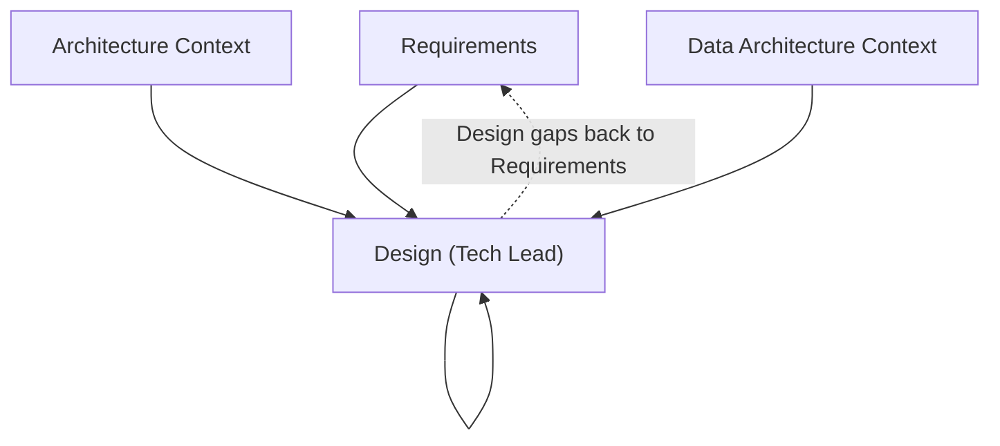

---

## **5.3 Design – Detailed Explanation**

### **5.3.1 Persona**

* **Tech Lead** – single accountable persona for solution and data design.

### **5.3.2 Context Inputs**

* **Architecture Context** – platforms, tech stack, service patterns, security standards.
* **Data Architecture Context** – data models, schemas, contracts, lineage, retention, privacy.

### **5.3.3 Outputs**

* **Component diagrams, sequence flows** – annotated with requirement keys they satisfy.
* **Data architecture artifacts**:
  - Conceptual, logical, and physical data models (tagged with requirement keys)
  - Data flow diagrams (batch and streaming)
  - Storage technology choices (RDBMS, NoSQL, data lake, warehouse)
  - Data partitioning and sharding strategies
  - Schema evolution and versioning plans
  - Data integration patterns (ETL, ELT, CDC, event streaming)
  - Data access patterns and query optimization
* **Integration patterns and APIs** – documented with requirement key mappings.
* **Security and compliance considerations** (encryption, masking, access controls) – linked to NFR requirement keys.
* **Design-to-Requirement traceability matrix** – maps design components to requirement keys:
  ```
  Component: AuthenticationService
  Satisfies: REQ-F-AUTH-001, REQ-NFR-SEC-001

  Data Model: CustomerProfile
  Satisfies: REQ-DATA-001, REQ-DATA-CQ-001, REQ-BR-CALC-001
  ```

### **5.3.4 Why Design Iterates**

* Early designs expose missing requirements or contradictions.
* Data considerations (lineage, governance) often reveal regulatory gaps.
* Iteration here is **cheaper** than in Code/UAT.

---

## **5.4 Design Stage Context**

### **5.4.1 Context Constraints**

Design is constrained by:
* **Architecture context** – approved tech stack, platform choices, architectural patterns
* **Data architecture context** – data modeling standards, storage technologies, integration patterns
* **Performance context** – latency requirements, throughput targets, scalability needs
* **Security context** – authentication/authorization patterns, encryption standards, audit requirements
* **Cost context** – infrastructure budgets, operational cost targets

### **5.4.2 Templates**

Templates stored in AI_SDLC_Context reference:
- Stage-specific templates (user stories, designs, tasks, code, tests, deployment plans)
- Context constraints (standards, patterns, approved tools)
- Governance rules (quality gates, approval workflows)

**Component Design Template** should contain:
- Component overview with requirement keys it satisfies
- Architecture pattern reference, tech stack, API design
- Data model and storage design with data quality rules
- Integration points, NFR considerations (performance, security, scalability)
- Explicit trade-offs and compliance checklist

### **5.4.3 Assets Produced**

| Asset Type | Description | Tagged With |
|-----------|-------------|-------------|
| Component Designs | Service/module specifications | Requirement keys |
| Data Models | Entity-relationship diagrams, schemas | REQ-DATA-* keys |
| API Specifications | REST/GraphQL/gRPC contracts | REQ-F-* keys |
| Data Flow Diagrams | Data movement and transformations | REQ-DATA-* keys |
| Integration Specs | System-to-system interfaces | REQ-F-* keys |
| Architecture Decision Records (ADRs) | Design decisions and rationale | Requirement keys |

### **5.4.4 Governance**

* **Quality Gates**:
  - Design adheres to approved architectural patterns
  - All components mapped to requirement keys
  - Data models follow data architecture standards
  - Security patterns applied per security context
  - Performance targets specified per NFRs
  - Cost estimates within budget constraints

* **Reviews**:
  - Architecture review (patterns, tech stack compliance)
  - Data architecture review (models, integration patterns)
  - Security review (threat modeling, controls)
  - Performance review (capacity planning)

---

# **6.0 Tasks / Work Breakdown Stage**

## **6.1 Tasks – Overview**

### **6.1.1 What are Tasks**
Converts design into a set of **actionable work items** (epics, stories, tasks) that can be implemented and tracked.

### **6.1.2 Why Tasks Matter**

* Enables planning, estimation, and prioritisation.
* Makes dependencies and workloads visible.
* Integrates with delivery tooling (Jira, Azure DevOps, etc.).

---

## **6.2 Tasks – Sub-Diagram**

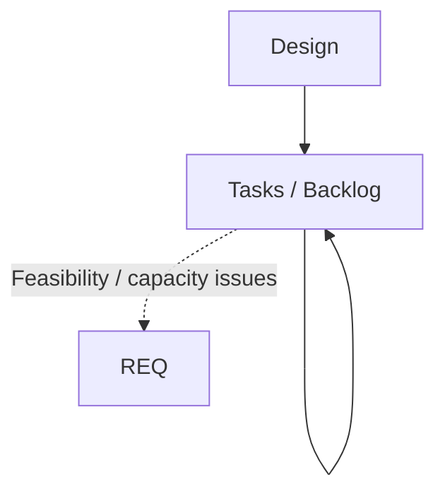

---

## **6.3 Tasks – Detailed Explanation**

### **6.3.1 Personas**

* **Product Owner** – prioritises based on value.
* **Tech Lead** – shapes the technical breakdown.

### **6.3.2 Outputs**

* **User stories with technical subtasks** – each task tagged with requirement keys it implements:
  ```
  Task: TASK-001 - Implement user login
  Implements: REQ-F-AUTH-001, REQ-NFR-SEC-001
  ```
* **Data engineering tasks** (all tagged with requirement keys):
  - Data pipeline development (ingestion, transformation, aggregation)
  - Schema creation and migration scripts
  - Data quality rule implementation
  - Master data management setup
  - Reference data loading
  - Data lineage tracking implementation
  - Data catalog population
  - Data access and security configuration
* **Application development tasks** (tagged with functional requirement keys).
* **Testing tasks** (tagged with the requirements they validate):
  - Functional tests
  - Integration tests
  - Data quality tests
  - Performance benchmarks
* **Infrastructure and DevOps tasks** (tagged with NFR requirement keys).

### **6.3.3 Why Feedback to Requirements**

* If work cannot be done within constraints (time, budget, technical feasibility),
  Requirements must change to reflect reality.

---

## **6.4 Tasks Stage Context**

### **6.4.1 Context Constraints**

Task breakdown is constrained by:
* **Capacity context** – team size, skill availability, sprint capacity
* **Workload context** – existing commitments, competing priorities
* **Estimation context** – velocity data, historical metrics, complexity factors
* **Dependency context** – external dependencies, blocking issues, technical constraints
* **Tooling context** – Jira, Azure DevOps, project management standards

### **6.4.2 Templates**

Templates stored in AI_SDLC_Context reference:
- Stage-specific templates (user stories, designs, tasks, code, tests, deployment plans)
- Context constraints (standards, patterns, approved tools)
- Governance rules (quality gates, approval workflows)

**Task Template** should contain:
- Task ID and requirement keys it implements
- Task type (feature, data, bug fix, tech debt), description, acceptance criteria
- Technical approach, dependencies, estimation (story points/hours)
- Data considerations (sources, quality, volume)
- Subtasks breakdown and notes

### **6.4.3 Assets Produced**

| Asset Type | Description | Tagged With |
|-----------|-------------|-------------|
| Epics | High-level features spanning multiple sprints | Requirement keys |
| User Stories | Deliverable functionality from user perspective | REQ-F-* keys |
| Technical Tasks | Infrastructure, refactoring, tech debt | REQ-NFR-* keys |
| Data Tasks | Data pipelines, models, quality checks | REQ-DATA-* keys |
| Bugs | Defect fixes | Original requirement keys |
| Spikes | Research and investigation tasks | Requirement keys |

### **6.4.4 Governance**

* **Quality Gates**:
  - All tasks linked to requirement keys
  - All tasks estimated (story points or hours)
  - All tasks have clear acceptance criteria
  - Dependencies identified and tracked
  - Capacity vs demand validated
  - Critical path identified

* **Planning Ceremonies**:
  - Backlog refinement (estimation, clarification)
  - Sprint planning (capacity allocation)
  - Daily standups (progress tracking)
  - Retrospectives (velocity improvement)

---

# **7.0 Code Stage**

## **7.1 Code – Overview**

### **7.1.1 What is Code**
The Code stage creates the actual executable **artifacts**: application code, data transformations, configurations, pipelines.

### **7.1.2 Why Code Matters**

* It is where abstract design becomes concrete behaviour.
* Choices here directly affect maintainability, performance, and risk.

---

## **7.2 Code – Sub-Diagram**

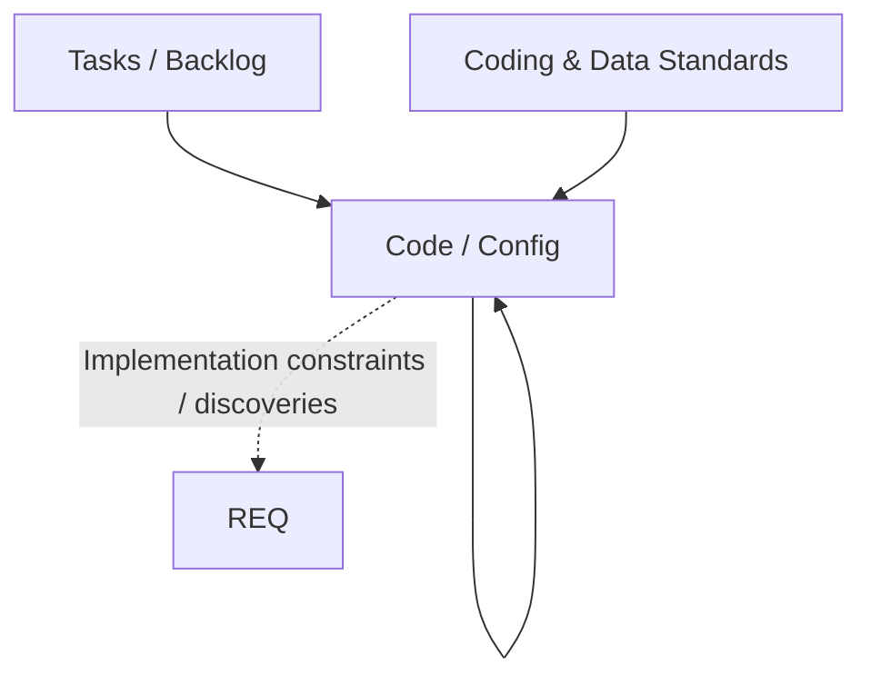

---

## **7.3 Code – Detailed Explanation**

### **7.3.1 Personas**

* **Application Developer** – implements application logic and APIs.
* **Data Engineer** – implements data pipelines, transformations, and data infrastructure.
* **Both roles** work collaboratively to ensure application and data components are integrated.

### **7.3.2 Inputs**

* Tasks / stories from backlog.
* Coding & data standards (style guides, secure coding, naming conventions, schema standards).

### **7.3.3 Outputs**

* **Application code** (with requirement key traceability):
  - Version-controlled source code with annotations:
    ```python
    # Implements: REQ-F-AUTH-001, REQ-NFR-SEC-001
    class AuthenticationService:
        """
        Handles user authentication and session management.
        Requirements: REQ-F-AUTH-001 (User Login), REQ-NFR-SEC-001 (Secure Auth)
        """
    ```
  - API implementations
  - Business logic and domain models
* **Data assets** (with requirement key traceability):
  - Data pipeline code (ingestion, transformation, aggregation)
    ```python
    # Implements: REQ-DATA-001, REQ-DATA-CQ-001
    def customer_data_pipeline():
        """
        Customer data ingestion and quality validation.
        Requirements: REQ-DATA-001 (Customer Data), REQ-DATA-CQ-001 (Data Quality)
        """
    ```
  - SQL/stored procedures for data processing
  - Schema definitions and migration scripts (tagged with requirement keys)
  - Data quality validation logic
  - Data transformation rules and mappings
  - Streaming job configurations
  - Data access layer implementations
* **Infrastructure-as-code** (tagged with NFR requirement keys):
  - Data platform configurations
  - Storage provisioning
  - Network and security rules
  - CI/CD pipeline definitions
* **Traceability artifacts**:
  - Code-to-requirement mapping maintained in version control
  - Automated tools can extract requirement keys from code annotations

### **7.3.4 Why Feedback to Requirements**

Implementation reveals:

* Unforeseen complexity.
* Performance constraints.
* Integration limitations.
* **Data-specific discoveries**:
  - Data quality issues in source systems
  - Schema incompatibilities
  - Volume/velocity challenges requiring architectural changes
  - Missing data elements or transformations
  - Regulatory compliance gaps (e.g., data residency, encryption)

These often imply either **scope adjustments** or **new non-functional requirements**.

---

## **7.4 Code Stage Context**

### **7.4.1 Context Constraints**

Code implementation is constrained by:
* **Coding standards context** – style guides, linting rules, formatting conventions
* **Technology context** – approved languages, frameworks, libraries, versions
* **Security context** – secure coding practices, OWASP guidelines, vulnerability scanning
* **Performance context** – optimization guidelines, resource limits
* **Data standards context** – schema naming conventions, data type standards, SQL style guides

### **7.4.2 Templates**

Templates stored in AI_SDLC_Context reference:
- Stage-specific templates (user stories, designs, tasks, code, tests, deployment plans)
- Context constraints (standards, patterns, approved tools)
- Governance rules (quality gates, approval workflows)

**Service Code Template** should contain:
- Module docstring with requirement keys and service description
- Type-safe request/response models with data requirement keys
- Service class with requirement keys in class docstring
- Public methods with requirement keys in method docstrings
- Input/output validation methods referencing data quality requirements
- Error handling, logging, and security practices per context standards

### **7.4.3 Assets Produced**

| Asset Type | Description | Tagged With |
|-----------|-------------|-------------|
| Application Code | Services, APIs, business logic | REQ-F-* keys in docstrings |
| Data Pipeline Code | ETL, streaming, transformations | REQ-DATA-* keys |
| SQL Scripts | Queries, stored procedures, migrations | REQ-DATA-*, REQ-BR-* keys |
| Infrastructure Code | Terraform, CloudFormation, K8s manifests | REQ-NFR-* keys |
| Unit Tests | Component-level tests | Requirement keys |
| Integration Tests | API and service integration tests | Requirement keys |
| Configuration Files | App config, environment variables | Requirement keys |

### **7.4.4 Governance**

* **Quality Gates**:
  - Code follows coding standards (linting passes)
  - Security scan passes (no critical vulnerabilities)
  - Unit test coverage ≥ 80%
  - Code review approved by ≥ 2 reviewers
  - All requirement keys documented in code
  - No unapproved dependencies
  - Performance benchmarks meet NFRs

* **Code Review Checklist**:
  - [ ] Implements specified requirements
  - [ ] Follows coding standards
  - [ ] Secure coding practices applied
  - [ ] Error handling comprehensive
  - [ ] Logging appropriate
  - [ ] Unit tests comprehensive
  - [ ] Documentation complete
  - [ ] Data quality validations implemented
  - [ ] Performance optimizations applied

---

# **8.0 System Test Stage**

## **8.1 System Test – Overview**

### **8.1.1 What is System Test**
Verifies that the integrated solution works correctly across components and data flows, including comprehensive data quality validation.

### **8.1.2 Why System Test Matters**

* Catches integration and environment issues.
* Provides objective evidence of behavioural correctness for both application logic and data flows.
* Validates data quality, integrity, and compliance requirements.
* Serves as a regression safety net for code and data.

---

## **8.2 System Test – Sub-Diagram**

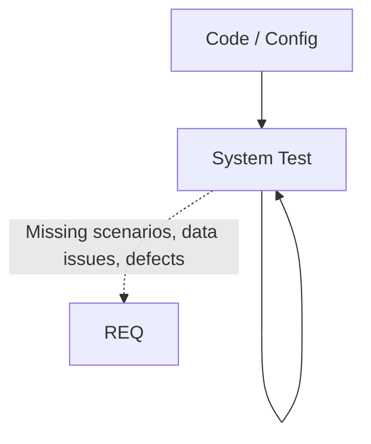

---

## **8.3 System Test – Detailed Explanation**

### **8.3.1 Personas**

* **System Tester / QA** – owns functional and integration test coverage.
* **Data Quality Engineer** – owns data validation, quality testing, and compliance verification.

### **8.3.2 Types of Tests**

All tests are **tagged with the requirement keys they validate**, enabling requirement coverage reporting.

* **Functional tests** (end-to-end scenarios, business logic validation):
  ```python
  # Validates: REQ-F-AUTH-001
  def test_user_login_success():
      """Test successful user authentication."""
      assert authenticate_user("valid_user", "password123")
  ```
* **Integration tests** (APIs, message flows, system-to-system interactions).
* **Data quality tests**:
  - Completeness checks (null rates, required fields)
  - Accuracy validation (value ranges, format validation)
  - Consistency checks (cross-field validation, referential integrity)
  - Timeliness verification (freshness, latency, SLA compliance)
  - Uniqueness validation (duplicate detection)
  - Data lineage verification (source-to-target traceability)
* **Data compliance tests**:
  - Privacy compliance (PII masking, data residency)
  - Retention policy enforcement
  - Access control validation
  - Encryption verification
* **Performance and resilience tests**:
  - Data volume scalability
  - Query performance
  - Pipeline throughput
  - Failure recovery and data reconciliation

### **8.3.3 Requirement Coverage Reporting**

System Test produces **requirement coverage reports** showing:
* Which requirements are validated by tests
* Test pass/fail status per requirement
* Untested requirements (coverage gaps)

```
Requirement Coverage Report:
REQ-F-AUTH-001: ✅ Covered (3 tests, all passing)
REQ-NFR-PERF-001: ✅ Covered (2 tests, all passing)
REQ-DATA-CQ-001: ⚠️ Covered (4 tests, 1 failing)
REQ-BR-CALC-001: ❌ Not covered (no tests found)
```

### **8.3.4 Why Feedback to Requirements**

* Reveals where requirements were incomplete or ambiguous.
* Identifies missing NFRs (e.g. performance not specified).
* Exposes **data quality gaps** in requirements:
  - Unstated data quality thresholds
  - Missing data governance rules
  - Incomplete data lineage requirements
  - Unspecified data retention or archival policies
* **Coverage gaps** trigger creation of missing requirements or clarification of existing ones.
* Helps refine acceptance criteria for UAT.

---

## **8.4 System Test – Stage Context**

### **8.4.1 Context Constraints**

The System Test stage operates within these constraints:

* **Test Strategies**: Defines the testing approach (e.g., risk-based testing, exploratory testing, automated regression)
* **Test Frameworks**: Technology and tooling constraints (JUnit, pytest, Selenium, k6, Great Expectations)
* **Test Environments**: Infrastructure constraints (staging, pre-prod, test data availability)
* **Test Data Management**: Test data provisioning, masking, and refresh strategies
* **Coverage Requirements**: Minimum thresholds for code coverage, requirement coverage, data quality coverage
* **Performance Baselines**: Expected NFR targets for latency, throughput, scalability
* **Data Quality Thresholds**: Acceptable limits for completeness, accuracy, consistency
* **Compliance Requirements**: Regulatory testing requirements (GDPR, HIPAA, SOC2)

### **8.4.2 Templates**

System Test templates are stored in AI_SDLC_Context:

```yaml
system_test_stage:
  test_strategy:
    approach: "file://testing/strategy/test_approach.md"
    risk_matrix: "file://testing/strategy/risk_based_testing.md"

  test_frameworks:
    unit:
      python: "file://testing/frameworks/pytest_config.md"
      java: "file://testing/frameworks/junit_config.md"
    integration:
      api: "file://testing/frameworks/rest_assured_config.md"
      messaging: "file://testing/frameworks/kafka_testing.md"
    e2e:
      ui: "file://testing/frameworks/selenium_config.md"
      api: "file://testing/frameworks/postman_config.md"
    performance:
      load: "file://testing/frameworks/k6_config.md"
      stress: "file://testing/frameworks/locust_config.md"
    data_quality:
      validation: "file://testing/frameworks/great_expectations_config.md"
      profiling: "file://testing/frameworks/data_profiling.md"

  templates:
    test_plan: "file://templates/testing/test_plan_template.md"
    test_case: "file://templates/testing/test_case_template.md"
    test_suite: "file://templates/testing/test_suite_template.md"
    data_quality_test: "file://templates/testing/data_quality_test_template.md"
    performance_test: "file://templates/testing/performance_test_template.md"
    defect_report: "file://templates/testing/defect_report_template.md"

  test_data:
    provisioning: "file://testing/data/test_data_provisioning.md"
    masking: "file://testing/data/pii_masking_rules.md"
    synthetic: "file://testing/data/synthetic_data_generation.md"
    refresh: "file://testing/data/test_data_refresh_schedule.md"

  coverage_requirements:
    code_coverage: "file://testing/coverage/code_coverage_thresholds.md"
    requirement_coverage: "file://testing/coverage/requirement_coverage_rules.md"
    data_coverage: "file://testing/coverage/data_quality_coverage.md"

  environments:
    staging: "file://environments/staging_environment.md"
    pre_prod: "file://environments/pre_prod_environment.md"
    performance: "file://environments/performance_test_environment.md"

  governance:
    entry_criteria: "file://testing/governance/test_entry_criteria.md"
    exit_criteria: "file://testing/governance/test_exit_criteria.md"
    defect_triage: "file://testing/governance/defect_triage_process.md"
```

**Test Plan Template** should contain:
- Requirements covered, test scope (in/out), test strategy and environment
- Test schedule with phases, entry/exit criteria
- Risk assessment and test metrics (coverage, defect density, pass/fail rate)

**Data Quality Test Template** should contain:
- Test class with requirement keys, Great Expectations assertions
- Tests for completeness, accuracy, uniqueness, consistency, timeliness
- Data volume and performance validation

### **8.4.3 Assets Produced**

| Asset Type | Description | Tagged With |
|-----------|-------------|-------------|
| Test Plans | Overall testing strategy and schedule | Requirement keys |
| Test Cases | Detailed test scenarios and steps | REQ-F-*, REQ-NFR-* keys |
| Test Scripts | Automated test code | Requirement keys in docstrings |
| Data Quality Tests | Great Expectations suites, validation rules | REQ-DATA-CQ-* keys |
| Performance Tests | Load/stress test scripts | REQ-NFR-PERF-* keys |
| Test Reports | Execution results, coverage reports | Linked to requirement keys |
| Defect Reports | Bug tracking with requirement traceability | Original requirement keys |
| Coverage Matrix | Requirement-to-test traceability | All requirement keys |

### **8.4.4 Governance**

* **Quality Gates**:
  - All planned test cases executed
  - Requirement coverage ≥ 95%
  - Code coverage ≥ 80% (unit tests)
  - No critical or high-severity defects open
  - Performance tests meet all NFRs
  - Data quality tests pass with ≥ 95% accuracy
  - Security tests pass (no vulnerabilities ≥ high severity)
  - Test summary report approved by QA lead

* **Test Execution Checklist**:
  - [ ] Entry criteria met
  - [ ] Test environment validated
  - [ ] Test data provisioned and masked
  - [ ] Functional tests executed
  - [ ] Integration tests executed
  - [ ] Data quality tests executed
  - [ ] Performance tests executed
  - [ ] Security tests executed
  - [ ] Defects logged and triaged
  - [ ] Regression tests executed
  - [ ] Coverage report generated
  - [ ] Exit criteria met
  - [ ] Test sign-off obtained

* **Defect Triage Process**:
  - **Critical**: Blocks release, immediate fix required
  - **High**: Major functionality broken, fix before release
  - **Medium**: Functionality impaired, fix if time permits
  - **Low**: Minor issue, defer to backlog

* **Coverage Reporting**:
  - Generate requirement coverage matrix showing which tests validate each requirement
  - Track coverage trends over sprints
  - Flag untested requirements for review
  - Report data quality test coverage separately

---

# **9.0 User Acceptance Testing (UAT)**

## **9.1 UAT – Overview**

### **9.1.1 What is UAT**
UAT checks whether the system **actually solves the intended business problem** in a way users can accept, including validation that data meets business expectations for accuracy, completeness, and usability.

### **9.1.2 Why UAT Matters**

* It is the final validation against **real-world intent**.
* Ensures data delivered to business users is fit for purpose.
* Validates that data supports decision-making and operational needs.
* Provides business sign-off for deployment.

---

## **9.2 UAT – Sub-Diagram**

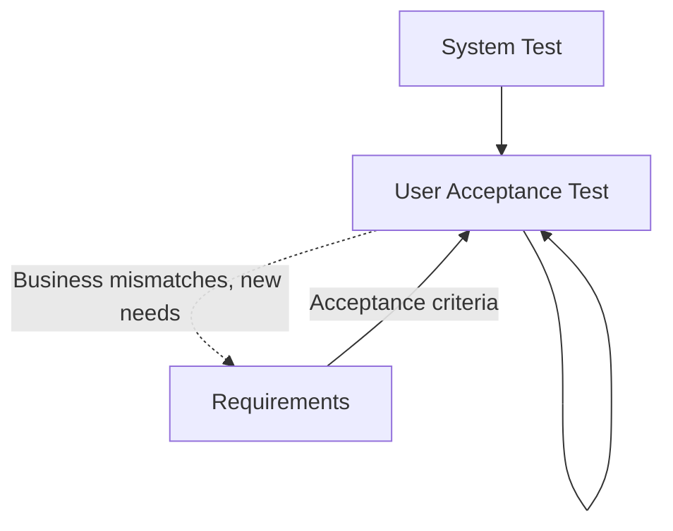

---

## **9.3 UAT – Detailed Explanation**

### **9.3.1 Personas**

* **UAT Tester / Business SME** – creates UAT test cases, validates business functionality and user workflows.
* **Business Data Steward** – validates data correctness, completeness, and business rule compliance.
* **QA Engineer** – translates UAT test cases into automated tests and automated data tests.

### **9.3.2 Inputs**

* Tested build from System Test.
* System test results (functional and data quality test outcomes).
* Acceptance criteria derived from Requirements (functional and data).
* Representative production-like data for testing.

### **9.3.3 UAT Test Development Process**

UAT involves **three parallel activities**:

1. **Manual UAT Test Cases**: Business SMEs create business scenario test cases
   - Written in business language (Given/When/Then)
   - Tagged with requirement keys
   - Used for manual validation by business users
   - Example: "As a customer, when I log in with valid credentials, I should see my dashboard"

2. **Automated UAT Tests**: QA Engineers translate UAT test cases into automated tests
   - Converts business scenarios into executable test code
   - Uses BDD frameworks (Cucumber, Behave) to maintain business readability
   - Tagged with same requirement keys as manual UAT test cases
   - Example:
     ```python
     # Automated from UAT test case
     # Validates: REQ-F-AUTH-001
     @given('a customer with valid credentials')
     @when('they log in')
     @then('they should see their dashboard')
     def test_customer_login():
         # Automated test implementation
     ```

3. **Automated Data Tests**: QA Engineers create data validation tests
   - Tests data quality, reconciliation, business rules
   - Uses data testing frameworks (Great Expectations, dbt tests)
   - Tagged with data requirement keys
   - Example:
     ```python
     # Validates: REQ-DATA-CQ-001
     def test_customer_data_completeness():
         assert customer_data.completeness_rate >= 0.95
     ```

### **9.3.4 Outputs**

* **UAT Test Cases** (manual business scenarios):
  - Business-readable test scenarios
  - Tagged with requirement keys
  - Used for manual business validation
* **Automated UAT Tests** (executable code from UAT test cases):
  - BDD-style automated tests
  - Maintain traceability to UAT test cases and requirement keys
  - Can be run continuously in CI/CD
* **Automated Data Tests** (executable data validation code):
  - Data quality validation scripts
  - Business rule validation tests
  - Data reconciliation tests
  - Tagged with data requirement keys
* **UAT results per requirement key**:
  ```
  REQ-F-AUTH-001: ✅ Accepted (User login meets business expectations)
  REQ-NFR-PERF-001: ✅ Accepted (Response time < 2s as required)
  REQ-DATA-CQ-001: ❌ Rejected (Data completeness below 95% threshold)
  ```
* **Data acceptance validation** (mapped to data requirement keys):
  - Business users confirm data accuracy and completeness
  - Data reconciliation reports (source vs target)
  - Data usability feedback (can users find and understand the data?)
  - Business rule validation results
* **Formal sign-off for both application and data delivery**:
  - Sign-off document lists all requirement keys and their acceptance status
  - Only requirements marked "Accepted" proceed to deployment
  - Rejected requirements trigger feedback loop to Requirements stage

### **9.3.4 Why Feedback to Requirements**

* UAT often reveals **latent intent** not fully captured earlier.
* Business conditions may have evolved since requirements were authored.
* **Data-specific feedback**:
  - Business users identify missing data elements or calculations
  - Data definitions or business rules need clarification
  - Data granularity or aggregation levels need adjustment
  - Data access patterns don't match business workflows
* Feeds into the next iteration of the AI SDLC.

---

## **9.4 UAT – Stage Context**

### **9.4.1 Context Constraints**

The UAT stage operates within these constraints:

* **Business Context**: Business domain knowledge, business rules, operational workflows
* **User Personas**: End user types, skill levels, accessibility requirements
* **UAT Environment**: Production-like environment with representative data
* **Acceptance Criteria**: Testable business outcomes defined in Requirements
* **Business Sign-off Process**: Approval workflows, stakeholder sign-off authorities
* **Data Validation Context**: Business data quality expectations, data reconciliation procedures
* **Business Timing**: Release windows, business cycles, seasonal considerations
* **Regulatory Context**: Compliance requirements, audit trail requirements

### **9.4.2 Templates**

UAT templates are stored in AI_SDLC_Context:

```yaml
uat_stage:
  uat_strategy:
    approach: "file://uat/strategy/uat_approach.md"
    user_scenarios: "file://uat/strategy/user_scenarios.md"
    business_rules: "file://uat/strategy/business_rules_validation.md"

  templates:
    uat_plan: "file://templates/uat/uat_plan_template.md"
    uat_script: "file://templates/uat/uat_script_template.md"
    uat_checklist: "file://templates/uat/uat_checklist_template.md"
    data_validation: "file://templates/uat/data_validation_template.md"
    sign_off: "file://templates/uat/sign_off_template.md"

  user_personas:
    end_users: "file://uat/personas/end_user_profiles.md"
    business_analysts: "file://uat/personas/business_analyst_profiles.md"
    data_stewards: "file://uat/personas/data_steward_profiles.md"
    compliance_officers: "file://uat/personas/compliance_officer_profiles.md"

  data_validation:
    reconciliation: "file://uat/data/reconciliation_procedures.md"
    business_rules: "file://uat/data/business_rule_validation.md"
    data_quality: "file://uat/data/business_data_quality_checks.md"
    sample_data: "file://uat/data/production_like_samples.md"

  sign_off_process:
    approval_workflow: "file://uat/governance/approval_workflow.md"
    stakeholder_matrix: "file://uat/governance/stakeholder_matrix.md"
    sign_off_criteria: "file://uat/governance/sign_off_criteria.md"

  environments:
    uat_environment: "file://environments/uat_environment.md"
    production_like_data: "file://environments/uat_data_provisioning.md"

  governance:
    entry_criteria: "file://uat/governance/uat_entry_criteria.md"
    exit_criteria: "file://uat/governance/uat_exit_criteria.md"
    escalation_process: "file://uat/governance/escalation_process.md"
```

**UAT Script Template** should contain:
- Requirements validated, business scenario (As-a/I-want/So-that), prerequisites
- Test steps with expected results, data validation checks
- Business user feedback, issues log, acceptance decision, sign-off

**Data Validation Template** should contain:
- Requirements validated, source-to-target reconciliation, business rule validation
- Data quality validation (completeness, accuracy, timeliness)
- Business user validation (usability, spot checks), issues log, data acceptance decision

### **9.4.3 Assets Produced**

| Asset Type | Description | Tagged With |
|-----------|-------------|-------------|
| UAT Plan | Overall UAT strategy and schedule | Requirement keys |
| UAT Scripts | Detailed user scenarios and test steps | REQ-F-*, REQ-BR-* keys |
| Data Validation Reports | Reconciliation and data quality results | REQ-DATA-*, REQ-DATA-CQ-* keys |
| UAT Test Results | Pass/fail status per scenario | Requirement keys |
| Business Feedback | Usability and business value feedback | Linked to requirement keys |
| Issues Log | Defects and gaps identified during UAT | Original requirement keys |
| Sign-off Document | Formal acceptance with requirement traceability | All requirement keys |

### **9.4.4 Governance**

* **Quality Gates**:
  - Entry criteria met (system test complete, UAT environment ready)
  - All critical business scenarios tested
  - Data validation and reconciliation complete
  - Business sign-off obtained for all requirements
  - No open critical or high severity UAT defects
  - User training completed (if applicable)
  - Deployment readiness checklist complete

* **UAT Execution Checklist**:
  - [ ] Entry criteria validated
  - [ ] UAT environment prepared and validated
  - [ ] Production-like data loaded
  - [ ] Business SMEs and data stewards available
  - [ ] UAT scripts reviewed and approved
  - [ ] All planned scenarios executed
  - [ ] Data validation complete
  - [ ] Data reconciliation reports reviewed
  - [ ] Business feedback documented
  - [ ] Issues logged and triaged
  - [ ] Acceptance decision documented
  - [ ] Sign-off obtained from all stakeholders
  - [ ] Exit criteria met

* **Sign-off Requirements**:
  - **Business SME**: Validates functional behavior and business value
  - **Business Data Steward**: Validates data quality and business rule compliance
  - **UAT Lead**: Confirms all UAT activities complete
  - **Compliance Officer** (if applicable): Validates regulatory requirements

* **Escalation Process**:
  - **Critical issues**: Escalate immediately to Product Owner and stakeholders
  - **High issues**: Escalate within 24 hours, assess deployment impact
  - **Medium/Low issues**: Document for backlog, assess if deployment blockers
  - **Data quality issues**: Escalate to Data Steward and determine business risk

---

# **10.0 Deployment and Runtime Feedback**

## **10.1 Deployment – Overview**

### **10.1.1 What is Deployment**
Transfer of approved assets (application code and data assets) into production or target runtime environments under controlled conditions, including data migration and schema evolution.

### **10.1.2 Why Deployment Matters**

* Ensures change is safe, auditable, and reversible for both code and data.
* Coordinates application and data deployments to maintain consistency.
* Validates data migration and cutover procedures.
* Keeps regulatory and operational controls intact.

---

## **10.2 Deployment & Runtime – Sub-Diagram**

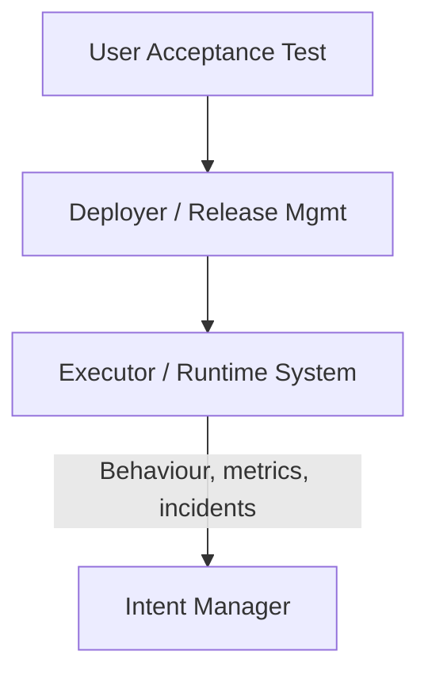

---

## **10.3 Deployment and Feedback – Detailed Explanation**

### **10.3.1 Personas**

* **Deployer / Release Manager / SRE** – coordinates application and infrastructure releases.
* **Data Operations Engineer** – manages data deployments, migrations, and cutover.

### **10.3.2 Responsibilities**

* Coordinate releases for both application and data components.
* **Track deployed requirement keys** in release manifests:
  ```yaml
  Release: v2.5.0
  Date: 2025-11-13
  Requirements Deployed:
    - REQ-F-AUTH-001 (v1)
    - REQ-NFR-PERF-001 (v2)
    - REQ-DATA-001 (v1)
    - REQ-DATA-CQ-001 (v1)
  ```
* Execute data migration and schema evolution procedures.
* **Data deployment activities**:
  - Schema migration execution (DDL changes)
  - Data backfill and historical data loading
  - Reference data and master data updates
  - Data pipeline deployment and activation
  - Cutover validation and reconciliation
  - Rollback procedures for data changes (with requirement key tracking)
* Monitor rollouts and rollbacks.
* Ensure alignment with change management policies.
* Maintain **deployment-to-requirement traceability** for audit and compliance.

### **10.3.3 Runtime Feedback**

* **Application telemetry** (tagged with requirement keys):
  - Logs, metrics, and traces
  - Error rates and performance metrics (linked to NFR requirement keys)
  - User complaints or unexpected behaviours
  - Example: `ERROR: REQ-F-AUTH-001 - Authentication failure rate exceeds threshold`
* **Data observability** (tagged with data requirement keys):
  - Data quality metrics (completeness, accuracy, freshness) → linked to `REQ-DATA-CQ-*`
  - Data lineage and impact analysis
  - Schema drift detection
  - Data volume and growth trends
  - Pipeline health and SLA adherence
  - Data access patterns and usage analytics
  - Example: `ALERT: REQ-DATA-CQ-001 - Data completeness dropped to 92% (threshold: 95%)`
* **Compliance and governance**:
  - Regulatory or audit findings (linked to compliance requirement keys)
  - Data privacy incidents
  - Access control violations

**All runtime issues are tagged with requirement keys**, enabling:
* Direct traceability from production issues back to originating requirements
* Impact analysis: "Which requirements are affected by this incident?"
* Trend analysis: "Which requirements generate the most issues?"

All of these feed back into the **Intent Manager**, creating **new or refined intent**, which re-enters the lifecycle at Requirements.

---

## **10.4 Deployment – Stage Context**

### **10.4.1 Context Constraints**

The Deployment stage operates within these constraints:

* **Release Windows**: Allowed deployment times (e.g., off-hours, maintenance windows, no-deploy periods)
* **Deployment Procedures**: Approved deployment methods (blue-green, canary, rolling, feature flags)
* **Environment Context**: Production topology, infrastructure constraints, capacity limits
* **Data Migration Context**: Data cutover procedures, zero-downtime migration strategies
* **Rollback Procedures**: Rollback time limits, rollback approval process, data rollback constraints
* **Change Management**: CAB approval, change freezes, emergency change procedures
* **Monitoring and Alerting**: Observability requirements, alert thresholds, on-call procedures
* **Compliance and Audit**: Deployment audit trail, separation of duties, regulatory requirements
* **Data Operations Context**: Data refresh schedules, ETL dependencies, downstream system impacts

### **10.4.2 Templates**

Deployment templates are stored in AI_SDLC_Context:

```yaml
deployment_stage:
  deployment_strategy:
    approach: "file://deployment/strategy/deployment_approach.md"
    blue_green: "file://deployment/strategy/blue_green_deployment.md"
    canary: "file://deployment/strategy/canary_deployment.md"
    feature_flags: "file://deployment/strategy/feature_flag_strategy.md"

  templates:
    release_plan: "file://templates/deployment/release_plan_template.md"
    deployment_runbook: "file://templates/deployment/deployment_runbook_template.md"
    rollback_plan: "file://templates/deployment/rollback_plan_template.md"
    release_notes: "file://templates/deployment/release_notes_template.md"
    deployment_checklist: "file://templates/deployment/deployment_checklist_template.md"
    data_migration_plan: "file://templates/deployment/data_migration_plan_template.md"

  environment_configs:
    production: "file://environments/production_config.md"
    staging: "file://environments/staging_config.md"
    dr_site: "file://environments/disaster_recovery_config.md"

  data_operations:
    migration_procedures: "file://deployment/data/migration_procedures.md"
    cutover_checklist: "file://deployment/data/cutover_checklist.md"
    reconciliation: "file://deployment/data/post_deployment_reconciliation.md"
    rollback_data: "file://deployment/data/data_rollback_procedures.md"

  monitoring:
    deployment_metrics: "file://deployment/monitoring/deployment_metrics.md"
    alerting_rules: "file://deployment/monitoring/alerting_rules.md"
    observability: "file://deployment/monitoring/observability_setup.md"
    data_observability: "file://deployment/monitoring/data_observability.md"

  change_management:
    cab_process: "file://deployment/governance/cab_approval_process.md"
    emergency_change: "file://deployment/governance/emergency_change_procedure.md"
    release_calendar: "file://deployment/governance/release_calendar.md"

  governance:
    deployment_approval: "file://deployment/governance/deployment_approval_workflow.md"
    audit_trail: "file://deployment/governance/audit_trail_requirements.md"
    compliance_checks: "file://deployment/governance/compliance_checklist.md"
```

**Release Plan Template** should contain:
- Release overview with requirement keys deployed, application and data changes
- Pre-deployment checklist, deployment steps with rollback procedures
- Validation criteria, rollback criteria, monitoring/observability setup
- Communication plan, post-deployment activities, risk assessment

**Data Migration Plan Template** should contain:
- Migration overview, schema changes (DDL), data migration steps
- Pre-migration validation, data reconciliation queries
- Rollback plan with criteria and procedures, post-migration validation
- Monitoring metrics (data quality, pipeline performance)

## Data Migration Steps
| Step | Description | SQL/Script | Duration | Validation |
|------|-------------|------------|----------|------------|
| 1 | [Migration step] | [Script/SQL] | [Duration] | [Validation query] |
| 2 | Backfill email_verified | [Backfill script] | [Duration] | SELECT COUNT(*) WHERE email_verified IS NULL |
| 3 | Apply data transformations | [Transform script] | [Duration] | [Validation query] |

## Pre-Migration Validation
- [ ] Source data quality validated (REQ-DATA-CQ-###)
- [ ] Target schema deployed and validated
- [ ] Migration scripts tested in staging
- [ ] Rollback scripts prepared and tested
- [ ] Database backups verified
- [ ] Data reconciliation queries prepared
- [ ] Monitoring and alerting configured

## Data Reconciliation
```sql
-- Source row count
SELECT COUNT(*) FROM source_system.customers;

-- Target row count
SELECT COUNT(*) FROM target_system.customers;

-- Data quality validation (REQ-DATA-CQ-###)
SELECT
  COUNT(*) as total_rows,
  SUM(CASE WHEN email IS NULL THEN 1 ELSE 0 END) as null_emails,
  SUM(CASE WHEN email_verified IS NULL THEN 1 ELSE 0 END) as null_verified
FROM target_system.customers;

-- Expected: null_emails = 0, null_verified = 0
```

## Rollback Plan
**Rollback Criteria**:
- Data reconciliation fails (source ≠ target)
- Data quality below threshold (REQ-DATA-CQ-###)
- Migration duration exceeds [time]
- Critical errors during migration

**Rollback Steps**:
```sql
-- Revert schema changes
ALTER TABLE customers DROP COLUMN email_verified;
DROP INDEX idx_email_verified;

-- Restore from backup if needed
-- [Restore commands]
```

## Post-Migration Validation
- [ ] Row count reconciliation passed
- [ ] Data quality checks passed (REQ-DATA-CQ-###)
- [ ] Referential integrity validated
- [ ] Application smoke tests passed
- [ ] Downstream systems validated
- [ ] Performance benchmarks met

## Monitoring
- **Data Quality Metrics**:
  - Completeness rate (REQ-DATA-CQ-###)
  - Accuracy rate
  - Migration lag
- **Pipeline Metrics**:
  - Migration throughput
  - Error rate
  - Duration
```

### **10.4.3 Assets Produced**

| Asset Type | Description | Tagged With |
|-----------|-------------|-------------|
| Release Plan | Comprehensive deployment strategy | All requirement keys in release |
| Deployment Runbook | Step-by-step deployment procedures | Requirement keys |
| Rollback Plan | Procedures to revert deployment | Requirement keys |
| Release Notes | User-facing and technical changes | Requirement keys |
| Data Migration Plan | Schema and data migration procedures | REQ-DATA-* keys |
| Release Manifest | Traceable record of deployed requirements | All requirement keys and versions |
| Deployment Audit Trail | Timestamped log of all deployment actions | Requirement keys |
| Post-Deployment Report | Deployment success metrics and issues | Requirement keys |

### **10.4.4 Governance**

* **Quality Gates**:
  - UAT sign-off obtained for all requirements
  - CAB approval obtained (if required)
  - All pre-deployment checks passed
  - Rollback plan tested and approved
  - Data migration tested in staging
  - Monitoring and alerting configured
  - Audit trail prepared
  - Release window approved

* **Deployment Checklist**:
  - [ ] Pre-deployment validation complete
  - [ ] Database backups verified
  - [ ] Deployment runbook reviewed
  - [ ] Rollback plan prepared and tested
  - [ ] Data migration plan validated
  - [ ] Monitoring dashboards configured
  - [ ] Stakeholders notified
  - [ ] On-call team briefed
  - [ ] Deployment executed per runbook
  - [ ] Smoke tests passed
  - [ ] Data reconciliation complete
  - [ ] Validation criteria met
  - [ ] Post-deployment monitoring active
  - [ ] Audit trail documented
  - [ ] Release notes published

* **Deployment Approval Workflow**:
  - **Low-risk changes**: Release Manager approval
  - **Medium-risk changes**: Release Manager + Product Owner approval
  - **High-risk changes**: CAB approval required
  - **Data migrations**: Data Operations + Release Manager approval
  - **Emergency changes**: CTO or designated authority approval

* **Rollback Decision Authority**:
  - **On-Call Engineer**: Can initiate immediate rollback if automated criteria met
  - **Release Manager**: Can authorize rollback based on manual assessment
  - **Product Owner**: Final decision on rollback vs. forward fix

* **Audit and Compliance**:
  - All deployments logged with timestamp, user, requirement keys
  - Approval chain documented and auditable
  - Change management process followed
  - Separation of duties enforced (deployer ≠ approver)
  - Deployment-to-requirement traceability maintained

---

# **11.0 End-to-End Requirement Traceability**

## **11.1 Overview**

### **11.1.1 What is Traceability**
End-to-end requirement traceability ensures that **every requirement has a unique, immutable key** that can be traced through the entire lifecycle from intent to runtime behavior.

> **Note on Requirement Keys**: Throughout this document, we use the example format `REQ-F-AUTH-001` for requirement keys. This is illustrative only. Your organization can use any identifier system (GUIDs, Jira keys, sequential IDs, etc.) as long as each key is **unique and immutable**. See [Section 4.3.4](#434-requirement-key-structure) for more details.

### **11.1.2 Why Traceability Matters**
* **Auditability** – Regulators and auditors can trace any system behavior back to its originating intent.
* **Impact Analysis** – Teams can answer "What will break if we change this requirement?"
* **Coverage Analysis** – Teams can identify untested or unimplemented requirements.
* **Root Cause Analysis** – Production issues can be traced back to specific requirements.
* **Change Management** – Teams can assess the scope and risk of proposed changes.

---

## **11.2 Traceability Flow**

```
Intent → REQ-F-AUTH-001 → Design (AuthService) → TASK-001 → Code (auth.py) → TEST-001 → UAT Sign-off → Release v2.5.0 → Runtime Metrics
```

### **11.2.1 Forward Traceability** (Intent → Runtime)

```mermaid
flowchart LR
    INTENT["Intent: Users need secure login"]
    REQ["REQ-F-AUTH-001: User Authentication"]
    DESIGN["Design: AuthenticationService"]
    TASK["TASK-001: Implement login"]
    CODE["Code: auth.py (line 42)"]
    TEST["TEST-001: test_user_login"]
    UAT["UAT: Accepted ✅"]
    DEPLOY["Release v2.5.0"]
    RUNTIME["Metric: auth_success_rate"]

    INTENT --> REQ
    REQ --> DESIGN
    DESIGN --> TASK
    TASK --> CODE
    CODE --> TEST
    TEST --> UAT
    UAT --> DEPLOY
    DEPLOY --> RUNTIME
```

### **11.2.2 Backward Traceability** (Runtime → Intent)

When a production issue occurs:
```
ALERT: Authentication failure rate = 15% (threshold: 5%)
  ↓
Metric: auth_success_rate
  ↓
Requirement: REQ-F-AUTH-001 (User Authentication)
  ↓
Code: auth.py (line 42)
  ↓
Test: TEST-001 (passed in UAT, now failing in production)
  ↓
Root Cause: Environment-specific issue not covered in UAT
  ↓
New Intent: "Improve UAT to test production-like conditions"
```

---

## **11.3 Traceability Matrix**

A **traceability matrix** provides a comprehensive view of requirement status across all stages:

| Requirement Key | Intent | Design | Tasks | Code | Tests | UAT | Deployed | Runtime Status |
|----------------|--------|--------|-------|------|-------|-----|----------|----------------|
| REQ-F-AUTH-001 | ✅ | ✅ | ✅ | ✅ | ✅ (3 tests) | ✅ Accepted | v2.5.0 | ✅ Healthy |
| REQ-NFR-PERF-001 | ✅ | ✅ | ✅ | ✅ | ✅ (2 tests) | ✅ Accepted | v2.5.0 | ⚠️ Degraded |
| REQ-DATA-CQ-001 | ✅ | ✅ | ✅ | ✅ | ⚠️ (1 failing) | ❌ Rejected | - | - |
| REQ-BR-CALC-001 | ✅ | ✅ | ✅ | ❌ | ❌ | ❌ | - | - |

---

## **11.4 Traceability Tools and Automation**

### **11.4.1 Automated Extraction**

Tools can automatically extract requirement keys from:
* **Code annotations**: Comments, docstrings
* **Test metadata**: Test decorators, test names
* **Commit messages**: Git commit metadata
* **Release manifests**: Deployment configuration files
* **Runtime logs**: Structured logging with requirement tags

### **11.4.2 Traceability Dashboard**

A centralized dashboard provides real-time visibility:
* **Requirement Coverage**: % of requirements implemented, tested, deployed
* **Requirement Health**: Pass/fail status across all stages
* **Requirement Risk**: Which requirements are causing issues in production
* **Requirement Impact**: Dependency graph showing related requirements

### **11.4.3 Integration with AI SDLC Context**

The **AI_SDLC_Context** configuration system can manage requirement metadata:

```yaml
# requirements/REQ-F-AUTH-001.yml
requirement:
  key: REQ-F-AUTH-001
  version: 1
  title: "User Authentication"
  description: "file://requirements/auth/user_login.md"
  type: functional
  priority: high
  acceptance_criteria:
    - "file://requirements/auth/user_login_acceptance.md"

  # Traceability links
  design_artifacts:
    - "ref://design.components.AuthenticationService"
  code_artifacts:
    - "src/auth/authentication_service.py:42"
  test_artifacts:
    - "tests/test_auth.py::test_user_login_success"
  deployed_in:
    - "v2.5.0"
```

---

# **12.0 AI SDLC Sub-Vectors: Nested and Parallel Lifecycles**

## **12.1 Overview**

The AI SDLC methodology is **recursive and composable**. Major activities within a stage can themselves be structured as complete AI SDLC lifecycles. This creates powerful patterns for:

1. **Nested lifecycles** - Complex activities decomposed into their own SDLC
2. **Parallel lifecycles** - Independent activities running concurrently
3. **Coordinated lifecycles** - Multiple SDLCs synchronized through requirement keys

This section demonstrates **three key sub-vectors** where the AI SDLC pattern repeats at different scales.

---

## **12.2 Sub-Vector #1: Solution Architecture as AI SDLC**

**Intent**: "We need a scalable, secure architecture for our e-commerce platform"

The **Design stage** can be structured as its own complete AI SDLC:

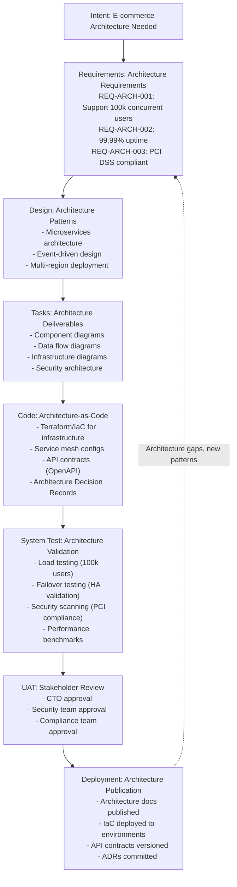

### **12.2.1 Key Characteristics**

* **Final Asset**: Technical Architecture (documented, code-defined, validated)
* **Requirements**: Architecture requirements (REQ-ARCH-*)
* **Code**: Architecture-as-Code (Terraform, K8s manifests, API specs)
* **Tests**: Architecture validation tests (load tests, HA tests, security scans)
* **UAT**: Architecture review and approval by technical stakeholders
* **Deployment**: Publishing architecture docs and deploying IaC to environments

### **12.2.2 Integration with Main SDLC**

The architecture SDLC runs **before the main code SDLC**:

```
Main SDLC Design Stage
  ↓
  Triggers: Architecture SDLC (sub-vector)
    Intent → REQ-ARCH-* → Design → Tasks → Code (IaC) → Test → UAT → Deploy
  ↓
  Produces: Architecture (REQ-ARCH-* assets)
  ↓
Main SDLC Code Stage (constrained by architecture)
```

### **12.2.3 Example Architecture Requirements**

```yaml
# Architecture Requirements
REQ-ARCH-SCALE-001: "System must scale to 100k concurrent users"
  type: architecture
  domain: scalability
  acceptance_criteria:
    - Load test demonstrates 100k concurrent users
    - Response time p95 < 500ms at peak load
    - Auto-scaling policies validated

REQ-ARCH-HA-001: "System must achieve 99.99% uptime"
  type: architecture
  domain: high_availability
  acceptance_criteria:
    - Multi-region deployment active
    - Automated failover tested
    - RTO < 5 minutes, RPO < 1 minute

REQ-ARCH-SEC-001: "System must be PCI DSS compliant"
  type: architecture
  domain: security
  acceptance_criteria:
    - Security architecture review approved
    - PCI compliance scans passing
    - Encryption at rest and in transit validated
```

---

## **12.3 Sub-Vector #2: UAT Test Development as Parallel AI SDLC**

**Intent**: "We need comprehensive UAT test coverage for user authentication feature"

The **UAT stage** involves creating both test cases AND automation code, which can be structured as its own AI SDLC running **in parallel** with the main code SDLC:


### **12.3.1 Key Characteristics**

* **Final Assets**:
  - Manual UAT test cases (business-readable scenarios)
  - Automated UAT tests (executable BDD tests)
  - Automated data tests (data quality validation)
* **Requirements**: UAT test requirements (REQ-UAT-*)
* **Code**: Test code (test_*.py, feature files, data validation scripts)
* **Tests**: Meta-tests (tests that validate the UAT tests work correctly)
* **UAT**: Business SME and QA Lead review and approval
* **Deployment**: Tests added to CI/CD pipeline

### **12.3.2 Parallel Execution Pattern**

The UAT test SDLC runs **in parallel** with the main code SDLC:

```
Timeline:
Sprint 1:
  - Main SDLC: Requirements → Design
  - UAT Test SDLC: Requirements → Design (test scenarios)

Sprint 2:
  - Main SDLC: Code → Unit Tests
  - UAT Test SDLC: Code (implement UAT tests) → Test (validate tests)

Sprint 3:
  - Main SDLC: Integration Tests → System Test
  - UAT Test SDLC: UAT (review test cases) → Deploy (to CI/CD)

Sprint 4:
  - Main SDLC: UAT (using the test cases from UAT Test SDLC) → Deploy
```

### **12.3.3 Example UAT Test Requirements**

```yaml
# UAT Test Requirements
REQ-UAT-AUTH-001: "UAT test cases for successful authentication flows"
  type: uat_test
  domain: authentication
  source_requirement: REQ-F-AUTH-001  # Links to main requirement
  deliverables:
    - Manual test case: "User login with valid credentials"
    - Automated BDD test: test_user_login_success()
    - Data test: verify_user_credentials_in_db()

REQ-UAT-AUTH-002: "UAT test cases for authentication error handling"
  type: uat_test
  domain: authentication
  source_requirement: REQ-F-AUTH-001
  deliverables:
    - Manual test case: "User login with invalid credentials"
    - Automated BDD test: test_user_login_invalid_credentials()
    - Data test: verify_failed_login_logged()

REQ-UAT-DATA-001: "Data validation tests for customer data quality"
  type: uat_test
  domain: data_quality
  source_requirement: REQ-DATA-CQ-001
  deliverables:
    - Automated data test: test_customer_data_completeness()
    - Automated data test: test_customer_data_accuracy()
    - Data reconciliation test: test_customer_source_target_match()
```

### **12.3.4 UAT Test Traceability**

```
Main Requirement → UAT Test Requirement → Test Cases → Test Code
REQ-F-AUTH-001 → REQ-UAT-AUTH-001 → "Login with valid credentials" → test_user_login_success()
                                  → "Login with invalid credentials" → test_user_login_invalid_credentials()
```

---

## **12.4 Sub-Vector #3: Data Platform as AI SDLC**

**Intent**: "We need a scalable data platform for analytics and ML"

Data platform development can be structured as its own AI SDLC running **independently** or **in parallel** with application development:

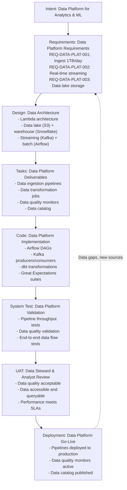

### **12.4.1 Key Characteristics**

* **Final Assets**:
  - Data ingestion pipelines (code)
  - Data transformation jobs (dbt, Spark)
  - Data quality monitors (Great Expectations)
  - Data catalog and documentation
* **Requirements**: Data platform requirements (REQ-DATA-PLAT-*)
* **Code**: Data pipeline code (Airflow, dbt, Kafka, Spark)
* **Tests**: Data quality tests, pipeline tests, end-to-end data flow tests
* **UAT**: Data stewards and analysts validate data quality and accessibility
* **Deployment**: Pipelines and monitors deployed to production

### **12.4.2 Integration with Application SDLC**

The data platform SDLC can run:
- **Independently**: Data platform built as separate system
- **In parallel**: Data platform built alongside application
- **Integrated**: Application and data share requirements (REQ-DATA-*)

```
Application SDLC:
  Requirements (REQ-F-*) → Design → Code (app.py) → Test → UAT → Deploy

Data Platform SDLC (parallel):
  Requirements (REQ-DATA-PLAT-*) → Design → Code (pipelines) → Test → UAT → Deploy

Shared Data Requirements (REQ-DATA-*):
  Used by both SDLCs, ensuring data consistency
```

### **12.4.3 Example Data Platform Requirements**

```yaml
# Data Platform Requirements
REQ-DATA-PLAT-INGEST-001: "Ingest customer data from source systems"
  type: data_platform
  domain: ingestion
  acceptance_criteria:
    - Ingest 1TB customer data per day
    - Latency < 15 minutes (near real-time)
    - Data quality checks pass (REQ-DATA-CQ-*)

REQ-DATA-PLAT-TRANSFORM-001: "Transform customer data for analytics"
  type: data_platform
  domain: transformation
  acceptance_criteria:
    - dbt transformations complete in < 30 minutes
    - Data models documented in data catalog
    - Business rules applied (REQ-BR-*)

REQ-DATA-PLAT-QUALITY-001: "Monitor data quality continuously"
  type: data_platform
  domain: quality
  acceptance_criteria:
    - Great Expectations suites run on every pipeline execution
    - Data quality dashboards updated real-time
    - Alerts triggered for quality violations
```

---

## **12.5 Sub-Vector Patterns and Best Practices**

### **12.5.1 When to Use Sub-Vectors**

Use AI SDLC sub-vectors when:

1. **Complexity warrants decomposition**: Activity is complex enough to benefit from full lifecycle structure
2. **Independent delivery**: Sub-vector can deliver value independently (e.g., architecture docs, test suites)
3. **Parallel execution**: Sub-vector can run concurrently with main SDLC to accelerate delivery
4. **Separate ownership**: Different teams own sub-vector (e.g., architecture team, QA team, data team)

### **12.5.2 Sub-Vector Coordination**

Coordinate multiple AI SDLCs through:

1. **Requirement Keys**: Link requirements across SDLCs
   ```
   REQ-F-AUTH-001 (main SDLC)
     → REQ-UAT-AUTH-001 (UAT test SDLC)
     → REQ-ARCH-SEC-001 (architecture SDLC)
   ```

2. **Shared Context**: Use AI_SDLC_Context to share constraints, templates, standards
   ```yaml
   # Shared context used by all sub-vectors
   shared_context:
     coding_standards: "file://standards/coding_standards.md"
     data_standards: "file://standards/data_standards.md"
   ```

3. **Synchronization Points**: Define dependencies and integration points
   ```
   Architecture SDLC (Deployment) → Blocks → Code SDLC (Code)
   Code SDLC (Design) → Triggers → UAT Test SDLC (Requirements)
   UAT Test SDLC (Deployment) → Validates → Code SDLC (UAT)
   ```

### **12.5.3 Benefits of Sub-Vectors**

1. **Parallelization**: Multiple teams work concurrently on coordinated lifecycles
2. **Specialization**: Each sub-vector can have specialized personas, tools, and processes
3. **Scalability**: Large projects decompose into manageable sub-lifecycles
4. **Reusability**: Sub-vectors (e.g., architecture SDLC) can be reused across projects
5. **Traceability**: Requirement keys maintain traceability across all sub-vectors

---

# **13.0 Conclusion**

## **13.1 Summary**

The AI SDLC methodology provides a **closed-loop, intent-driven** framework that:

* Connects **real-world observations** to **system change**.
* Uses **CRUD work types** to structure intent.
* Channels all work through a **Builder.CRUD AI SDLC pipeline**.
* Maintains **Requirements** as a single, evolving source of truth.
* Ensures **continuous governance** through observation and evaluation.
* Provides **end-to-end traceability** through unique, immutable requirement keys.

---

## **13.2 Benefits**

* **Complete traceability** from intent to runtime behavior using unique requirement keys:
  - Forward traceability: Intent → Requirements → Design → Code → Tests → Deployment → Runtime
  - Backward traceability: Production issues → Code → Requirements → Intent
* Strong **governance** and auditability across the full software and data lifecycle.
* Clear **persona responsibilities** and artifacts for application and data engineering.
* **Data as a first-class concern** throughout all stages, not an afterthought.
* Comprehensive **data quality and compliance** validation at every stage.
* **Requirement coverage analysis** at every stage (design, code, test, UAT).
* **Impact analysis** capabilities: "What will break if we change this requirement?"
* **Root cause analysis** from production issues back to originating requirements.
* **Recursive and composable**: AI SDLC sub-vectors enable parallel and nested lifecycles for architecture, testing, and data platforms.
* **Parallelization**: UAT test development can run in parallel with main code development, accelerating delivery.
* AI used responsibly as a **context-aware augmenter**.

---

## **13.3 Next Steps**

Depending on your environment, you can:

* Attach **RACI matrices** to each stage.
* Map **concrete tools** (e.g. Jira, Git, CI/CD, Data Platforms) to each box.
* Add **AI agent roles** (Req-Agent, Design-Agent, Code-Agent, Test-Agent) as overlays on this methodology.

---

# **Appendix A: The Fundamental Unit of Asset Creation**

## **A.1 Overview**

Every asset in the AI SDLC—whether a requirement document, design specification, code file, test suite, or deployment plan—is created using the same **fundamental building block pattern**:

```
Input (Intent + Context) → Synthesis → Asset → Observe → Evaluate → Feedback → Update Input/Context
```

This pattern is **recursive** and forms the basis for chaining assets together throughout the entire lifecycle. Understanding this building block is essential to understanding how the AI SDLC operates at all scales.

---

## **A.2 The Asset Creation Cycle**

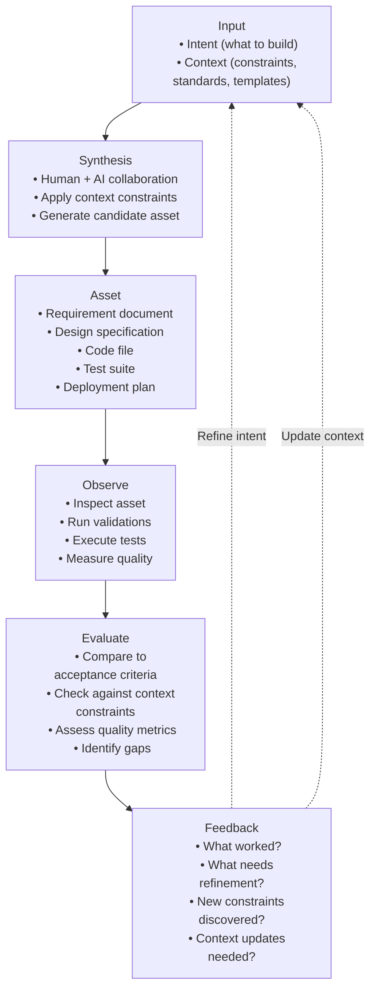

---

## **A.3 Component Breakdown**

### **A.3.1 Input: Intent + Context**

The input to asset creation consists of two components:

#### **Intent** (The "What" and "Why")
- **What** needs to be built or changed
- **Why** it's needed (business value, problem to solve)
- **Source**: Comes from the Requirements stage or upstream assets
- **Examples**:
  - "Implement user authentication" (REQ-F-AUTH-001)
  - "Design scalable architecture for 100k users" (REQ-ARCH-SCALE-001)
  - "Create UAT test cases for login flow" (REQ-UAT-AUTH-001)

#### **Context** (The "How" Constraints)
- **Constraints** that shape how the asset is created
- **Source**: Stored in AI_SDLC_Context as URI references
- **Types**:
  - **Stage-specific context**: Design patterns, coding standards, test frameworks
  - **Regulatory context**: Compliance requirements, data governance
  - **Technical context**: Tech stack, architecture constraints, performance targets
  - **Organizational context**: Templates, standards, approved libraries

**Example Context** (from AI_SDLC_Context):
```yaml
code_stage:
  coding_standards: "file://standards/coding/python_style_guide.md"
  security: "file://standards/security/secure_coding.md"
  templates:
    service: "file://templates/code/service_template.py"
  approved_libraries:
    authentication: ["bcrypt", "PyJWT", "passlib"]
```

### **A.3.2 Synthesis: Creating the Asset**

**Synthesis** is the creative process of generating the asset:

- **Human + AI collaboration**: Developer works with AI assistant
- **Apply context constraints**: Use templates, follow standards, respect patterns
- **Generate candidate asset**: Create initial version of the asset
- **Iterative refinement**: Multiple synthesis rounds may occur

**Example Synthesis Process**:
```python
# Intent: REQ-F-AUTH-001 - Implement user authentication
# Context: Python coding standards + security guidelines + service template

# Synthesis Step 1: Start with template
# (Load from: file://templates/code/service_template.py)

# Synthesis Step 2: Apply security context
# (Reference: file://standards/security/secure_coding.md)
# - Use approved library: bcrypt
# - Implement password hashing
# - Add rate limiting

# Synthesis Step 3: Follow coding standards
# (Reference: file://standards/coding/python_style_guide.md)
# - Type hints
# - Docstrings with requirement keys
# - Error handling

# Result: auth_service.py (asset)
```

### **A.3.3 Asset: The Output**

The **asset** is the tangible output of synthesis:

- **Tagged with requirement keys**: Maintains traceability
- **Version controlled**: Git commit, document version
- **Documented**: Includes references to intent and context used
- **Types**:
  - Requirements: User stories, NFRs, data requirements
  - Design: Architecture diagrams, API specs, data models
  - Code: Application code, infrastructure-as-code, pipelines
  - Tests: Test cases, automated tests, data quality tests
  - Documentation: Runbooks, release notes, architecture decisions

**Example Asset**:
```python
# Asset: auth_service.py
# Implements: REQ-F-AUTH-001 (User Authentication)
# Context Used:
#   - file://standards/coding/python_style_guide.md
#   - file://standards/security/secure_coding.md
#   - file://templates/code/service_template.py

class AuthenticationService:
    """
    Service for user authentication.

    Requirements:
    - REQ-F-AUTH-001: User Login
    - REQ-NFR-SEC-001: Secure Authentication
    """

    def authenticate(self, username: str, password: str) -> AuthToken:
        """Authenticate user and return token."""
        # Implementation using bcrypt (approved library)
        ...
```

### **A.3.4 Observe: Inspecting the Asset**

**Observation** is the process of examining the asset:

- **Inspection techniques**:
  - Code review (peer review)
  - Linting and static analysis
  - Test execution (unit, integration, system)
  - Data quality checks
  - Security scanning
  - Performance benchmarking

- **Produces observable data**:
  - Test results (pass/fail)
  - Code coverage metrics
  - Lint errors/warnings
  - Security vulnerabilities
  - Performance measurements
  - Data quality scores

**Example Observation**:
```bash
# Observe the asset through multiple lenses

# 1. Run linter
pylint auth_service.py
# Result: 9.5/10 score, 2 minor warnings

# 2. Run tests
pytest tests/test_auth_service.py -v
# Result: 12 tests, 11 passed, 1 failed

# 3. Security scan
bandit auth_service.py
# Result: No high-severity issues

# 4. Check coverage
pytest --cov=auth_service tests/
# Result: 85% coverage
```

### **A.3.5 Evaluate: Assessing Quality**

**Evaluation** compares observations against acceptance criteria:

- **Evaluation criteria**:
  - **Functional**: Does it implement the intent correctly?
  - **Context compliance**: Does it follow all context constraints?
  - **Quality gates**: Does it meet minimum quality thresholds?
  - **Requirement coverage**: Are all requirements addressed?

- **Evaluation outcomes**:
  - ✅ **Accept**: Asset meets all criteria, proceed to next stage
  - ⚠️ **Accept with conditions**: Minor issues, can be addressed later
  - ❌ **Reject**: Critical issues, must be fixed before proceeding

**Example Evaluation**:
```yaml
Evaluation Result for auth_service.py (REQ-F-AUTH-001):

Functional Correctness:
  ✅ Implements login functionality
  ❌ Password reset flow missing (REQ-F-AUTH-002)

Context Compliance:
  ✅ Follows Python style guide
  ✅ Uses approved library (bcrypt)
  ⚠️ Missing docstring for one method

Quality Gates:
  ✅ Linting: 9.5/10 (threshold: 8.0)
  ❌ Test coverage: 85% (threshold: 90%)
  ✅ Security scan: No high issues
  ⚠️ Tests: 1 test failing

Decision: ❌ REJECT - Fix failing test and improve coverage
```

### **A.3.6 Feedback: Learning and Refinement**

**Feedback** captures learnings and informs the next iteration:

- **Feedback types**:
  - **Refinement feedback**: How to improve the current asset
  - **Intent feedback**: Was the intent clear? Does it need revision?
  - **Context feedback**: Are context constraints complete? Do we need new templates/standards?
  - **Process feedback**: What worked well? What should change?

- **Feedback destinations**:
  - **Back to Input**: Refine intent, clarify requirements
  - **Back to Context**: Update templates, add new constraints, revise standards
  - **Forward to next stage**: Inform downstream stages about discoveries
  - **Back to Requirements**: Gaps or ambiguities discovered

**Example Feedback**:
```yaml
Feedback for auth_service.py (REQ-F-AUTH-001):

Refinement Feedback:
  - Fix failing test: test_authenticate_with_expired_token
  - Add missing docstring for _hash_password method
  - Increase test coverage to 90%+ (add edge case tests)

Intent Feedback:
  - REQ-F-AUTH-001 incomplete: missing password reset requirement
  - New requirement needed: REQ-F-AUTH-002 (Password Reset)

Context Feedback:
  - Token expiration policy not documented in security standards
  - ADD to context: file://standards/security/token_management.md
  - Service template should include logging best practices
  - UPDATE: file://templates/code/service_template.py

Process Feedback:
  - Security scan should run before code review (shift left)
  - UPDATE: file://processes/code_review_checklist.md
```

---

## **A.4 Chaining Assets: The Chain Reaction**

The power of this building block pattern is that **one asset's output becomes the next asset's input**:

```
Requirements Asset (REQ-F-AUTH-001)
  ↓ (Intent + Context)
Design Asset (AuthenticationService design)
  ↓ (Intent + Context)
Code Asset (auth_service.py)
  ↓ (Intent + Context)
Test Asset (test_auth_service.py)
  ↓ (Intent + Context)
Deployment Asset (release_plan_v2.5.md)
  ↓ (Intent + Context)
Runtime Metrics (auth_success_rate)
  ↓ (Feedback)
Updated Requirements (REQ-F-AUTH-001 v2)
```

### **A.4.1 Chain Example: From Requirement to Code**

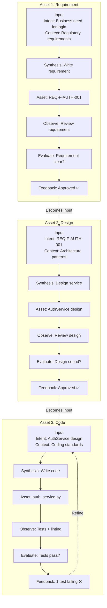

### **A.4.2 Context Evolution Through the Chain**

As assets are created, **context evolves**:

```yaml
# Initial Context (Requirements Stage)
requirements_stage:
  regulatory: "file://context/regulatory/gdpr.md"
  business_rules: "file://context/business/auth_rules.md"

# Context Grows (Design Stage)
design_stage:
  # Inherits from requirements_stage
  architecture: "file://architecture/microservices_patterns.md"
  auth_pattern: "file://architecture/patterns/oauth2.md"

# Context Grows (Code Stage)
code_stage:
  # Inherits from design_stage
  coding_standards: "file://standards/coding/python_style_guide.md"
  security: "file://standards/security/secure_coding.md"
  templates: "file://templates/code/service_template.py"

# Context Feedback (New constraint discovered)
code_stage:
  # ADD: New context discovered during coding
  token_management: "file://standards/security/token_management.md"  # NEW!
```

---

## **A.5 AI_SDLC_Context: The Context Repository**

The **AI_SDLC_Context** system stores all context constraints as URI references:

### **A.5.1 Context Structure**

```yaml
# AI_SDLC_Context configuration
ai_sdlc_context:

  # Shared context (used by all stages)
  shared:
    regulatory: "file://context/regulatory/gdpr.md"
    data_governance: "file://context/data/governance_policies.md"

  # Stage-specific context
  stages:
    requirements:
      templates:
        user_story: "file://templates/requirements/user_story_template.md"
        nfr: "file://templates/requirements/nfr_template.md"
      context:
        business_rules: "file://context/business/domain_rules.md"

    design:
      architecture:
        patterns: "file://architecture/patterns/microservices.md"
        tech_stack: "file://architecture/tech_stack.md"
      templates:
        api_spec: "file://templates/design/api_spec_template.yaml"

    code:
      coding_standards:
        python: "file://standards/coding/python_style_guide.md"
        security: "file://standards/security/secure_coding.md"
      templates:
        service: "file://templates/code/service_template.py"
      approved_libraries:
        authentication: ["bcrypt", "PyJWT", "passlib"]

    test:
      test_frameworks:
        unit: "file://testing/frameworks/pytest_config.md"
        data_quality: "file://testing/frameworks/great_expectations_config.md"
      templates:
        test_case: "file://templates/testing/test_case_template.md"
```

### **A.5.2 Lazy Loading of Context**

Context is loaded **lazily** (only when needed):

```python
# Example: Asset creation for auth_service.py

# Step 1: Load intent
intent = get_requirement("REQ-F-AUTH-001")

# Step 2: Load relevant context (lazy)
context = config_manager.get_context("code_stage")
# Only now are the URIs resolved:
#   - file://standards/coding/python_style_guide.md → content loaded
#   - file://standards/security/secure_coding.md → content loaded
#   - file://templates/code/service_template.py → content loaded

# Step 3: Synthesis with intent + context
asset = synthesize(intent, context)

# Step 4-6: Observe, Evaluate, Feedback
...
```

---

## **A.6 The Building Block at Every Scale**

This building block pattern operates at **multiple scales**:

### **A.6.1 Micro Scale: Single Function**
```
Intent: "Implement password hashing"
Context: Approved libraries (bcrypt), secure coding standards
Synthesis: Write hash_password() function
Observe: Unit tests
Evaluate: Tests pass, follows standards
Feedback: Function approved
```

### **A.6.2 Meso Scale: Service Implementation**
```
Intent: REQ-F-AUTH-001 (User Authentication)
Context: Coding standards, security guidelines, service template
Synthesis: Write AuthenticationService class
Observe: Unit + integration tests, security scan
Evaluate: 85% coverage, 1 test failing
Feedback: Fix failing test, improve coverage
```

### **A.6.3 Macro Scale: Complete Feature**
```
Intent: User authentication feature
Context: All stage contexts (requirements → deployment)
Synthesis: Full SDLC (Requirements → Design → Code → Test → UAT → Deploy)
Observe: System tests, UAT validation, production metrics
Evaluate: UAT approved, metrics healthy
Feedback: Feature successful, identify improvements for next iteration
```

### **A.6.4 Meta Scale: Sub-Vector SDLC**
```
Intent: Build UAT test automation framework
Context: Test frameworks, BDD patterns, data quality standards
Synthesis: Complete UAT Test SDLC (Section 12.3)
Observe: Tests validate main code, detect failures
Evaluate: Test coverage 95%, business SME approves
Feedback: Test framework accelerates delivery
```

---

## **A.7 Key Principles**

### **A.7.1 Immutable Intent, Evolving Context**

- **Intent** (requirements) should be **stable** and **immutable** (versioned if changed)
- **Context** (constraints, templates, standards) **evolves** based on feedback
- This separation enables continuous improvement without breaking traceability

### **A.7.2 Context is Explicit, Not Implicit**

- All context constraints are **explicitly documented** in AI_SDLC_Context
- No "tribal knowledge" or undocumented standards
- Context is **reusable** across projects and teams

### **A.7.3 Feedback Improves Context, Not Just Assets**

- Feedback doesn't just fix the current asset
- Feedback **updates context** for future assets
- This creates a **learning organization** where each asset creation improves the system

### **A.7.4 AI as Context-Aware Augmenter**

- AI assistants use **both intent and context** to generate better assets
- Context makes AI output **consistent** and **compliant**
- Human remains in control: validates, evaluates, and provides feedback

---

## **A.8 Summary**

The **fundamental unit of asset creation** is:

```
Input (Intent + Context) → Synthesis → Asset → Observe → Evaluate → Feedback
```

**Key takeaways**:

1. **Every asset** in the AI SDLC is created using this pattern
2. **Assets chain together**: One asset's output becomes the next asset's input
3. **Context evolves**: Feedback updates context for future asset creation
4. **AI_SDLC_Context**: Stores all context as URI references, loaded lazily
5. **Scalable**: Pattern works at all scales (function → service → feature → system)
6. **Traceable**: Requirement keys flow through the entire chain
7. **Learning**: Each cycle improves both assets and context

This building block is the **atomic unit** of the AI SDLC, and understanding it is key to understanding how the entire methodology operates.
