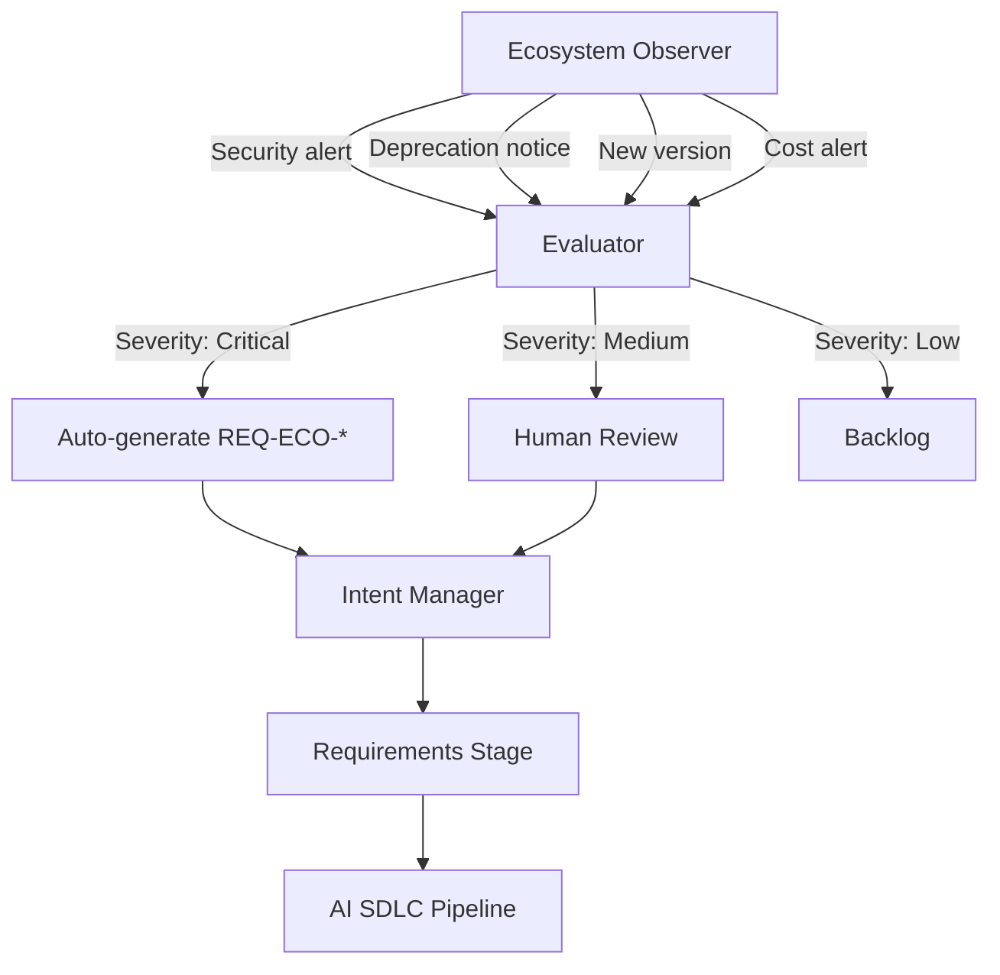

# Ecosystem Requirements Integration

**Date**: 2025-11-20
**Purpose**: Extend Requirements Stage to treat external dependencies as first-class requirements
**Related**: Category-Theoretic Formalization (Appendix X), v1.2 Section 4.0

---

## Problem Statement

**Current State** (v1.2):
Requirements are categorized as:
- `REQ-F-*` - Functional requirements
- `REQ-NFR-*` - Non-functional requirements
- `REQ-DATA-*` - Data requirements
- `REQ-BR-*` - Business rules

**Gap**: External dependencies (APIs, libraries, infrastructure, models) are treated as:
1. **Implementation details** (decided during Design/Code stages)
2. **Implicit constraints** (mentioned in "Context Configuration")
3. **Post-hoc discoveries** (found during coding)

**Problem**: This creates several issues:

### Issue 1: Ecosystem Changes are Invisible to Requirements
```
Scenario: OpenAI deprecates GPT-3.5 API
Current: No requirement tracks API dependency
Result: Breaking change discovered during runtime
Should: REQ-ECO-LLM-001 tracks API version requirement
```

### Issue 2: Storage/Infrastructure Needs Not Captured
```
Intent: "I need to store my output somewhere"
Current: Becomes implementation choice (S3? Database? File system?)
Result: Missed opportunity to capture business constraints
Should: REQ-ECO-STORAGE-001 with durability/cost/compliance needs
```

### Issue 3: Library Version Conflicts Not Anticipated
```
Scenario: New library version has breaking changes
Current: Requirements don't mention library dependencies
Result: Surprise conflicts during integration
Should: REQ-ECO-DEPS-001 specifies compatibility matrix
```

### Issue 4: No Traceability for Ecosystem-Driven Intents
```
Scenario: npm audit finds security vulnerability
Current: Creates ad-hoc fix without requirement
Result: No traceability, priority unclear
Should: Auto-generates REQ-ECO-SEC-042 with CVE link
```

---

## Solution: Add REQ-ECO-* (Ecosystem Requirements)

### New Requirement Type

```yaml
REQ-ECO-{CATEGORY}-{SEQUENCE}

Categories:
  - API: External API dependencies
  - LIB: Library/package dependencies
  - INFRA: Infrastructure requirements
  - MODEL: AI model dependencies
  - STORAGE: Storage system requirements
  - RUNTIME: Runtime environment requirements
  - PLATFORM: Cloud/platform dependencies
```

### Examples

#### REQ-ECO-API-001: OpenAI API Dependency
```yaml
id: REQ-ECO-API-001
category: ecosystem.api
title: "OpenAI GPT-4 API for Content Generation"
intent: "Use OpenAI GPT-4 for generating product descriptions"

constraints:
  provider: OpenAI
  service: GPT-4 API
  min_version: "2024-02-15"
  max_version: null  # Accept latest

  availability:
    uptime_requirement: 99.5%
    fallback_required: true
    fallback_provider: "Anthropic Claude"

  cost:
    max_monthly_spend: $500
    cost_per_request_max: $0.10

  compliance:
    data_residency: US
    gdpr_compliant: true
    pii_allowed: false

acceptance_criteria:
  - API responds within 5 seconds (p95)
  - Error rate < 1%
  - Cost tracking enabled
  - Fallback tested quarterly

deprecation_policy:
  monitor: true
  notification_lead_time: 90 days
  auto_upgrade_minor: true
  auto_upgrade_major: false

links:
  - intent: INT-042
  - functional_req: REQ-F-PROD-005 (uses this API)
  - runtime_feedback: ALERT-2025-11-15-API-TIMEOUT
```

#### REQ-ECO-LIB-001: Python Dependencies
```yaml
id: REQ-ECO-LIB-001
category: ecosystem.library
title: "Python Core Dependencies"
intent: "Manage Python package ecosystem for backend services"

dependencies:
  fastapi:
    min_version: "0.104.0"
    max_version: "0.x.x"  # No breaking major versions
    reason: "Core web framework"
    license: MIT
    security_scan: required

  pydantic:
    min_version: "2.0.0"
    max_version: "2.x.x"
    reason: "Data validation"
    license: MIT
    peer_dependencies:
      - fastapi

  sqlalchemy:
    min_version: "2.0.0"
    max_version: "2.x.x"
    reason: "ORM for database access"
    license: MIT

constraints:
  python_version: ">=3.11,<3.13"
  total_dependencies_max: 50  # Control dependency bloat
  security_vulnerabilities_max: 0  # Critical/High

  update_policy:
    frequency: monthly
    automated: true
    requires_approval: major_version_only
    test_coverage_required: true

acceptance_criteria:
  - All dependencies install without conflicts
  - Security scan passes (no critical/high CVEs)
  - License compatibility verified
  - Dependency graph acyclic

monitoring:
  dependabot: enabled
  vulnerability_alerts: enabled
  auto_pr_minor_updates: true
  auto_pr_security_patches: true

links:
  - intent: INT-001 (initial setup)
  - code_stage: REQ-CODE-STD-001 (coding standards)
```

#### REQ-ECO-STORAGE-001: Output Storage Requirements
```yaml
id: REQ-ECO-STORAGE-001
category: ecosystem.storage
title: "Long-term Storage for Generated Reports"
intent: "I need to store my output somewhere with durability and compliance"

requirements:
  type: object_storage  # vs block, file, database

  capacity:
    initial: 100 GB
    growth_rate: 10 GB/month
    max: 1 TB

  durability:
    target: 99.999999999%  # 11 nines
    replication: multi-region
    backup_frequency: daily
    retention: 7 years  # Compliance requirement

  performance:
    read_latency_p95: 100ms
    write_latency_p95: 500ms
    throughput_min: 100 MB/s

  cost:
    max_monthly: $200
    cost_per_gb_max: $0.023  # S3 Standard pricing
    cost_optimization: enable_lifecycle_policies

  compliance:
    encryption_at_rest: required (AES-256)
    encryption_in_transit: required (TLS 1.3)
    access_logging: required
    versioning: required
    gdpr_compliant: true
    data_residency: EU
    audit_trail: required

acceptance_criteria:
  - Storage provisioned and accessible
  - Encryption verified
  - Lifecycle policies configured
  - Cost alerts configured
  - Backup/restore tested

marketplace_selection:
  candidates:
    - AWS S3 (Standard, Intelligent-Tiering)
    - Google Cloud Storage
    - Azure Blob Storage

  selection_criteria:
    weights:
      cost: 0.3
      durability: 0.3
      compliance: 0.2
      performance: 0.1
      vendor_lock_in: 0.1

  selected: AWS S3 Intelligent-Tiering
  rationale: "Best cost/durability balance for our access patterns"
  review_frequency: quarterly

links:
  - intent: INT-067
  - functional_req: REQ-F-REPORT-003
  - nfr: REQ-NFR-PERF-001
```

#### REQ-ECO-MODEL-001: AI Model Dependency
```yaml
id: REQ-ECO-MODEL-001
category: ecosystem.model
title: "Embedding Model for Semantic Search"
intent: "Use embedding model for document similarity search"

model:
  type: text_embedding
  provider: OpenAI
  model_id: text-embedding-3-large
  version: "2024-02"

  characteristics:
    embedding_dimension: 3072
    max_input_tokens: 8191
    languages: [en, es, fr, de]

  performance:
    latency_p95: 200ms
    throughput_min: 100 requests/sec
    cost_per_1M_tokens: $0.13

constraints:
  context_window_min: 8000
  quality_threshold:
    cosine_similarity_accuracy: 0.85
    retrieval_recall_at_10: 0.90

  fallback_models:
    - text-embedding-3-small  # Cheaper, lower quality
    - sentence-transformers/all-mpnet-base-v2  # Self-hosted option

evolution_policy:
  monitor_new_versions: true
  benchmark_frequency: quarterly
  auto_upgrade: false  # Embeddings must be stable
  migration_plan_required: true  # Re-embed entire corpus

acceptance_criteria:
  - Embedding quality benchmarked
  - Latency meets SLA
  - Cost tracking enabled
  - Fallback tested

links:
  - intent: INT-089
  - functional_req: REQ-F-SEARCH-002
```

---

## Integration with Existing Requirement Types

### Relationship Matrix

| Ecosystem Req | Links To | Rationale |
|:---|:---|:---|
| REQ-ECO-API-001 | REQ-F-PROD-005 | API enables functional capability |
| REQ-ECO-LIB-001 | REQ-CODE-STD-001 | Libraries must meet code standards |
| REQ-ECO-STORAGE-001 | REQ-NFR-PERF-001 | Storage impacts performance |
| REQ-ECO-STORAGE-001 | REQ-DATA-RETENTION-001 | Storage implements data policy |
| REQ-ECO-MODEL-001 | REQ-F-SEARCH-002 | Model enables search feature |
| REQ-ECO-INFRA-001 | REQ-NFR-SCALE-001 | Infrastructure enables scaling |

### Traceability Flow Update

**Original Golden Thread**:
```
Intent → REQ-F-* → Design → Code → Test → Runtime
```

**Enhanced Golden Thread**:
```
Intent → {REQ-F-*, REQ-ECO-*} → Design → Code → Test → Runtime
                 ↓
         Marketplace Selection
                 ↓
         Utility Evaluation
                 ↓
         Continuous Monitoring
                 ↓
         Eco-Intent (deprecation, upgrade, cost alert)
```

---

## Eco-Intent: Environment-Driven Requirements

### Definition

**Eco-Intent** = Intent generated by **external ecosystem changes**, not internal observations

### Sources of Eco-Intent

| Source | Example | Generated Requirement |
|:---|:---|:---|
| Security Alert | npm audit: lodash vulnerability | REQ-ECO-SEC-042 "Upgrade lodash to 4.17.21" |
| Deprecation Notice | AWS: "RDS MySQL 5.7 EOL Jan 2024" | REQ-ECO-INFRA-015 "Migrate to MySQL 8.0" |
| New Version | OpenAI: "GPT-4.5 released with 2x speed" | REQ-ECO-MODEL-003 "Evaluate GPT-4.5 upgrade" |
| Cost Alert | S3: "Monthly spend exceeded $500 threshold" | REQ-ECO-STORAGE-007 "Optimize storage costs" |
| Performance Issue | CDN: "Latency degraded in EU region" | REQ-ECO-INFRA-021 "Add EU edge locations" |
| License Change | Library: "Changing from MIT to GPL" | REQ-ECO-LIB-032 "Find MIT-licensed alternative" |

### Eco-Intent Workflow



### Example: Automated Eco-Intent Generation

**Trigger**: Dependabot detects vulnerability
```json
{
  "source": "dependabot",
  "type": "security_alert",
  "package": "lodash",
  "current_version": "4.17.19",
  "vulnerable_versions": "< 4.17.21",
  "cve": "CVE-2021-23337",
  "severity": "high",
  "recommendation": "Upgrade to 4.17.21+"
}
```

**Auto-Generated Eco-Intent**:
```yaml
intent_id: INT-AUTO-2025-11-20-001
source: ecosystem.security
priority: high
auto_generated: true

description: |
  Security vulnerability detected in lodash dependency.
  CVE-2021-23337: Command injection via template.

original_intent: REQ-ECO-LIB-001 (Python Core Dependencies)
triggered_by: dependabot_alert
action_required: true
```

**Auto-Generated Requirement**:
```yaml
id: REQ-ECO-SEC-042
category: ecosystem.security
parent: REQ-ECO-LIB-001
title: "Upgrade lodash to address CVE-2021-23337"
intent: INT-AUTO-2025-11-20-001

details:
  cve: CVE-2021-23337
  severity: HIGH
  package: lodash
  current_version: 4.17.19
  safe_version: ">=4.17.21"

  risk:
    exploit_probability: medium
    impact: high
    affected_components:
      - REQ-F-PROD-005 (uses lodash templates)
      - REQ-F-SEARCH-002 (uses lodash utilities)

acceptance_criteria:
  - lodash upgraded to >=4.17.21
  - All tests pass
  - No breaking changes detected
  - Security scan clear

priority: P1 (must fix within 7 days)
sla: 7 days from detection

workflow:
  stage: requirements
  next_stage: design (auto-skip, trivial upgrade)
  automation_eligible: true
  auto_approve: false  # Requires human review
```

---

## Requirements Stage Updates

### 4.4 Assets Produced (Enhanced)

| Asset Type | Description | Key Type |
|:---|:---|:---|
| **User Stories** | Functional capabilities | `REQ-F-*` |
| **NFRs** | Performance, Security, Constraints | `REQ-NFR-*` |
| **Data Requirements** | Quality, Retention, Lineage, PII | `REQ-DATA-*` |
| **Business Rules** | Domain invariants | `REQ-BR-*` |
| **Ecosystem Requirements** ⭐ **NEW** | APIs, Libraries, Infrastructure, Models, Storage | `REQ-ECO-*` |
| **BDD Scenarios** | Executable specifications (Gherkin) | Linked to Keys |

### 4.3 Context Configuration (Enhanced)

**Add**:
```yaml
ecosystem_context:
  marketplace:
    registries:
      - npm (JavaScript/TypeScript)
      - PyPI (Python)
      - Docker Hub (Containers)
      - AWS Marketplace (Infrastructure)
      - Hugging Face (AI Models)
      - Claude Code Plugin Marketplace

  current_environment:
    cloud_provider: AWS
    regions: [us-east-1, eu-west-1]
    runtime: Python 3.11
    infrastructure: Kubernetes 1.28

  policies:
    dependency_updates: automated_minor_versions
    security_patches: automated_always
    major_upgrades: manual_review_required
    cost_threshold_alert: $1000/month

  monitoring:
    dependabot: enabled
    snyk: enabled
    aws_trusted_advisor: enabled
    cloud_cost_monitor: enabled
```

### 4.5 Governance & Quality Gates (Enhanced)

**Add**:
- [ ] Ecosystem requirements documented for all external dependencies
- [ ] Marketplace alternatives evaluated and documented
- [ ] Cost implications assessed
- [ ] Deprecation/EOL dates tracked
- [ ] Security vulnerabilities resolved
- [ ] License compatibility verified

---

## Personas Update

### New Persona: **Ecosystem Architect**

**Responsibilities**:
- Define ecosystem requirements (REQ-ECO-*)
- Evaluate marketplace alternatives
- Monitor deprecations and vulnerabilities
- Manage cost/performance trade-offs
- Plan migrations and upgrades

**Collaborates With**:
- Product Owner (prioritization)
- Tech Lead (technical feasibility)
- Security Officer (vulnerability response)
- Finance (cost optimization)

**Tools**:
- Dependabot, Snyk, WhiteSource
- AWS Trusted Advisor, GCP Recommender
- Cloud cost analyzers
- API deprecation monitors

---

## Category-Theoretic Integration

### Ecosystem Requirements as Objects in 𝓔_Eco

Each `REQ-ECO-*` is an **object** in the ecosystem category:

```
REQ-ECO-API-001: OpenAI GPT-4 API
  ↓ (version upgrade morphism)
REQ-ECO-API-002: OpenAI GPT-4.5 API
```

### Fibration Extended

**Original Fibration**:
```
p: 𝓔_Assets → 𝓑_Req
```

**Extended Fibration**:
```
p': 𝓔_Assets × 𝓔_Eco → 𝓑_Req ∪ 𝓑_EcoReq

Where:
- 𝓑_Req = {REQ-F-*, REQ-NFR-*, REQ-DATA-*, REQ-BR-*}
- 𝓑_EcoReq = {REQ-ECO-*}
```

**Each asset now traces to**:
1. **Functional requirement** (what it does)
2. **Ecosystem requirement** (what it depends on)

**Example**:
```python
# code/auth_service.py
# Implements: REQ-F-AUTH-001 (user authentication)
# Depends: REQ-ECO-API-001 (OpenAI API)
# Depends: REQ-ECO-LIB-001 (FastAPI, Pydantic)

from fastapi import FastAPI  # ← REQ-ECO-LIB-001
import openai  # ← REQ-ECO-API-001

async def authenticate(user: str):
    """Implements: REQ-F-AUTH-001"""
    ...
```

### Marketplace Functor Q Enhanced

**Original**:
```
Q: 𝓒_SDLC → 𝓜
```

**Enhanced with Requirements Constraint**:
```
Q: (𝓒_SDLC × 𝓑_EcoReq) → 𝓜

Where Q(stage, eco_req) selects service satisfying eco_req at stage
```

**Example**:
```
Q(Code Stage, REQ-ECO-STORAGE-001)
  → AWS S3 Intelligent-Tiering

  (selected from marketplace based on utility function
   considering: cost, durability, compliance, performance)
```

---

## Implementation Roadmap

### Phase 1: Documentation (Week 1-2)
- [ ] Update v1.2 Section 4.4 with REQ-ECO-* type
- [ ] Add Ecosystem Architect persona
- [ ] Create REQ-ECO-* templates
- [ ] Update traceability examples

### Phase 2: Tooling (Week 3-4)
- [ ] Extend requirement key generator for REQ-ECO-*
- [ ] Add ecosystem context schema to config
- [ ] Integrate Dependabot/Snyk outputs
- [ ] Create eco-intent auto-generator

### Phase 3: Agent Integration (Week 5-6)
- [ ] Train Requirements Agent to generate REQ-ECO-*
- [ ] Implement marketplace selection logic
- [ ] Add utility function evaluator
- [ ] Enable auto-upgrade workflows

### Phase 4: Production (Week 7-8)
- [ ] Deploy to customer_portal example
- [ ] Monitor eco-intents in production
- [ ] Tune utility weights
- [ ] Document lessons learned

---

## Examples in Practice

### Example 1: New Project Initialization

**Intent**: "Build customer portal with authentication"

**Generated Requirements**:
```yaml
REQ-F-AUTH-001: User authentication
REQ-F-AUTH-002: Session management

REQ-ECO-API-001: Authentication provider (Auth0, Okta, or self-hosted)
REQ-ECO-LIB-001: Web framework (FastAPI, Flask, Django)
REQ-ECO-STORAGE-001: Session storage (Redis, Memcached, Database)
REQ-ECO-INFRA-001: Hosting environment (AWS, GCP, Azure)
REQ-ECO-MODEL-001: Optional: AI-powered fraud detection
```

**Marketplace Selection**:
- Auth0 vs Okta vs Self-hosted → **Auth0** (utility: ease of use)
- FastAPI vs Flask → **FastAPI** (utility: performance + modern)
- Redis vs Memcached → **Redis** (utility: persistence + features)

### Example 2: Mid-Life Dependency Update

**Trigger**: AWS announces RDS MySQL 5.7 EOL

**Auto-Generated**:
```yaml
intent: INT-ECO-2025-11-20-005
source: aws_deprecation_notice
priority: medium

requirement: REQ-ECO-INFRA-015
title: "Migrate RDS from MySQL 5.7 to MySQL 8.0"
parent: REQ-ECO-INFRA-001 (original database requirement)

timeline:
  announcement: 2024-06-15
  eol_date: 2025-02-28
  action_by: 2025-01-31

migration_plan:
  approach: blue-green deployment
  testing_required: full regression
  rollback_plan: required
  estimated_effort: 2 weeks
```

### Example 3: Cost Optimization

**Trigger**: Monthly S3 cost exceeds $500 threshold

**Auto-Generated**:
```yaml
intent: INT-ECO-2025-11-20-008
source: cloud_cost_monitor
priority: low

requirement: REQ-ECO-STORAGE-007
title: "Optimize S3 storage costs"
parent: REQ-ECO-STORAGE-001

analysis:
  current_cost: $637/month
  threshold: $500/month
  excess: $137/month (27% over)

recommendations:
  - Enable S3 Intelligent-Tiering (save $80/month)
  - Implement lifecycle policies (save $40/month)
  - Compress large objects (save $30/month)
  - Archive old reports to Glacier (save $20/month)

estimated_savings: $170/month
effort: 1 week
roi: 3 months
```

---

## Conclusion

By treating **ecosystem dependencies as first-class requirements**, we:

1. ✅ **Capture intent early** - "I need to store my output" becomes REQ-ECO-STORAGE-001
2. ✅ **Enable traceability** - Track API/library changes through entire lifecycle
3. ✅ **Automate responses** - Security alerts auto-generate requirements
4. ✅ **Optimize continuously** - Marketplace utility drives improvement
5. ✅ **Prevent surprises** - Dependencies explicit from Requirements stage

This transforms the SDLC from **implementation-driven** to **ecosystem-aware**, making external dependencies visible, traceable, and optimizable.

---

**Next**: Integrate this into v1.2 Section 4.0 and Appendix X (Category Theory)
