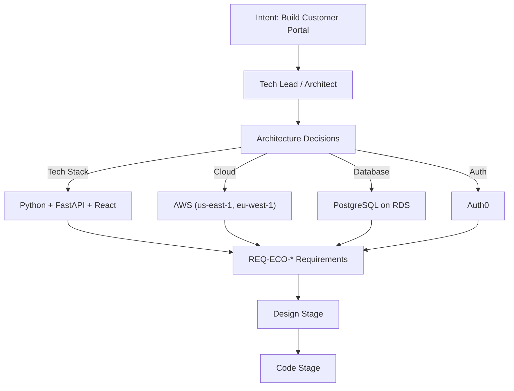
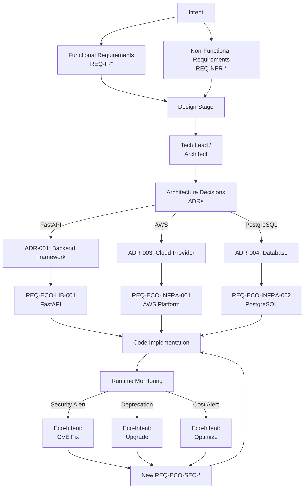

# Ecosystem Requirements: Workflow and Responsibility Model

**Date**: 2025-11-20
**Purpose**: Clarify how ecosystem requirements flow from Architecture → Requirements → Code
**Key Insight**: External dependencies are defined by Architecture/Tech Lead, formalized as REQ-ECO-*, then traced

---

## The Reality: Architecture Drives Ecosystem Choices

### Current Practice (Correct!)



**Key Point**: The **Tech Lead/Architect** makes the strategic decisions about:
- Programming languages and frameworks
- Cloud providers and regions
- Database engines
- Authentication providers
- Message queues, caching layers, etc.

**REQ-ECO-* requirements don't make these decisions** - they **formalize and trace** them.

---

## Workflow: Architecture → Ecosystem Requirements

### Phase 1: Architecture Decision (Design Stage)

**Persona**: Tech Lead, Architect, Data Architect

**Input**:
- Functional requirements (REQ-F-*)
- Non-functional requirements (REQ-NFR-*)
- Business constraints (cost, compliance, team skills)

**Output**: Architecture Decision Records (ADRs)

**Example ADR**:
```markdown
# ADR-001: Select Web Framework

**Date**: 2025-11-15
**Status**: Accepted
**Deciders**: Tech Lead, Senior Developer

## Context
We need a Python web framework for the customer portal backend.
Requirements:
- REQ-NFR-PERF-001: Response time < 200ms (p95)
- REQ-NFR-SCALE-001: Support 10,000 concurrent users
- REQ-F-AUTH-001: User authentication
- Team constraint: Team knows Flask but not async frameworks

## Decision
Use **FastAPI** (not Flask, not Django)

## Rationale
| Framework | Performance | Async | Team Knowledge | Decision |
|:---|:---|:---|:---|:---|
| Flask | Medium | No | High | ❌ Too slow |
| Django | Medium | Partial | Medium | ❌ Too heavy |
| **FastAPI** | **High** | **Yes** | **Low** | ✅ **Selected** |

FastAPI provides:
- Best performance (meets REQ-NFR-PERF-001)
- Native async (meets REQ-NFR-SCALE-001)
- Auto OpenAPI docs (bonus)
- Team willing to learn (1 week ramp-up acceptable)

## Consequences
- Team needs FastAPI training (1 week)
- Must use Pydantic for validation
- Requires Python 3.11+ (async improvements)

## Alternatives Considered
- Flask: Too slow for performance requirements
- Django: Overkill, slower
- Tornado: Outdated ecosystem

## Cost
- No licensing cost (MIT license)
- Training: 1 week team time
- Community support: Excellent (300k+ GitHub stars)

## Tags
- Relates: REQ-NFR-PERF-001, REQ-NFR-SCALE-001
- Supersedes: None
- Superseded By: None (current)
```

### Phase 2: Formalize as Ecosystem Requirement

**Persona**: Ecosystem Architect (or Tech Lead wearing that hat)

**Action**: Convert ADR into REQ-ECO-* for traceability

```yaml
id: REQ-ECO-LIB-001
category: ecosystem.library.framework
title: "FastAPI as Backend Web Framework"
intent: INT-001 (Build customer portal)
source: ADR-001

decision:
  framework: FastAPI
  decided_by: Tech Lead, Senior Developer
  decided_on: 2025-11-15
  rationale_ref: ADR-001

constraints:
  version: ">=0.104.0,<1.0.0"
  python_version: ">=3.11"
  license: MIT

  peer_dependencies:
    - pydantic: ">=2.0"
    - uvicorn: ">=0.24"  # ASGI server
    - starlette: ">=0.32"  # Underlying framework

  performance:
    min_throughput: 1000 req/sec
    max_latency_p95: 200ms

  support:
    community_size: large
    documentation: excellent
    team_knowledge: low (training required)

evolution_policy:
  update_frequency: monthly
  auto_upgrade_minor: true
  auto_upgrade_major: false
  breaking_change_review: required

acceptance_criteria:
  - FastAPI installed and running
  - Team trained (1 week completed)
  - Performance benchmarks meet requirements
  - Auto-generated OpenAPI docs accessible

links:
  - adr: ADR-001
  - functional_req: REQ-F-AUTH-001, REQ-F-PORTAL-001
  - nfr: REQ-NFR-PERF-001, REQ-NFR-SCALE-001

monitoring:
  dependabot: enabled
  security_alerts: enabled
  deprecation_watch: enabled
```

**Why formalize as REQ-ECO-*?**
1. **Traceability**: Links ADR decision → Code → Runtime
2. **Evolution**: Tracks when FastAPI 1.0 or 2.0 is released
3. **Governance**: Security/deprecation monitoring
4. **Onboarding**: New team members see "why FastAPI"
5. **Audit**: Compliance teams can trace tech choices

---

## Responsibility Matrix

| Stage | Persona | Responsibility | Output |
|:---|:---|:---|:---|
| **Requirements** | Product Owner | Define WHAT to build | REQ-F-* (features) |
| | Business Analyst | Formalize business rules | REQ-BR-* |
| | Data Analyst | Define data needs | REQ-DATA-* |
| **Design** | **Tech Lead** | **Decide tech stack** | **ADRs** |
| | **Architect** | **Select cloud/infra** | **Architecture docs** |
| | Data Architect | Design data models | ERDs, schemas |
| **Requirements** (2nd pass) | **Ecosystem Architect** | **Formalize tech as REQ-ECO-*** | **Ecosystem requirements** |
| **Code** | Developer | Implement with chosen stack | Code, tests |
| **Runtime** | DevOps/SRE | Monitor dependencies | Alerts, eco-intents |

**Key Flow**:
```
Intent → Requirements (REQ-F-*)
      → Design (Tech Lead decides: FastAPI, AWS, PostgreSQL)
      → ADRs written
      → Ecosystem Requirements formalized (REQ-ECO-*)
      → Code (implements using FastAPI)
      → Runtime (monitors FastAPI versions)
      → Eco-Intent (when FastAPI 1.0 released)
```

---

## Two Types of Ecosystem Requirements

### Type A: Architecture-Driven (Strategic)

**Decision Maker**: Tech Lead, Architect
**Timing**: Design stage
**Scope**: Foundational choices

**Examples**:
- `REQ-ECO-LIB-001`: Web framework (FastAPI vs Flask vs Django)
- `REQ-ECO-INFRA-001`: Cloud provider (AWS vs GCP vs Azure)
- `REQ-ECO-PLATFORM-001`: Container orchestration (Kubernetes vs ECS)
- `REQ-ECO-RUNTIME-001`: Language version (Python 3.11 vs 3.12)

**Characteristics**:
- High impact
- Hard to change later
- Requires deep technical expertise
- Affects entire project
- Documented in ADRs

---

### Type B: Implementation-Driven (Tactical)

**Decision Maker**: Developer, Ecosystem Architect
**Timing**: Code stage or Runtime
**Scope**: Specific utilities, minor dependencies

**Examples**:
- `REQ-ECO-LIB-042`: Date parsing library (python-dateutil)
- `REQ-ECO-API-005`: Weather data API (OpenWeatherMap)
- `REQ-ECO-STORAGE-007`: File upload temporary storage (Redis)

**Characteristics**:
- Lower impact
- Easier to swap
- Tactical choices
- May not need ADR (just code review)

---

### Type C: Environment-Driven (Reactive)

**Decision Maker**: System (auto-generated)
**Timing**: Runtime
**Scope**: Security patches, deprecations, cost alerts

**Examples**:
- `REQ-ECO-SEC-042`: Security vulnerability in lodash
- `REQ-ECO-INFRA-015`: AWS MySQL 5.7 EOL migration
- `REQ-ECO-STORAGE-023`: S3 cost exceeded threshold

**Characteristics**:
- Auto-generated (Eco-Intent)
- Reactive to external events
- Time-sensitive
- May require urgent action

---

## Detailed Workflow Example

### Scenario: Building Customer Portal

#### Step 1: Intent & Functional Requirements

**Product Owner**:
```yaml
intent: INT-001
description: "Build customer portal for self-service"

requirements:
  REQ-F-AUTH-001: User login/logout
  REQ-F-PROFILE-001: View/edit profile
  REQ-F-ORDERS-001: View order history
  REQ-NFR-PERF-001: Page load < 2 seconds
  REQ-NFR-SCALE-001: Support 10,000 concurrent users
  REQ-DATA-001: Store customer data (GDPR compliant)
```

**No tech decisions yet** - just business needs.

---

#### Step 2: Architecture Decisions

**Tech Lead / Architect**:

**Decision 1: Backend Framework**
```markdown
ADR-001: Select Backend Framework
Decision: FastAPI
Reason: Performance, async, modern
Alternatives: Flask (too slow), Django (too heavy)
```

**Decision 2: Frontend Framework**
```markdown
ADR-002: Select Frontend Framework
Decision: React
Reason: Team expertise, ecosystem, component library
Alternatives: Vue (less team knowledge), Angular (too complex)
```

**Decision 3: Cloud Provider**
```markdown
ADR-003: Select Cloud Provider
Decision: AWS
Reason: Existing relationship, team knowledge, full feature set
Alternatives: GCP (less team knowledge), Azure (higher cost)
```

**Decision 4: Database**
```markdown
ADR-004: Select Database
Decision: PostgreSQL on AWS RDS
Reason: ACID compliance, GDPR support, team expertise
Alternatives: MySQL (less features), MongoDB (no ACID)
```

**Decision 5: Authentication**
```markdown
ADR-005: Select Authentication Provider
Decision: Auth0
Reason: GDPR compliant, OIDC standard, low maintenance
Alternatives: Okta (more expensive), Self-hosted (high maintenance)
```

---

#### Step 3: Formalize as Ecosystem Requirements

**Ecosystem Architect** (or Tech Lead):

```yaml
# Backend Framework
REQ-ECO-LIB-001:
  title: "FastAPI Backend Framework"
  source: ADR-001
  links: [REQ-NFR-PERF-001, REQ-NFR-SCALE-001]

# Frontend Framework
REQ-ECO-LIB-002:
  title: "React Frontend Framework"
  source: ADR-002
  links: [REQ-F-PROFILE-001, REQ-F-ORDERS-001]

# Cloud Infrastructure
REQ-ECO-INFRA-001:
  title: "AWS Cloud Platform (us-east-1, eu-west-1)"
  source: ADR-003
  links: [REQ-NFR-SCALE-001, REQ-DATA-001]

# Database
REQ-ECO-INFRA-002:
  title: "PostgreSQL 15 on AWS RDS"
  source: ADR-004
  links: [REQ-DATA-001]

# Authentication
REQ-ECO-API-001:
  title: "Auth0 Authentication Service"
  source: ADR-005
  links: [REQ-F-AUTH-001, REQ-DATA-001]
```

**Why formalize?**
- Traceability: Can see "why we chose FastAPI"
- Evolution: Monitor for FastAPI deprecations
- Onboarding: New devs understand stack
- Governance: Audit trail for compliance

---

#### Step 4: Code Implementation

**Developer**:

```python
# code/main.py
# Implements: REQ-F-AUTH-001, REQ-F-PROFILE-001
# Depends: REQ-ECO-LIB-001 (FastAPI)
# Depends: REQ-ECO-API-001 (Auth0)

from fastapi import FastAPI  # ← REQ-ECO-LIB-001
from authlib.integrations.starlette_client import OAuth  # ← REQ-ECO-API-001

app = FastAPI()

@app.get("/profile")
async def get_profile():
    """Implements: REQ-F-PROFILE-001"""
    ...
```

**Traceability established**:
```
REQ-F-PROFILE-001 (functional)
  ↓
ADR-001 (decision: use FastAPI)
  ↓
REQ-ECO-LIB-001 (ecosystem requirement)
  ↓
code/main.py (implementation)
  ↓
Runtime (monitoring FastAPI performance)
```

---

#### Step 5: Runtime Monitoring & Evolution

**Scenario 1: Security Alert**
```yaml
trigger: Dependabot detects FastAPI 0.104.0 has vulnerability
auto_generated:
  intent: INT-ECO-2025-11-20-001
  requirement: REQ-ECO-SEC-042
  title: "Upgrade FastAPI to 0.104.1 (CVE-2024-XXXX)"
  priority: P0 (critical)
  parent: REQ-ECO-LIB-001
  action: Auto-create PR with upgrade
```

**Scenario 2: New Major Version**
```yaml
trigger: FastAPI 1.0.0 released (breaking changes)
auto_generated:
  intent: INT-ECO-2025-12-01-015
  requirement: REQ-ECO-LIB-020
  title: "Evaluate FastAPI 1.0.0 upgrade"
  priority: P2 (medium, 3 months to evaluate)
  parent: REQ-ECO-LIB-001
  action: Tech Lead reviews breaking changes, decides timing
```

**Scenario 3: Cost Alert**
```yaml
trigger: AWS bill exceeded $1000 threshold
auto_generated:
  intent: INT-ECO-2025-11-25-008
  requirement: REQ-ECO-INFRA-030
  title: "Optimize AWS costs (bill: $1247/mo)"
  priority: P2 (medium)
  parent: REQ-ECO-INFRA-001
  action: Architect reviews RDS, S3, EC2 usage
```

---

## Integration with Design Stage (v1.2 Section 5.0)

### Current v1.2 Design Stage

**Section 5.2: The Workflow**
```yaml
personas:
  tech_lead: Solution architecture and integration patterns
  data_architect: Data modeling, storage, and flow design

inputs:
  - Requirements (Keys) + BDD Scenarios

outputs:
  - Component Design
  - Data Model
  - API Specifications
  - Data Flow Diagrams
  - Traceability Matrix
```

**Missing**: Ecosystem decisions and their formalization

---

### Enhanced Design Stage (with Ecosystem Requirements)

**Section 5.2: The Workflow (Enhanced)**
```yaml
personas:
  tech_lead: Solution architecture and integration patterns
  data_architect: Data modeling, storage, and flow design
  ecosystem_architect: ⭐ NEW - External dependency strategy

inputs:
  - Requirements (REQ-F-*, REQ-NFR-*, REQ-DATA-*)
  - BDD Scenarios

outputs:
  component_design:
    - Service boundaries
    - Interactions

  data_model:
    - ERDs
    - Schemas

  api_specifications:
    - OpenAPI contracts

  architecture_decisions: ⭐ NEW
    - ADRs for tech stack
    - Cloud provider selection
    - Framework choices

  ecosystem_requirements: ⭐ NEW
    - REQ-ECO-LIB-* (frameworks, libraries)
    - REQ-ECO-INFRA-* (cloud, kubernetes)
    - REQ-ECO-API-* (external services)
    - REQ-ECO-PLATFORM-* (runtime platforms)

  traceability_matrix:
    - Maps Design Elements → Req Keys
    - Maps ADRs → Ecosystem Requirements ⭐ NEW
```

**New Quality Gate**:
```yaml
quality_gates:
  # Existing
  - Design adheres to Architecture Context
  - All components mapped to REQ keys
  - Security controls defined

  # New
  - All strategic dependencies documented in ADRs ⭐
  - ADRs converted to REQ-ECO-* ⭐
  - Ecosystem monitoring configured ⭐
  - Deprecation/EOL dates tracked ⭐
```

---

## Practical Guidance for Tech Leads

### When to Write ADRs

**DO write ADRs for** (Type A - Strategic):
- Programming language selection
- Web/mobile framework selection
- Database engine selection
- Cloud provider selection
- Authentication/authorization approach
- Message queue/event bus selection
- Container orchestration platform
- CI/CD platform selection

**DON'T write ADRs for** (Type B - Tactical):
- Utility libraries (date parsing, string formatting)
- Minor dependencies (can change easily)
- Development tools (linters, formatters)
- Test helpers

**Guideline**: If changing it later would require >1 week of work, write an ADR.

---

### ADR → REQ-ECO-* Template

```markdown
# ADR-XXX: {Decision Title}

## Context
- What functional/non-functional requirements drive this?
- What constraints exist (cost, team, compliance)?

## Decision
- **Selected**: {Chosen option}
- **Rejected**: {Alternative 1}, {Alternative 2}

## Rationale
| Option | Pros | Cons | Score |
|:---|:---|:---|:---|
| {Chosen} | ... | ... | 9/10 |
| {Alt 1} | ... | ... | 6/10 |

## Consequences
- Team training needed?
- Cost implications?
- Vendor lock-in?

## Ecosystem Requirement

```yaml
id: REQ-ECO-XXX-YYY
source: ADR-XXX
decision: {Chosen option}
constraints:
  version: "..."
  license: "..."
evolution_policy:
  update_frequency: monthly
  auto_upgrade_minor: true
links:
  - adr: ADR-XXX
  - functional_req: REQ-F-XXX
  - nfr: REQ-NFR-XXX
```

---

## Summary: The Complete Flow



**Key Insight**:
- **Tech Lead decides** the architecture (ADRs)
- **Ecosystem Requirements formalize** those decisions (REQ-ECO-*)
- **Eco-Intent handles evolution** when external world changes

---

## Conclusion

**Ecosystem Requirements are NOT about making tech decisions** - they're about:

1. ✅ **Formalizing decisions** made by Tech Lead/Architect
2. ✅ **Tracing decisions** from ADR → Code → Runtime
3. ✅ **Monitoring evolution** of external dependencies
4. ✅ **Automating responses** to ecosystem changes (Eco-Intent)
5. ✅ **Onboarding teams** with rationale for tech choices

**The Tech Lead/Architect remains the decision maker** - REQ-ECO-* is the traceability and governance layer.

---

**Next**: Update v1.2 Section 5.0 (Design Stage) to include ADRs and ecosystem requirement formalization
