# **AI SDLC Methodology Document**

*A Unified Intent-Driven Software Development Framework for AI-Augmented Delivery*

---

# **1.0 Introduction**

## **1.1 Purpose**

### **1.1.1 Definition**
This document defines the **AI-Augmented Software Development Lifecycle (AI SDLC)**: a unified, intent-driven methodology for designing, building, validating, and deploying digital assets where **AI assistants work alongside humans at every stage**.

**What is AI-Augmented?** Artificial Intelligence (AI) tools—particularly Large Language Models (LLMs) like GPT, Claude, and others—assist human practitioners throughout the development process. Humans remain in control and accountable; AI accelerates and enriches their work.

### **1.1.2 Goals**
The methodology aims to preserve:

* **Traceability** – Track every asset from initial business need through to live system behavior
* **Iterability** – Every stage can be revisited and improved based on feedback
* **Context preservation** – Maintain shared understanding of constraints, standards, and decisions across all team members and stages
* **Governance & safety** – Continuously monitor system behavior against expectations and respond to deviations

## **1.2 Core Principles**

### **1.2.1 Intent First**

**What is Intent?** Intent is the desire for change—something that should be built, fixed, or improved.

**How does Intent arise?** A person (domain expert, user, developer, manager) observes a problem, opportunity, or risk in the real world. They compare what they see with what they **expect or desire** (their mental model). When these don't match, they form an **intent** to change the system.

**Example**:
- **Observation**: "Users are complaining about slow login times"
- **Mental Model**: "Login should be fast and responsive"
- **Mismatch**: Slow login ≠ Fast login
- **Intent**: "Make login faster" → enters the AI SDLC

### **1.2.2 Requirements as the Control System**

**Requirements serve two critical roles:**

1. **Intent Store**: Requirements capture and document all intents in a structured, traceable format. Every requirement gets a unique identifier (e.g., REQ-F-AUTH-001) that flows through the entire lifecycle.

2. **Control System**: Requirements define the **target state** the system should maintain (like a thermostat's temperature setting). The system continuously compares actual behavior against these targets and generates corrective actions when deviations occur.

**Signal Transformation**: Each stage transforms the requirement "signal" by adding stage-specific constraints:

- **Requirements** → Pure intent: "What needs to be built and why"
- **Design** → Intent + Architecture: "What technical approach and patterns to use"
- **Tasks** → Intent + Workload: "How to break work into manageable pieces"
- **Code** → Intent + Standards: "What coding style, libraries, and security rules to follow"
- **System Test** → Intent + Quality: "What tests to run and what coverage is needed"
- **UAT** → Intent + Business: "How users will validate the solution works"
- **Deployment** → Intent + Operations: "How to safely release to production"

### **1.2.3 Persona-Centric Stages**

**What are Personas?** Personas are the **roles** of people who work on the system (e.g., Product Owner, Developer, Tester).

**Why Personas matter**: Each stage clearly defines:
- **Who** does the work (persona)
- **What** they produce (artifacts like documents, code, tests)
- **What** they're responsible for (decisions, approvals, quality)

This clarity ensures everyone knows their role and that work is reproducible when team members change.

### **1.2.4 AI as an Augmenter, Not a Replacement**

**AI Role**: AI assistants (Large Language Models like GPT-4, Claude, GitHub Copilot) help humans by:
- Suggesting code implementations
- Generating test cases
- Drafting documentation
- Analyzing data quality
- Identifying patterns and issues

**Human Role**: Humans remain in control:
- Make final decisions
- Review and approve AI suggestions
- Take accountability for outcomes
- Apply judgment and domain expertise

**Key principle**: AI accelerates work but does not replace human responsibility.

### **1.2.5 Continuous Feedback**

**What is Continuous Feedback?** The system constantly monitors how the live application behaves and compares it to requirements.

**Feedback sources**:
- **Runtime behavior**: Performance metrics (response times, error rates)
- **Incidents**: System failures, bugs, security breaches
- **Usage metrics**: How users actually interact with the system
- **Data quality**: Accuracy and completeness of data

**Closing the loop**: When feedback reveals a problem or opportunity, it generates new **intent**, which flows back into Requirements, restarting the cycle.

## **1.3 Scope and Diagrams**

### **1.3.1 Diagram Structure**
The methodology is described using three tiers of diagrams:

* **Figure 2.1 – End-to-End Intent Lifecycle with CRUD and Builder.CRUD**
* **Figure 3.1 – AI SDLC Builder Pipeline (Requirements → UAT)**
* **Stage-specific sub-diagrams** (Requirements, Design, Tasks, Code, Test, UAT, Deployment)

### **1.3.2 Intended Use**
These diagrams are intended to be embedded in:

* Architecture manuals
* Operating model references
* Engineering methodology guides
* Governance and audit documentation

---

# **2.0 End-to-End Intent Lifecycle (Macro View)**

## **2.1 Overview**

### **2.1.1 Scope**
This section describes the **full lifecycle from Real-World Observations to Runtime Execution and back into Intent**.

### **2.1.2 Key Concepts**
It introduces:

* How **intent** is formed.
* How intent is **classified into CRUD-style work types**.
* How all work types flow into a single **Builder.CRUD** engine.
* How certified assets are **deployed** and **governed** via continuous feedback.

---

## **2.2 Figure 2.1 – Full Intent → CRUD → Builder.CRUD → Runtime**

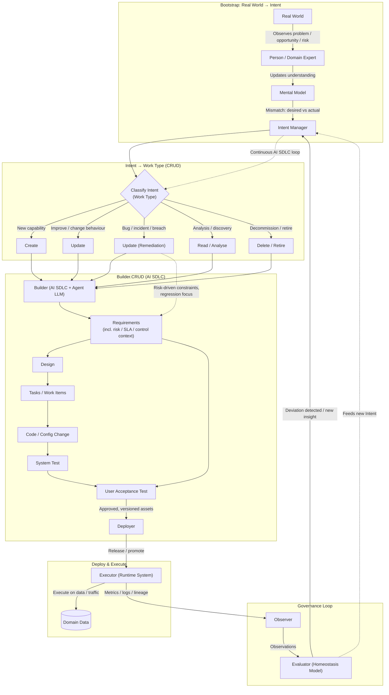

---

## **2.3 Bootstrap: Real World → Intent**

### **2.3.1 What is Bootstrap**

* A **Person / Domain Expert** observes events in the **Real World**.
* Their **Mental Model** compares "expected" vs "actual" outcomes.
* Mismatch generates **Intent** and flows into the **Intent Manager (IM)**.

### **2.3.2 Why Bootstrap Matters**

* Establishes a clear origin story for all change.
* Anchors the system in reality, not in tooling.
* Provides an explicit interface between human judgement and the AI SDLC.

---

## **2.4 Intent Classification into CRUD Work Types**

### **2.4.1 What is Intent Classification**

Intent is classified into five work types:

* **Create** – build something new.
* **Update** – change existing behaviour/functionality.
* **Update (Remediation)** – specific form of Update driven by risk/incident.
* **Read / Analyse** – understand, document, or explore the current state.
* **Delete / Retire** – decommission or consolidate assets.

### **2.4.2 Why Classification Matters**

* Allows different control regimes (e.g. remediation = higher scrutiny).
* Keeps the **Builder stage generic**, with intent type expressed as metadata.
* Makes it easier to reason about portfolio health and lifecycle states.

---

## **2.5 Builder.CRUD (AI SDLC)**

### **2.5.1 What is Builder.CRUD**

All work types are fed into a **single Builder engine** that:

* Uses AI + humans to execute the internal SDLC stages:
  **Requirements → Design → Tasks → Code → System Test → UAT**.
* Applies extra risk controls where necessary (e.g. remediation).

### **2.5.2 Why Builder.CRUD Matters**

* Avoids duplicating SDLC for different work types.
* Keeps governance consistent while still allowing risk-based variation.
* Makes intent classification orthogonal to how we build.

---

## **2.6 Deploy & Execute**

### **2.6.1 What is Deploy & Execute**

* **Deployment** (external CI/CD platform) promotes assets to live environments.
* **Executor** runs these assets against **Domain Data**.

> **Note**: Deployment is handled by external CI/CD platforms (Jenkins, GitLab CI, GitHub Actions, ArgoCD, etc.) and is **outside the AI SDLC scope**. The AI SDLC integrates with any CI/CD platform. See [Section 10.0](#100-runtime-feedback-and-deployment-integration) for details.

### **2.6.2 Why Deploy & Execute Matters**

* Provides a clear separation between building and running.
* Supports multiple runtime targets (batch, streaming, services, UIs).
* Runtime feedback (tagged with requirement keys) closes the loop back to Requirements.

---

## **2.7 Governance Loop**

### **2.7.1 What is Governance Loop**

* **Observer** collects metrics, logs, lineage, and incidents.
* **Evaluator** compares behaviour against a **Homeostasis Model** (target behaviour, SLAs, risk thresholds).
* Deviations emit **new or refined Intent** back into the Intent Manager.

### **2.7.2 Why Governance Loop Matters**

* Creates a **homeostatic system** – always correcting towards desired state.
* Governance is not a one-off gate; it is continuous.

### **2.7.3 The Homeostasis Model and Requirements**

**The homeostasis model IS the Requirements phase output.**

The Governance Loop creates a **self-regulating system** analogous to biological homeostasis (e.g., body temperature regulation). The AI SDLC captures this model explicitly within the **Requirements phase**:

#### **Requirements Define the Homeostasis Model**

The Requirements phase captures three types of requirements that together form the homeostasis model:

1. **Functional Requirements** – Define desired system behavior
   - *Example*: "Users must be able to log in within 2 seconds"
   - *Homeostasis role*: Target functional state

2. **Non-Functional Requirements (NFRs)** – Define quality attributes and constraints
   - *Examples*:
     - Performance: "99.9% uptime" (SLA)
     - Security: "All passwords must be hashed with bcrypt"
     - Scalability: "Support 100k concurrent users"
   - *Homeostasis role*: Target quality thresholds

3. **Data Requirements** – Define data quality, governance, and lineage expectations
   - *Examples*:
     - Data quality: "Customer email addresses must be 95% valid"
     - Data governance: "PII must be encrypted at rest"
     - Data lineage: "All data transformations must be tracked"
   - *Homeostasis role*: Target data health state

#### **How the Homeostasis Loop Works**

```
Requirements Phase
  ↓
Defines Homeostasis Model
  ↓
(Design → Code → Test → Deploy → Execute)
  ↓
Runtime Execution produces Observable Behavior
  ↓
Observer collects metrics/logs/incidents
  ↓
Evaluator compares: Observed Behavior vs. Homeostasis Model
  ↓
Deviation detected?
  ├─ No → System is in homeostasis (desired state)
  └─ Yes → Generate corrective Intent
        ↓
     Intent Manager classifies Intent (Create/Update/Remediation)
        ↓
     Requirements Phase captures NEW requirement
        ↓
     Updates Homeostasis Model
        ↓
     (SDLC loop repeats with updated model)
```

#### **Homeostasis Examples**

**Example 1: Performance Degradation**

| **Phase** | **Activity** |
|-----------|-------------|
| **Requirements (initial)** | NFR: "Login response time < 2 seconds (p95)" |
| **Execute** | System runs in production |
| **Observer** | Detects: Login response time = 5 seconds (p95) |
| **Evaluator** | Deviation: 5s > 2s threshold → Generate Intent: "Performance degradation detected" |
| **Intent Manager** | Classify as: **Update (Remediation)** |
| **Requirements (updated)** | New requirement: "Optimize login query performance" + Update NFR: "Login response time < 1.5 seconds (p95)" |
| **SDLC executes** | Design → Code → Test → Deploy optimized query |
| **Execute** | New system runs with optimization |
| **Observer** | Detects: Login response time = 1.2 seconds (p95) |
| **Evaluator** | Within threshold → **Homeostasis restored** |

**Example 2: Data Quality Issue**

| **Phase** | **Activity** |
|-----------|-------------|
| **Requirements (initial)** | Data Req: "Customer email addresses must be 95% valid" |
| **Execute** | Data pipeline runs in production |
| **Observer** | Detects: Email validation rate = 78% |
| **Evaluator** | Deviation: 78% < 95% threshold → Generate Intent: "Data quality below threshold" |
| **Intent Manager** | Classify as: **Update (Remediation)** |
| **Requirements (updated)** | New requirement: "Add email validation at data ingestion" + Update Data Req: "Email validation must occur at ingestion with rejection logging" |
| **SDLC executes** | Design → Code validation logic → Test → Deploy |
| **Execute** | Pipeline runs with validation |
| **Observer** | Detects: Email validation rate = 97% |
| **Evaluator** | Within threshold → **Homeostasis restored** |

**Example 3: New Business Goal (Proactive Evolution)**

| **Phase** | **Activity** |
|-----------|-------------|
| **Requirements (initial)** | Functional: "Support 10k concurrent users" |
| **Execute** | System runs successfully |
| **Observer** | Detects: Usage growth trend → will hit 10k in 3 months |
| **Evaluator** | Predictive deviation → Generate Intent: "Scale capacity proactively" |
| **Intent Manager** | Classify as: **Create** (new capacity) |
| **Requirements (updated)** | New requirement: "Support 50k concurrent users" + NFR: "Horizontal scaling with Kubernetes" |
| **SDLC executes** | Design → Code → Test → Deploy scaled infrastructure |
| **Execute** | System runs with new capacity |
| **Observer** | Detects: System handles 15k users with headroom |
| **Evaluator** | Ahead of threshold → **Homeostasis maintained proactively** |

#### **Key Insights**

1. **Requirements ARE the homeostasis model** – They define the desired state the system should maintain
2. **Governance Loop is continuous** – Not a one-time gate, but constant observation and correction
3. **Deviations drive new Requirements** – Runtime observations create new intent, which updates the model
4. **Self-regulating system** – Like biological homeostasis, the system self-corrects toward desired state
5. **Requirements evolve** – The homeostasis model is not static; it improves based on feedback

#### **Homeostasis Model as Living Requirements**

Traditional SDLC treats requirements as **fixed specifications** written once at the beginning.

AI SDLC treats requirements as a **living homeostasis model** that:
- Defines target state (functional, quality, data)
- Is continuously compared against runtime behavior
- Evolves based on deviations and insights
- Drives corrective action automatically
- Improves over time through feedback

**This is the fundamental shift**: Requirements become the **control system** for maintaining desired system behavior, not just a static blueprint.

---

# **3.0 AI SDLC Builder Pipeline (Micro View)**

## **3.1 Overview**

### **3.1.1 Scope**
This section zooms into the **Builder.CRUD** box from Figure 2.1 and fully elaborates the AI SDLC stages:

* Requirements
* Design
* Tasks / Work Items
* Code
* System Test
* User Acceptance Test
* Deployment handoff
* Feedback loops into Requirements

---

## **3.2 Figure 3.1 – AI SDLC Builder Pipeline**

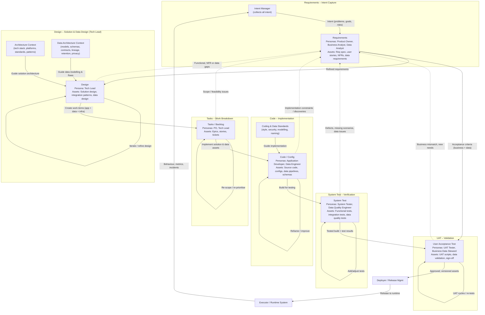

---

## **3.3 How to Read Figure 3.1**

**Figure 3.1** shows the complete AI SDLC Builder Pipeline from intent through to deployment. Here's how to understand it:

### **3.3.1 The Flow: Left to Right, Top to Bottom**

1. **Intent Manager** → **Requirements Stage**: All intents (problems, goals, risks) flow into Requirements, where they are structured into formal requirements with unique keys

2. **Requirements** → **Design Stage**: Requirements drive the Design stage, which is informed by:
   - **Architecture Context**: Technical standards, platforms, patterns
   - **Data Architecture Context**: Data models, schemas, governance rules

3. **Design** → **Tasks Stage**: Design outputs are broken down into work items (epics, stories, tickets) by Product Owners and Tech Leads

4. **Tasks** → **Code Stage**: Developers and data engineers implement the solution, guided by:
   - **Coding & Data Standards**: Style guides, security rules, naming conventions

5. **Code** → **System Test Stage**: Testers verify the implementation with functional, integration, and data quality tests

6. **System Test** → **UAT Stage**: Business users validate that the solution meets their needs, using:
   - Acceptance criteria from Requirements
   - Test results from System Test

7. **UAT** → **Deployer**: Approved assets are handed off for deployment to production

8. **Deployer** → **Runtime System**: Assets are released to the live environment

9. **Runtime System** → **Intent Manager**: Runtime behavior, metrics, and incidents flow back as new intent

### **3.3.2 Feedback Loops (Dotted Arrows)**

The dotted arrows show **backward feedback** when gaps or issues are discovered:

- **Design → Requirements**: Architectural gaps or ambiguities discovered during design
- **Tasks → Requirements**: Scope or feasibility issues during work breakdown
- **Code → Requirements**: Implementation constraints or discoveries during coding
- **System Test → Requirements**: Defects, missing scenarios, or data issues found during testing
- **UAT → Requirements**: Business mismatches or new needs identified during user validation

**Key insight**: Feedback flows back to **Requirements**, not to the previous stage. This ensures the intent store remains the single source of truth.

### **3.3.3 Iteration Within Stages (Self-Loops)**

Several stages show self-loops (arrows back to themselves):

- **Design**: "Iterate / refine design" - multiple design iterations before moving forward
- **Tasks**: "Re-scope / re-prioritise" - work breakdown is adjusted as needed
- **Code**: "Refactor / improve" - code is improved iteratively
- **System Test**: "Add/adjust tests" - tests are refined as defects are found
- **UAT**: "UAT cycles / re-tests" - multiple UAT rounds before approval

---

## **3.4 Stage Context Framework**

### **3.4.1 What is Stage Context?**

**Context** in the AI SDLC refers to the **constraints, standards, templates, and governance rules** that guide how work is performed at each stage.

**Why Context matters**:
- Ensures **consistency**: Everyone follows the same standards
- Enables **quality**: Clear governance and review processes
- Supports **AI augmentation**: AI assistants use context to generate better suggestions
- Maintains **traceability**: Context decisions are documented and version-controlled

### **3.4.2 Context as Stage Constraints**

Each AI SDLC stage operates on the **requirement signal** but applies **stage-specific context** that constrains and guides the transformation:

| Stage Component | Description | Examples |
|----------------|-------------|----------|
| **Persona** | Who performs the work | Product Owner, Tech Lead, Coder, Tester |
| **Input** | Requirement signal + context from prior stages | Requirements + Design docs + Architecture context |
| **Context Constraints** | Rules, standards, patterns, governance that shape the work | Architecture patterns, coding standards, test strategies |
| **Templates** | Reusable structures and formats | Design patterns, code templates, test frameworks |
| **Assets Produced** | Tangible outputs tagged with requirement keys | Design docs, code files, test suites, reports |
| **Governance** | Quality gates, reviews, approvals | Code reviews, test coverage thresholds, sign-offs |

**Explanation of each component**:

- **Persona**: The role responsible for the work ensures accountability and clear ownership
- **Input**: What information the stage needs to begin work
- **Context Constraints**: The rules and standards that must be followed (e.g., "all APIs must use REST", "all passwords must be hashed")
- **Templates**: Starting points that provide structure (e.g., a standard design document template, a code file template)
- **Assets Produced**: The deliverables tagged with requirement keys for traceability
- **Governance**: The checks and approvals required before moving to the next stage

---

### **3.4.3 Context Management Principles**

**How should context be managed?**

Context must be managed with the same rigor as source code:

1. **Version Controlled**: All context (standards, templates, governance rules) must be versioned
   - **Why**: Track what standards were in effect when each asset was created
   - **Example**: If security standards change, you know which code was built under old vs new standards

2. **Explicitly Documented**: No tribal knowledge or implicit assumptions
   - **Why**: New team members can onboard and understand constraints
   - **Example**: "We use PostgreSQL" is documented in architecture context, not just known informally

3. **Hierarchical and Inherited**: Context is organized by scope (organization → team → project → stage)
   - **Why**: Enables reuse and consistency across projects
   - **Example**: Organization security standards apply to all projects; project-specific standards only apply to one project

4. **Referenced, Not Embedded**: Context references external documents rather than duplicating content
   - **Why**: Updates in one place propagate everywhere; avoids inconsistency
   - **Example**: Design stage references the architecture standards document; when standards are updated, all designs use the new version

5. **Governed and Reviewed**: Context changes require appropriate review and approval
   - **Why**: Poor context leads to poor assets; context quality matters
   - **Example**: Security standard changes must be reviewed by security team before adoption

**See Appendix A.5 for detailed context management principles.**

---

# **4.0 Requirements Stage**

## **4.1 Requirements – Overview**

### **4.1.1 What is Requirements**
The Requirements stage is the **intent store**. It translates raw intent into structured requirements, constraints, and acceptance criteria. **Each requirement is assigned a unique, immutable key** (a key that never changes) that provides end-to-end traceability throughout the entire lifecycle.

### **4.1.2 Why Requirements Matter**

* Provides the **authoritative single source** of what the system should do (no conflicting versions across teams or documents)
* Acts as the central hub for **all feedback loops** (all stages feed discoveries back here)
* Ensures that every iteration is anchored in an updated understanding of intent
* **Unique requirement keys** enable full traceability from intent → requirements → design → code → tests → deployment → runtime behavior

---

## **4.2 Requirements – Sub-Diagram**

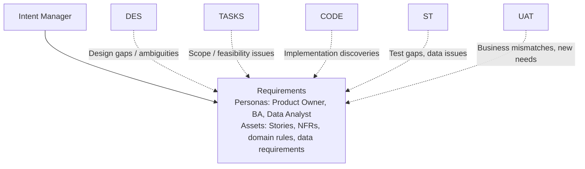

---

## **4.3 Requirements – Detailed Explanation**

### **4.3.1 Personas**

* **Product Owner (PO)** – owns business value, prioritisation, and acceptance criteria.
* **Business Analyst (BA)** – formalises business rules, scenarios, and domain constraints.
* **Data Analyst / Data Steward** – identifies data requirements, quality expectations, and governance constraints.

### **4.3.2 Inputs**

* Intent from **Intent Manager** (problems, goals, risks)
* Discovery results from **"Read / Analyse" work type** (investigations into existing systems, documentation efforts, exploratory analysis)
* Changes from governance, regulatory, or risk teams

### **4.3.3 Outputs**

* **User stories & features** – each with a unique requirement key (e.g., `REQ-001`, `REQ-F-AUTH-001`).
* **Non-functional requirements (NFRs)** – each with unique keys (e.g., `REQ-NFR-PERF-001`).
* **Domain rules and invariants** – each with unique keys (e.g., `REQ-BR-001`).
* **Acceptance criteria for UAT** – linked to parent requirement keys.
* **Data requirements** – each with unique keys (e.g., `REQ-DATA-001`):
  - Data sources and acquisition needs
  - Data quality expectations (completeness, accuracy, timeliness, consistency)
  - Data retention and archival policies
  - Privacy and sensitivity classifications:
    - **PII** (Personally Identifiable Information): name, email, SSN
    - **PHI** (Protected Health Information): medical records, diagnoses
    - Other sensitive data per regulatory requirements
  - **Data lineage** requirements (tracking where data comes from, how it's transformed, and where it goes)
  - Master data and reference data needs

### **4.3.4 Requirement Key Structure**

Requirements use a **unique, immutable key system** for traceability.

> **Note**: The key structure shown below is an **example for this document**. Organizations can use any identifier system that meets their needs:
> - **Hierarchical keys** (e.g., `REQ-F-AUTH-001`)
> - **GUIDs** (e.g., `550e8400-e29b-41d4-a716-446655440000`)
> - **Jira keys** (e.g., `PROJ-1234`)
> - **Sequential IDs** (e.g., `REQ-001`, `REQ-002`)
> - **Custom naming conventions** specific to your organization
>
> The critical requirement is that each key is **unique and immutable** to enable traceability throughout the lifecycle.

**Example Structure** (used throughout this document):

```
REQ-{TYPE}-{DOMAIN}-{SEQUENCE}

Examples:
- REQ-F-AUTH-001     (Functional: Authentication, sequence 001)
- REQ-NFR-PERF-001   (Non-Functional: Performance, sequence 001)
- REQ-DATA-CQ-001    (Data: Quality, sequence 001)
- REQ-BR-CALC-001    (Business Rule: Calculation, sequence 001)
```

**Key Properties** (regardless of structure chosen):
* **Unique** – Each requirement has a distinct identifier
* **Immutable** – Once assigned, the key never changes (even if requirement is refined)
* **Versioned** – Refinements create new versions: `REQ-F-AUTH-001 v2` (or version tracked separately)
* **Traceable** – All downstream artifacts (design, code, tests, deployments) reference the requirement key
* **Auditable** – Changes tracked with timestamp, author, and reason

### **4.3.5 Why This Stage is Critical**

* Requirements are the **only authoritative source** that UAT uses to determine if the system is correct (UAT validates against Requirements, not against informal conversations or emails)
* All other stages push **discovered gaps back to Requirements**, avoiding silent drift where different teams have different understandings
* **Unique requirement keys** enable auditors and governance bodies to trace behavior to intent across the entire lifecycle
* Requirement keys provide **bi-directional traceability**: from intent forward to deployed code, and from runtime issues backward to originating requirements

---

## **4.4 Requirements Stage Context**

### **4.4.1 Context Constraints**

Requirements are shaped by:
* **Regulatory context** – compliance requirements, data privacy laws:
  - **GDPR** (General Data Protection Regulation): EU data privacy law
  - **CCPA** (California Consumer Privacy Act): California data privacy law
  - **HIPAA** (Health Insurance Portability and Accountability Act): US healthcare data privacy law
* **Business context** – strategic goals, market conditions, competitive landscape
* **Domain context** – industry-specific rules, domain knowledge, business processes
* **Risk context** – risk appetite, security requirements, audit requirements

### **4.4.2 Templates**

**What templates does the Requirements stage use?**

Requirements stage templates provide consistent structure for capturing intent:

* **User Story Template**
* **Non-Functional Requirements (NFR) Template**
* **Data Requirements Template**
* **Business Rules Template**

**User Story Template** should contain:
- User story in standard format with requirement key:
  - **Given/When/Then** format: "Given [context], When [action], Then [outcome]"
  - **As-a/I-want/So-that** format: "As a [persona], I want [capability], So that [benefit]"
- Acceptance criteria linked to requirement key
- Non-functional requirements (performance, security, data quality)
- Regulatory considerations and dependencies

### **4.4.3 Assets Produced**

| Asset Type | Description | Tagged With |
|-----------|-------------|-------------|
| User Stories | Functional requirements | REQ-F-* keys |
| NFRs | Non-functional requirements | REQ-NFR-* keys |
| Data Requirements | Data-specific needs | REQ-DATA-* keys |
| Business Rules | Domain logic | REQ-BR-* keys |
| Acceptance Criteria | UAT validation points | Linked to parent REQ keys |

### **4.4.4 Governance**

**What are Quality Gates?** Quality gates are checkpoints that requirements must pass before moving to the next stage. They ensure requirements meet minimum quality standards.

* **Quality Gates** (requirements must pass all checks):
  - All requirements have unique keys
  - All requirements have acceptance criteria
  - All requirements reviewed by Product Owner
  - Data requirements reviewed by Data Steward
  - Compliance requirements reviewed by Compliance Officer

* **Traceability** (audit trail requirements):
  - Each requirement traces to originating intent
  - Each requirement has clear ownership (who is accountable)
  - Changes tracked with version history (what changed, when, why, by whom)

---

# **5.0 Design Stage**

## **5.1 Design – Overview**

### **5.1.1 What is Design**
The Design stage transforms Requirements into an **implementable technical and data solution**, owned by the **Tech Lead**.

### **5.1.2 Why Design Matters**

* Aligns business intent with architectural and platform constraints.
* Makes trade-offs explicit (performance vs cost vs complexity).
* Ensures both **application** and **data** views are designed coherently.

---

## **5.2 Design – Sub-Diagram**

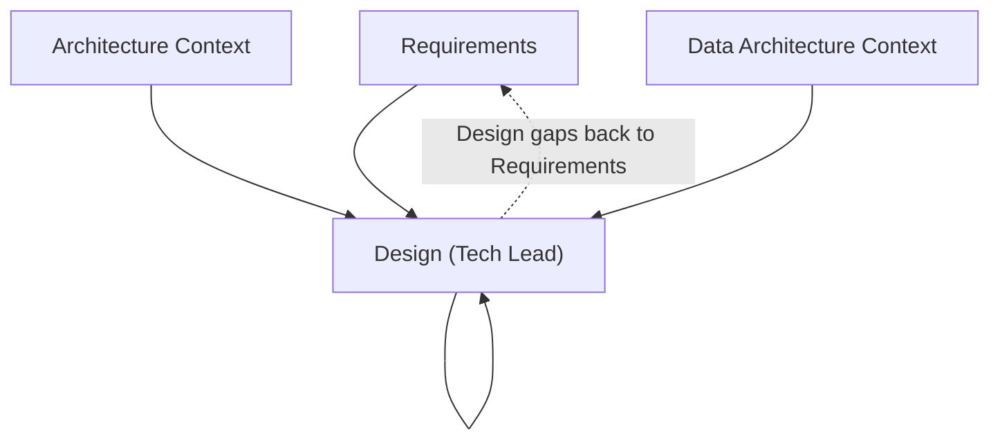

---

## **5.3 Design – Detailed Explanation**

### **5.3.1 Persona**

* **Tech Lead** – single accountable persona for solution and data design.

### **5.3.2 Context Inputs**

* **Architecture Context** – platforms, tech stack, service patterns, security standards.
* **Data Architecture Context** – data models, schemas, contracts, lineage, retention, privacy.

### **5.3.3 Outputs**

* **Component diagrams, sequence flows** – annotated with requirement keys they satisfy.
* **Data architecture artifacts**:
  - Conceptual, logical, and physical data models (tagged with requirement keys)
  - Data flow diagrams (batch and streaming)
  - Storage technology choices (RDBMS, NoSQL, data lake, warehouse)
  - Data partitioning and sharding strategies
  - Schema evolution and versioning plans
  - Data integration patterns (ETL, ELT, CDC, event streaming)
  - Data access patterns and query optimization
* **Integration patterns and APIs** – documented with requirement key mappings.
* **Security and compliance considerations** (encryption, masking, access controls) – linked to NFR requirement keys.
* **Design-to-Requirement traceability matrix** – maps design components to requirement keys:
  ```
  Component: AuthenticationService
  Satisfies: REQ-F-AUTH-001, REQ-NFR-SEC-001

  Data Model: CustomerProfile
  Satisfies: REQ-DATA-001, REQ-DATA-CQ-001, REQ-BR-CALC-001
  ```

### **5.3.4 Why Design Iterates**

* Early designs expose missing requirements or contradictions.
* Data considerations (lineage, governance) often reveal regulatory gaps.
* Iteration here is **cheaper** than in Code/UAT.

---

## **5.4 Design Stage Context**

### **5.4.1 Context Constraints**

Design is constrained by:
* **Architecture context** – approved tech stack, platform choices, architectural patterns
* **Data architecture context** – data modeling standards, storage technologies, integration patterns
* **Performance context** – latency requirements, throughput targets, scalability needs
* **Security context** – authentication/authorization patterns, encryption standards, audit requirements
* **Cost context** – infrastructure budgets, operational cost targets

### **5.4.2 Templates**

Templates stored in AI_SDLC_Context reference:
- Stage-specific templates (user stories, designs, tasks, code, tests, deployment plans)
- Context constraints (standards, patterns, approved tools)
- Governance rules (quality gates, approval workflows)

**Component Design Template** should contain:
- Component overview with requirement keys it satisfies
- Architecture pattern reference, tech stack, API design
- Data model and storage design with data quality rules
- Integration points, NFR considerations (performance, security, scalability)
- Explicit trade-offs and compliance checklist

### **5.4.3 Assets Produced**

| Asset Type | Description | Tagged With |
|-----------|-------------|-------------|
| Component Designs | Service/module specifications | Requirement keys |
| Data Models | Entity-relationship diagrams, schemas | REQ-DATA-* keys |
| API Specifications | REST/GraphQL/gRPC contracts | REQ-F-* keys |
| Data Flow Diagrams | Data movement and transformations | REQ-DATA-* keys |
| Integration Specs | System-to-system interfaces | REQ-F-* keys |
| Architecture Decision Records (ADRs) | Design decisions and rationale | Requirement keys |

### **5.4.4 Governance**

* **Quality Gates**:
  - Design adheres to approved architectural patterns
  - All components mapped to requirement keys
  - Data models follow data architecture standards
  - Security patterns applied per security context
  - Performance targets specified per NFRs
  - Cost estimates within budget constraints

* **Reviews**:
  - Architecture review (patterns, tech stack compliance)
  - Data architecture review (models, integration patterns)
  - Security review (threat modeling, controls)
  - Performance review (capacity planning)

---

# **6.0 Tasks / Work Breakdown Stage**

## **6.1 Tasks – Overview**

### **6.1.1 What are Tasks**
Converts design into a set of **actionable work items** (epics, stories, tasks) that can be implemented and tracked.

### **6.1.2 Why Tasks Matter**

* Enables planning, estimation, and prioritisation.
* Makes dependencies and workloads visible.
* Integrates with delivery tooling (Jira, Azure DevOps, etc.).

---

## **6.2 Tasks – Sub-Diagram**

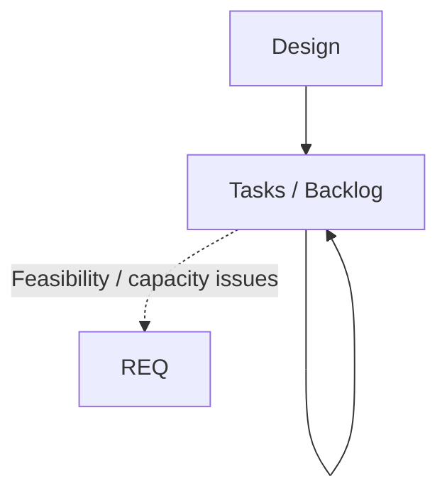

---

## **6.3 Tasks – Detailed Explanation**

### **6.3.1 Personas**

* **Product Owner** – prioritises based on value.
* **Tech Lead** – shapes the technical breakdown.

### **6.3.2 Outputs**

* **User stories with technical subtasks** – each task tagged with requirement keys it implements:
  ```
  Task: TASK-001 - Implement user login
  Implements: REQ-F-AUTH-001, REQ-NFR-SEC-001
  ```
* **Data engineering tasks** (all tagged with requirement keys):
  - Data pipeline development (ingestion, transformation, aggregation)
  - Schema creation and migration scripts
  - Data quality rule implementation
  - Master data management setup
  - Reference data loading
  - Data lineage tracking implementation
  - Data catalog population
  - Data access and security configuration
* **Application development tasks** (tagged with functional requirement keys).
* **Testing tasks** (tagged with the requirements they validate):
  - Functional tests
  - Integration tests
  - Data quality tests
  - Performance benchmarks
* **Infrastructure and DevOps tasks** (tagged with NFR requirement keys).

### **6.3.3 Why Feedback to Requirements**

* If work cannot be done within constraints (time, budget, technical feasibility),
  Requirements must change to reflect reality.

---

## **6.4 Tasks Stage Context**

### **6.4.1 Context Constraints**

Task breakdown is constrained by:
* **Capacity context** – team size, skill availability, sprint capacity
* **Workload context** – existing commitments, competing priorities
* **Estimation context** – velocity data, historical metrics, complexity factors
* **Dependency context** – external dependencies, blocking issues, technical constraints
* **Tooling context** – Jira, Azure DevOps, project management standards

### **6.4.2 Templates**

Templates stored in AI_SDLC_Context reference:
- Stage-specific templates (user stories, designs, tasks, code, tests, deployment plans)
- Context constraints (standards, patterns, approved tools)
- Governance rules (quality gates, approval workflows)

**Task Template** should contain:
- Task ID and requirement keys it implements
- Task type (feature, data, bug fix, tech debt), description, acceptance criteria
- Technical approach, dependencies, estimation (story points/hours)
- Data considerations (sources, quality, volume)
- Subtasks breakdown and notes

### **6.4.3 Assets Produced**

| Asset Type | Description | Tagged With |
|-----------|-------------|-------------|
| Epics | High-level features spanning multiple sprints | Requirement keys |
| User Stories | Deliverable functionality from user perspective | REQ-F-* keys |
| Technical Tasks | Infrastructure, refactoring, tech debt | REQ-NFR-* keys |
| Data Tasks | Data pipelines, models, quality checks | REQ-DATA-* keys |
| Bugs | Defect fixes | Original requirement keys |
| Spikes | Research and investigation tasks | Requirement keys |

### **6.4.4 Governance**

* **Quality Gates**:
  - All tasks linked to requirement keys
  - All tasks estimated (story points or hours)
  - All tasks have clear acceptance criteria
  - Dependencies identified and tracked
  - Capacity vs demand validated
  - Critical path identified

* **Planning Ceremonies**:
  - Backlog refinement (estimation, clarification)
  - Sprint planning (capacity allocation)
  - Daily standups (progress tracking)
  - Retrospectives (velocity improvement)

---

# **7.0 Code Stage (TDD-Driven)**

## **7.1 Code – Overview**

### **7.1.1 What is Code Stage**

The Code stage creates executable artifacts using **Test-Driven Development (TDD)**. Developers and AI agents write **tests first**, then implement code to pass those tests.

**TDD Purpose**: Ensure code correctness at the component level through fast, automated unit tests.

### **7.1.2 Why TDD Matters**

* **Constrains AI agents**: Tests define exact behavior before code is written
* **Enables safe refactoring**: Tests protect against breaking changes during iteration
* **Documents intent**: Tests show how code should be used
* **Fast feedback**: Unit tests run in milliseconds, enabling rapid iteration
* **Facilitates discovery**: TDD cycles support solution discovery within requirements constraints

### **7.1.3 TDD vs BDD**

**TDD (This Section - Code Stage)**:
- **Focus**: Internal code correctness (unit/component level)
- **Language**: Technical assertions, mocking, test frameworks
- **Audience**: Developers and AI agents
- **Scope**: Functions, methods, classes
- **Speed**: Milliseconds (isolated unit tests)

**BDD (Sections 8 & 9 - System Test & UAT)**:
- **Focus**: External system behavior (integration/end-to-end)
- **Language**: Business-readable scenarios (Given/When/Then)
- **Audience**: Testers (Section 8) and business users (Section 9)
- **Scope**: Features, user journeys, business rules
- **Speed**: Seconds to minutes (integrated tests)

---

## **7.2 TDD Cycle (The Core Development Loop)**

### **7.2.1 Overview**

Every code change follows the **RED → GREEN → REFACTOR** cycle:

```
Requirements (REQ-F-AUTH-001)
  ↓
[TDD CYCLE]
  ↓
RED: Write failing test that validates requirement
  ↓ (Test fails - no implementation yet)
GREEN: Write minimal code to pass test
  ↓ (Test passes - requirement met)
REFACTOR: Improve code quality while keeping tests green
  ↓ (Tests still pass - code improved)
COMMIT: Save with requirement traceability
  ↓
[Repeat for next requirement or edge case]
```

### **7.2.2 RED Phase: Write Failing Test First**

**Requirements**:
- Write test before any implementation code
- Test must validate a specific requirement
- Test must fail when run (proves it's testing something)
- Tag test with requirement keys

**Example** (concept only - no code):
- Test: `test_hash_password_uses_bcrypt()` validates REQ-F-AUTH-001
- Expected result: Test FAILS (function doesn't exist yet)

### **7.2.3 GREEN Phase: Write Minimal Code**

**Requirements**:
- Write simplest code that makes test pass
- No premature optimization
- Focus on correctness first
- All tests must pass

**Purpose**: Proves test validates requirement; establishes baseline for refactoring

### **7.2.4 REFACTOR Phase: Improve Quality**

**What can be improved**:
- Code structure and organization
- Performance optimization
- Pattern application
- Error handling
- Documentation

**Constraint**: All tests must remain green (passing)

### **7.2.5 COMMIT Phase: Save with Traceability**

**Commit must include**:
- Requirement keys in commit message
- Description of what was implemented
- TDD phase indicators (RED → GREEN → REFACTOR)
- Test coverage metrics

### **7.2.6 Multiple TDD Cycles per Requirement**

Complex requirements need multiple cycles:
- Cycle 1: Core functionality
- Cycle 2: Error handling
- Cycle 3: Edge cases
- Cycle 4: Performance optimization
- Integration: Combine cycles, validate interactions

---

## **7.3 AI Agent TDD Constraints**

### **7.3.1 Mandatory TDD Rules**

AI agents **must** follow these constraints:

1. **No code without tests first**
   - Cannot write implementation until test exists and fails
   - Test must be executed and confirmed failing

2. **One cycle at a time**
   - Complete RED → GREEN → REFACTOR before next cycle
   - Commit after each complete cycle

3. **Test coverage gates**
   - Minimum 80% line coverage
   - All public methods must have tests
   - Critical paths (security, data) require 100% coverage

4. **Tests must be meaningful**
   - Test behavior, not implementation details
   - Include edge cases and error conditions
   - Tag with requirement keys

5. **Refactoring preserves green**
   - All existing tests must pass after refactoring
   - Can add tests, cannot remove tests
   - Cannot weaken assertions

### **7.3.2 Agent Work Unit Execution with TDD**

From Section 6 agent orchestration, agents execute TDD cycles:

**Agent receives work unit** → **Executes TDD**:
1. Analyze requirement → identify test scenarios
2. RED: Generate failing test
3. Validate: Test fails (no implementation)
4. GREEN: Implement minimal code
5. Validate: Test passes
6. REFACTOR: Improve code quality
7. Validate: Tests still pass, coverage ≥ threshold
8. COMMIT: Save with requirement keys
9. Report: Update Jira ticket (Section 6.4)

---

## **7.4 Code Stage Outputs**

### **7.4.1 Personas**

* **Application Developer** – implements application logic with TDD
* **Data Engineer** – implements data pipelines with TDD
* **AI Agents** – execute TDD cycles autonomously per work units (Section 6.3)

### **7.4.2 Code Assets with Unit Tests**

**Application code**:
- Services, APIs, business logic with requirement keys in docstrings
- Type-safe models and interfaces
- Error handling and logging

**Unit tests** (TDD):
- Test files co-located with code
- Tests tagged with requirement keys
- Coverage ≥ 80%, critical paths 100%

**Data assets**:
- Data pipeline code (ingestion, transformation, aggregation)
- SQL/stored procedures with requirement keys
- Schema definitions and migration scripts
- Data quality validation logic

**Infrastructure-as-code**:
- Platform configurations tagged with NFR keys
- Storage and network provisioning
- CI/CD pipeline definitions

---

## **7.5 Iteration Within Build Loop**

### **7.5.1 Inner Loop: TDD Cycles (Agent Autonomous)**

Agents iterate rapidly within TDD without human intervention:

```
Design → Agent Work Unit
  ↓
[AGENT AUTONOMOUS ITERATION]
  TDD Cycle 1: Core feature
  TDD Cycle 2: Error handling
  TDD Cycle 3: Edge cases
  TDD Cycle 4: Performance optimization
[END AUTONOMOUS]
  ↓
All cycles complete → Report status to Section 6
```

### **7.5.2 When to Escalate**

**Escalate to Design (Section 5)** when:
- Design is ambiguous (can't write clear test)
- Design approach doesn't work (tests can't pass with current architecture)
- Performance NFRs can't be met with current design

**Escalate to Requirements (Section 4)** when:
- Requirement is contradictory (tests for two requirements conflict)
- Technical impossibility (requirement can't be implemented)
- External dependency blocking (requirement assumes unavailable system)

---

## **7.6 Code Stage Context**

### **7.6.1 Context Constraints**

Code implementation is constrained by:
* **TDD context** – Test frameworks (pytest, JUnit, Jest), mocking libraries, coverage tools (≥ 80%)
* **Coding standards context** – Style guides, linting rules, formatting conventions
* **Technology context** – Approved languages, frameworks, libraries, versions
* **Security context** – Secure coding practices, OWASP guidelines, vulnerability scanning
* **Data standards context** – Schema naming conventions, data type standards, SQL style guides

### **7.6.2 Templates**

**Code template requirements**:
- Module docstring with requirement keys
- Type-safe models with data requirement keys
- Public methods with requirement keys in docstrings
- Unit test template with test-to-requirement mapping

### **7.6.3 Assets Produced**

| Asset Type | Description | Tagged With |
|-----------|-------------|-------------|
| Application Code | Services, APIs, business logic | REQ-F-* keys in docstrings |
| Unit Tests (TDD) | Component-level tests | Requirement keys |
| Data Pipeline Code | ETL, streaming, transformations | REQ-DATA-* keys |
| SQL Scripts | Queries, stored procedures, migrations | REQ-DATA-*, REQ-BR-* keys |
| Infrastructure Code | Terraform, K8s manifests | REQ-NFR-* keys |

### **7.6.4 Governance**

**TDD Quality Gates**:
- ✅ All code has corresponding unit tests (TDD cycle followed)
- ✅ All tests pass (GREEN)
- ✅ Unit test coverage ≥ 80% (critical paths 100%)
- ✅ Code follows coding standards (linting passes)
- ✅ Security scan clean (no critical vulnerabilities)
- ✅ All requirement keys documented in code and tests
- ✅ Git history shows RED → GREEN → REFACTOR commits

**TDD Audit Trail**:
- Tests committed before implementation
- Requirement keys in all test docstrings
- Coverage reports linked to requirements

---

# **8.0 System Test Stage (BDD-Driven)**

## **8.1 System Test – Overview**

### **8.1.1 What is System Test**

The System Test stage verifies **system behavior** using **Behavior-Driven Development (BDD)**. Testers write scenarios in business language (Given/When/Then) that validate the integrated system.

**BDD Purpose**: Ensure the system behaves correctly from an external perspective, validating business requirements through executable, business-readable specifications.

### **8.1.2 Why BDD Matters**

* **Business-readable**: Non-technical stakeholders can understand test scenarios
* **Requirements validation**: BDD scenarios directly map to and validate requirements
* **Integration testing**: Tests system components working together
* **Living documentation**: BDD scenarios document expected system behavior
* **Regression safety net**: Automated BDD scenarios catch breaking changes

### **8.1.3 BDD vs TDD**

**TDD (Section 7 - Completed)**:
- Developer/agent focused
- Unit tests (fast, isolated)
- Technical assertions
- Focus: Code correctness

**BDD (This Section - System Test)**:
- Tester focused
- Integration/system tests (integrated components)
- Business scenarios (Given/When/Then)
- Focus: System behavior

**BDD (Section 9 - UAT)**:
- Business user focused
- End-to-end user journeys
- Pure business language
- Focus: User acceptance

---

## **8.2 BDD Scenario Structure**

### **8.2.1 Given/When/Then Format**

All BDD scenarios use business-readable format:

**Structure**:
- **Feature**: High-level capability being tested
- **Background**: Common setup for all scenarios
- **Scenario**: Specific test case in Given/When/Then format
- **Tags**: Requirement keys for traceability

**Gherkin syntax** (example structure):
```
Feature: User Authentication
  # Validates: REQ-F-AUTH-001, REQ-NFR-SEC-001

  Scenario: Successful authentication with valid credentials
    Given a user exists with username "testuser" and password "ValidPass123!"
    When the user attempts to authenticate
    Then authentication succeeds
    And a valid session token is returned
    And the token expires in 3600 seconds
```

### **8.2.2 Scenario Types**

**Functional scenarios** (REQ-F-* requirements):
- Happy path flows
- Error handling
- Edge cases

**Integration scenarios** (system interactions):
- Service-to-service communication
- API contracts
- Message flows

**Data quality scenarios** (REQ-DATA-CQ-* requirements):
- Completeness validation
- Accuracy checks
- Consistency verification
- Timeliness requirements

**Performance scenarios** (REQ-NFR-PERF-* requirements):
- Load testing
- Response time validation
- Throughput requirements

---

## **8.3 System Test – Detailed Explanation**

### **8.3.1 Personas**

* **System Tester / QA Engineer** – writes and executes BDD scenarios for functional and integration testing
* **Data Quality Engineer** – writes BDD scenarios for data validation and compliance

### **8.3.2 BDD Test Automation**

**BDD frameworks**: Behave (Python), Cucumber (Java/JS), SpecFlow (.NET)

**Step definitions**: Implement Given/When/Then steps in code
- Given steps: Setup/preconditions
- When steps: Actions/operations
- Then steps: Assertions/validations

**Execution**: Automated BDD scenarios run in CI/CD pipeline

### **8.3.3 Requirement Coverage Reporting**

System Test produces **requirement coverage reports**:
- Which requirements have BDD scenarios
- Scenario pass/fail status per requirement
- Coverage gaps (requirements without scenarios)

**Example coverage report**:
```
REQ-F-AUTH-001: ✅ Covered (3 scenarios, all passing)
REQ-NFR-PERF-001: ✅ Covered (2 scenarios, all passing)
REQ-DATA-CQ-001: ⚠️  Covered (4 scenarios, 1 failing)
REQ-BR-CALC-001: ❌ Not covered (no scenarios)
```

### **8.3.4 Why Feedback to Requirements**

**Coverage gaps drive action**:
- Missing scenarios → Create requirements or add scenarios
- Failing scenarios → Defects or requirement clarification needed
- Ambiguous scenarios → Requirements need refinement

**Common feedback triggers**:
- Requirements incomplete or contradictory
- Missing NFRs (performance, security)
- Data quality thresholds unspecified
- Integration assumptions invalid

---

## **8.4 System Test Stage Context**

### **8.4.1 Context Constraints**

**BDD context**:
- BDD frameworks (Behave, Cucumber, SpecFlow)
- Gherkin scenario writing standards
- Step definition libraries
- Test environments (staging, pre-prod)

**Test execution context**:
- Automated regression testing
- Performance baselines (NFR thresholds)
- Data quality thresholds
- Test data provisioning strategies

### **8.4.2 Templates**

**BDD Feature template**:
- Feature description with requirement keys
- Background setup (common preconditions)
- Scenario structure (Given/When/Then)
- Tags for requirement traceability

**Step definition template**:
- Given/When/Then implementations
- Requirement key annotations
- Reusable step patterns

### **8.4.3 Assets Produced**

| Asset Type | Description | Tagged With |
|-----------|-------------|-------------|
| BDD Feature Files | Gherkin scenarios | Requirement keys in comments |
| Step Definitions | Automated test implementations | Requirement keys |
| Test Reports | Scenario execution results | Requirement coverage |
| Coverage Matrix | Scenario-to-requirement mapping | All requirement keys |
| Defect Reports | Bug tracking | Original requirement keys |

### **8.4.4 Governance**

**BDD Quality Gates**:
- ✅ All requirements have ≥ 1 BDD scenario
- ✅ All scenarios pass (or failures documented with tickets)
- ✅ Requirement coverage ≥ 95%
- ✅ No critical defects open
- ✅ Performance scenarios meet NFRs
- ✅ Data quality scenarios pass
- ✅ QA Lead approves test summary

---

# **9.0 User Acceptance Test Stage (BDD-Driven)**

## **9.1 UAT – Overview**

### **9.1.1 What is UAT**

User Acceptance Test validates that the system meets **business expectations** through **BDD scenarios written in pure business language**. Business users confirm the system solves their problems using Given/When/Then scenarios they can read and approve.

**UAT BDD Purpose**: Business stakeholders validate functionality through scenarios in plain language, with no technical jargon.

### **9.1.2 Why UAT BDD Matters**

* **Business validation**: Users confirm system meets their needs in their language
* **Plain language**: Scenarios use business terms, not technical terms
* **Acceptance criteria**: BDD scenarios ARE the acceptance criteria
* **Sign-off**: Passing scenarios = approved requirements, ready for deployment

### **9.1.3 UAT BDD vs System Test BDD**

**System Test BDD (Section 8)**:
- Written by: QA Engineers
- Focus: Technical integration and system behavior
- Language: Some technical detail acceptable
- Audience: Testers and developers

**UAT BDD (This Section)**:
- Written by: Business Analysts with user input
- Focus: User journeys and business value
- Language: Pure business terms only
- Audience: Business users and stakeholders

---

## **9.2 UAT – Sub-Diagram**

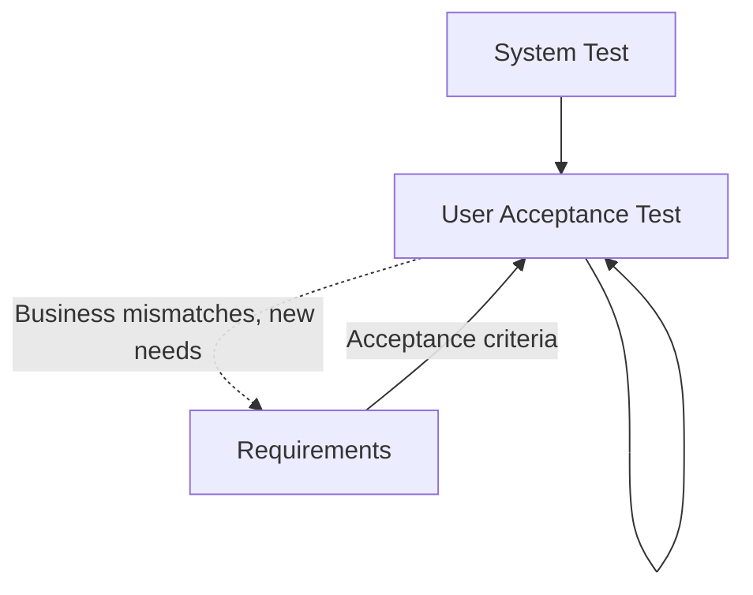

---

## **9.3 UAT – Detailed Explanation**

### **9.3.1 Personas**

* **UAT Tester / Business SME** – creates UAT test cases, validates business functionality and user workflows.
* **Business Data Steward** – validates data correctness, completeness, and business rule compliance.
* **QA Engineer** – translates UAT test cases into automated tests and automated data tests.

### **9.3.2 Inputs**

* Tested build from System Test.
* System test results (functional and data quality test outcomes).
* Acceptance criteria derived from Requirements (functional and data).
* Representative production-like data for testing.

### **9.3.3 UAT Test Development Process**

UAT involves **three parallel activities**:

1. **Manual UAT Test Cases**: Business SMEs create business scenario test cases
   - Written in business language (Given/When/Then)
   - Tagged with requirement keys
   - Used for manual validation by business users
   - Example: "As a customer, when I log in with valid credentials, I should see my dashboard"

2. **Automated UAT Tests**: QA Engineers translate UAT test cases into automated tests
   - Converts business scenarios into executable test code
   - Uses BDD frameworks (Cucumber, Behave) to maintain business readability
   - Tagged with same requirement keys as manual UAT test cases
   - Example:
     ```python
     # Automated from UAT test case
     # Validates: REQ-F-AUTH-001
     @given('a customer with valid credentials')
     @when('they log in')
     @then('they should see their dashboard')
     def test_customer_login():
         # Automated test implementation
     ```

3. **Automated Data Tests**: QA Engineers create data validation tests
   - Tests data quality, reconciliation, business rules
   - Uses data testing frameworks (Great Expectations, dbt tests)
   - Tagged with data requirement keys
   - Example:
     ```python
     # Validates: REQ-DATA-CQ-001
     def test_customer_data_completeness():
         assert customer_data.completeness_rate >= 0.95
     ```

### **9.3.4 Outputs**

* **UAT Test Cases** (manual business scenarios):
  - Business-readable test scenarios
  - Tagged with requirement keys
  - Used for manual business validation
* **Automated UAT Tests** (executable code from UAT test cases):
  - BDD-style automated tests
  - Maintain traceability to UAT test cases and requirement keys
  - Can be run continuously in CI/CD
* **Automated Data Tests** (executable data validation code):
  - Data quality validation scripts
  - Business rule validation tests
  - Data reconciliation tests
  - Tagged with data requirement keys
* **UAT results per requirement key**:
  ```
  REQ-F-AUTH-001: ✅ Accepted (User login meets business expectations)
  REQ-NFR-PERF-001: ✅ Accepted (Response time < 2s as required)
  REQ-DATA-CQ-001: ❌ Rejected (Data completeness below 95% threshold)
  ```
* **Data acceptance validation** (mapped to data requirement keys):
  - Business users confirm data accuracy and completeness
  - Data reconciliation reports (source vs target)
  - Data usability feedback (can users find and understand the data?)
  - Business rule validation results
* **Formal sign-off for both application and data delivery**:
  - Sign-off document lists all requirement keys and their acceptance status
  - Only requirements marked "Accepted" proceed to deployment
  - Rejected requirements trigger feedback loop to Requirements stage

### **9.3.4 Why Feedback to Requirements**

* UAT often reveals **latent intent** not fully captured earlier.
* Business conditions may have evolved since requirements were authored.
* **Data-specific feedback**:
  - Business users identify missing data elements or calculations
  - Data definitions or business rules need clarification
  - Data granularity or aggregation levels need adjustment
  - Data access patterns don't match business workflows
* Feeds into the next iteration of the AI SDLC.

---

## **9.4 UAT – Stage Context**

### **9.4.1 Context Constraints**

The UAT stage operates within these constraints:

* **Business Context**: Business domain knowledge, business rules, operational workflows
* **User Personas**: End user types, skill levels, accessibility requirements
* **UAT Environment**: Production-like environment with representative data
* **Acceptance Criteria**: Testable business outcomes defined in Requirements
* **Business Sign-off Process**: Approval workflows, stakeholder sign-off authorities
* **Data Validation Context**: Business data quality expectations, data reconciliation procedures
* **Business Timing**: Release windows, business cycles, seasonal considerations
* **Regulatory Context**: Compliance requirements, audit trail requirements

### **9.4.2 Templates**

Templates stored in AI_SDLC_Context reference:
- UAT strategy, user scenarios, user personas (end users, analysts, stewards)
- UAT templates (plans, scripts, checklists), data validation procedures
- Sign-off process, UAT environment, governance (entry/exit criteria, escalation)

**UAT Script Template** should contain:
- Requirements validated, business scenario (As-a/I-want/So-that), prerequisites
- Test steps with expected results, data validation checks
- Business user feedback, issues log, acceptance decision, sign-off

**Data Validation Template** should contain:
- Requirements validated, source-to-target reconciliation, business rule validation
- Data quality validation (completeness, accuracy, timeliness)
- Business user validation (usability, spot checks), issues log, data acceptance decision

### **9.4.3 Assets Produced**

| Asset Type | Description | Tagged With |
|-----------|-------------|-------------|
| UAT Plan | Overall UAT strategy and schedule | Requirement keys |
| UAT Scripts | Detailed user scenarios and test steps | REQ-F-*, REQ-BR-* keys |
| Data Validation Reports | Reconciliation and data quality results | REQ-DATA-*, REQ-DATA-CQ-* keys |
| UAT Test Results | Pass/fail status per scenario | Requirement keys |
| Business Feedback | Usability and business value feedback | Linked to requirement keys |
| Issues Log | Defects and gaps identified during UAT | Original requirement keys |
| Sign-off Document | Formal acceptance with requirement traceability | All requirement keys |

### **9.4.4 Governance**

* **Quality Gates**:
  - Entry criteria met (system test complete, UAT environment ready)
  - All critical business scenarios tested
  - Data validation and reconciliation complete
  - Business sign-off obtained for all requirements
  - No open critical or high severity UAT defects
  - User training completed (if applicable)
  - Deployment readiness checklist complete

* **UAT Execution Checklist**:
  - [ ] Entry criteria validated
  - [ ] UAT environment prepared and validated
  - [ ] Production-like data loaded
  - [ ] Business SMEs and data stewards available
  - [ ] UAT scripts reviewed and approved
  - [ ] All planned scenarios executed
  - [ ] Data validation complete
  - [ ] Data reconciliation reports reviewed
  - [ ] Business feedback documented
  - [ ] Issues logged and triaged
  - [ ] Acceptance decision documented
  - [ ] Sign-off obtained from all stakeholders
  - [ ] Exit criteria met

* **Sign-off Requirements**:
  - **Business SME**: Validates functional behavior and business value
  - **Business Data Steward**: Validates data quality and business rule compliance
  - **UAT Lead**: Confirms all UAT activities complete
  - **Compliance Officer** (if applicable): Validates regulatory requirements

* **Escalation Process**:
  - **Critical issues**: Escalate immediately to Product Owner and stakeholders
  - **High issues**: Escalate within 24 hours, assess deployment impact
  - **Medium/Low issues**: Document for backlog, assess if deployment blockers
  - **Data quality issues**: Escalate to Data Steward and determine business risk

---

# **10.0 Runtime Feedback and Deployment Integration**

## **10.1 Overview**

**Deployment** (the actual CI/CD mechanics of releasing code and data to production) is handled by external release platforms and is **outside the scope of the AI SDLC**. The AI SDLC is **platform-agnostic** and can integrate with any CI/CD system (Jenkins, GitLab CI, GitHub Actions, ArgoCD, etc.).

The AI SDLC's concern with deployment is:
1. **Requirement key tracking** in release manifests
2. **Runtime feedback** with requirement key tagging to close the loop

## **10.2 Deployment Integration**

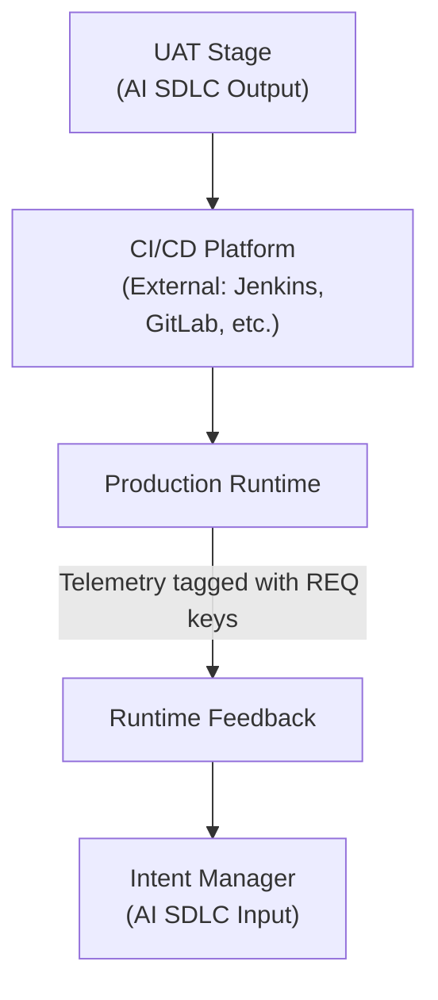

### **10.2.1 Release Manifest with Requirement Keys**

When deploying, the CI/CD platform should track which requirement keys are being deployed.

**Release manifest structure**:
- Release identifier (version/tag)
- Deployment date
- List of requirement keys with versions
- Example: `v2.5.0: REQ-F-AUTH-001 (v1), REQ-NFR-PERF-001 (v2), REQ-DATA-001 (v1)`

**Purpose**: Enables deployment-to-requirement traceability for audit and impact analysis.

### **10.2.2 Runtime Feedback Loop**

**Critical for AI SDLC**: Production runtime must tag telemetry and issues with requirement keys to close the feedback loop.

**Application Telemetry** (tagged with requirement keys):
- Logs, metrics, traces tagged with requirement keys from code annotations
- Example: `ERROR: REQ-F-AUTH-001 - Authentication failure rate exceeds threshold`
- Error rates and performance metrics linked to NFR requirement keys

**Data Observability** (tagged with data requirement keys):
- Data quality metrics (completeness, accuracy, freshness) → linked to `REQ-DATA-CQ-*`
- Example: `ALERT: REQ-DATA-CQ-001 - Data completeness dropped to 92% (threshold: 95%)`
- Data lineage, schema drift, pipeline health, data access patterns

**Compliance and Governance**:
- Regulatory or audit findings linked to compliance requirement keys
- Data privacy incidents, access control violations

### **10.2.3 Feedback Enables Traceability**

**All runtime issues tagged with requirement keys** enable:
- **Direct traceability**: Production issues → Originating requirements
- **Impact analysis**: "Which requirements are affected by this incident?"
- **Trend analysis**: "Which requirements generate the most issues?"
- **Root cause**: Trace from alert → Code → Design → Requirement → Intent

All runtime feedback feeds into the **Intent Manager**, creating **new or refined intent**, which re-enters the lifecycle at Requirements, **closing the loop**.

---

## **10.3 Runtime Feedback Context**

### **10.3.1 Context Constraints**

**Observability context**:
- Observability platforms (Datadog, New Relic, Prometheus, Grafana)
- Telemetry standards (requirement key tagging in logs, metrics, traces)
- Alert routing to Intent Manager

**Integration context**:
- CI/CD platforms (Jenkins, GitLab CI, GitHub Actions, ArgoCD)
- Release management tools
- Incident management systems (PagerDuty, Opsgenie)

### **10.3.2 Assets Produced**

| Asset Type | Description | Tagged With |
|-----------|-------------|-------------|
| Release Manifests | Deployed requirement keys per release | Requirement keys with versions |
| Runtime Telemetry | Metrics, logs, traces | Requirement keys from code |
| Alerts | Issues and anomalies | Requirement keys |
| Feedback Reports | New intent from runtime observations | Links to requirement keys |

### **10.3.3 Governance**

**Runtime observability gates**:
- ✅ All deployed code tagged with requirement keys
- ✅ Telemetry systems configured to capture requirement keys
- ✅ Alerts routed to Intent Manager
- ✅ Release manifests include requirement traceability
- ✅ Incident response links issues to requirements

**Feedback loop health**:
- Telemetry coverage (% of code with requirement key tags)
- Feedback latency (time from issue to new intent)
- Traceability completeness (% of alerts with requirement keys)

---

# **11.0 End-to-End Requirement Traceability**

## **11.1 Overview**

### **11.1.1 What is Traceability**
End-to-end requirement traceability ensures that **every requirement has a unique, immutable key** that can be traced through the entire lifecycle from intent to runtime behavior.

> **Note on Requirement Keys**: Throughout this document, we use the example format `REQ-F-AUTH-001` for requirement keys. This is illustrative only. Your organization can use any identifier system (GUIDs, Jira keys, sequential IDs, etc.) as long as each key is **unique and immutable**. See [Section 4.3.4](#434-requirement-key-structure) for more details.

### **11.1.2 Why Traceability Matters**

**Current benefits**:
* **Auditability** – Regulators and auditors can trace any system behavior back to its originating intent
* **Impact Analysis** – Teams can answer "What will break if we change this requirement?"
* **Coverage Analysis** – Teams can identify untested or unimplemented requirements
* **Root Cause Analysis** – Production issues can be traced back to specific requirements
* **Change Management** – Teams can assess the scope and risk of proposed changes

**Future critical importance** (AI-generated applications):
* **Runtime Assurance** – Requirements enable automated assurance over AI-built applications
* **Probabilistic Behavior Control** – LLM-based agents need requirements as behavioral constraints
* **Post-Run Verification** – Every data artifact traces to requirement for audit after execution
* **Automatic Observer Generation** – Requirements enable auto-generated monitoring and evaluation
* **On-Demand Application Building** – Requirements are the specification for AI to build entire applications

---

## **11.2 Traceability Flow**

```
Intent → REQ-F-AUTH-001 → Design (AuthService) → TASK-001 → Code (auth.py) → TEST-001 → UAT Sign-off → Release v2.5.0 → Runtime Metrics
```

### **11.2.1 Forward Traceability** (Intent → Runtime)

```mermaid
flowchart LR
    INTENT["Intent: Users need secure login"]
    REQ["REQ-F-AUTH-001: User Authentication"]
    DESIGN["Design: AuthenticationService"]
    TASK["TASK-001: Implement login"]
    CODE["Code: auth.py (line 42)"]
    TEST["TEST-001: test_user_login"]
    UAT["UAT: Accepted ✅"]
    DEPLOY["Release v2.5.0"]
    RUNTIME["Metric: auth_success_rate"]

    INTENT --> REQ
    REQ --> DESIGN
    DESIGN --> TASK
    TASK --> CODE
    CODE --> TEST
    TEST --> UAT
    UAT --> DEPLOY
    DEPLOY --> RUNTIME
```

### **11.2.2 Backward Traceability** (Runtime → Intent)

When a production issue occurs:
```
ALERT: Authentication failure rate = 15% (threshold: 5%)
  ↓
Metric: auth_success_rate
  ↓
Requirement: REQ-F-AUTH-001 (User Authentication)
  ↓
Code: auth.py (line 42)
  ↓
Test: TEST-001 (passed in UAT, now failing in production)
  ↓
Root Cause: Environment-specific issue not covered in UAT
  ↓
New Intent: "Improve UAT to test production-like conditions"
```

---

## **11.3 Traceability Matrix**

A **traceability matrix** provides a comprehensive view of requirement status across all stages:

| Requirement Key | Intent | Design | Tasks | Code | Tests | UAT | Deployed | Runtime Status |
|----------------|--------|--------|-------|------|-------|-----|----------|----------------|
| REQ-F-AUTH-001 | ✅ | ✅ | ✅ | ✅ | ✅ (3 tests) | ✅ Accepted | v2.5.0 | ✅ Healthy |
| REQ-NFR-PERF-001 | ✅ | ✅ | ✅ | ✅ | ✅ (2 tests) | ✅ Accepted | v2.5.0 | ⚠️ Degraded |
| REQ-DATA-CQ-001 | ✅ | ✅ | ✅ | ✅ | ⚠️ (1 failing) | ❌ Rejected | - | - |
| REQ-BR-CALC-001 | ✅ | ✅ | ✅ | ❌ | ❌ | ❌ | - | - |

---

## **11.4 Traceability Tools and Automation**

### **11.4.1 Automated Extraction**

Tools can automatically extract requirement keys from:
* **Code annotations**: Comments, docstrings
* **Test metadata**: Test decorators, test names
* **Commit messages**: Git commit metadata
* **Release manifests**: Deployment configuration files
* **Runtime logs**: Structured logging with requirement tags

### **11.4.2 Traceability Dashboard**

A centralized dashboard provides real-time visibility:
* **Requirement Coverage**: % of requirements implemented, tested, deployed
* **Requirement Health**: Pass/fail status across all stages
* **Requirement Risk**: Which requirements are causing issues in production
* **Requirement Impact**: Dependency graph showing related requirements

### **11.4.3 Integration with AI SDLC Context**

The **AI_SDLC_Context** configuration system can manage requirement metadata:

```yaml
# requirements/REQ-F-AUTH-001.yml
requirement:
  key: REQ-F-AUTH-001
  version: 1
  title: "User Authentication"
  description: "file://requirements/auth/user_login.md"
  type: functional
  priority: high
  acceptance_criteria:
    - "file://requirements/auth/user_login_acceptance.md"

  # Traceability links
  design_artifacts:
    - "ref://design.components.AuthenticationService"
  code_artifacts:
    - "src/auth/authentication_service.py:42"
  test_artifacts:
    - "tests/test_auth.py::test_user_login_success"
  deployed_in:
    - "v2.5.0"
```

---

## **11.5 Future Evolution: AI-Generated Applications and Runtime Assurance**

### **11.5.1 The Future of AI-Built Applications**

**Assumption**: Future AI-powered development will enable **on-demand application generation** where AI systems build entire applications from requirements specifications using the AI SDLC methodology.

**This transforms requirements from documentation to executable specifications**:
- Requirements become the **primary artifact** (code is derived, not primary)
- AI agents build applications on-demand from requirement specifications
- Applications can be regenerated/adapted as requirements evolve
- Traditional code becomes a **transient implementation detail**

### **11.5.2 Requirements-Based Runtime Assurance**

**Challenge**: AI-generated applications, especially those with **probabilistic LLM-based compute** (agentic AI applications), require runtime assurance mechanisms to ensure correct behavior despite non-deterministic execution.

**Solution**: Requirements-based traceability enables **automatic runtime assurance**:

**Assurance through requirements**:
1. **Requirements define expected behavior** (deterministic specification)
2. **Observers auto-generated from requirements** (monitor actual behavior)
3. **Evaluators auto-generated from requirements** (compare expected vs actual)
4. **Feedback auto-generated when deviations occur** (homeostasis correction)

**Example**:
```
Requirement: REQ-F-AUTH-001
"Authentication must succeed within 2 seconds with valid credentials"

Auto-generated Observer:
- Monitors auth_response_time metric
- Monitors auth_success_rate metric
- Tags all observations with REQ-F-AUTH-001

Auto-generated Evaluator:
- Expected: response_time < 2000ms (p95)
- Expected: success_rate > 99%
- Evaluates: Observed vs Expected
- Tags deviations with REQ-F-AUTH-001

Auto-generated Feedback:
- Deviation detected → Generate Intent
- Intent: "REQ-F-AUTH-001 violated: response time 3200ms"
- Feeds back to Intent Manager
- Triggers AI SDLC remediation cycle
```

### **11.5.3 Data-Level Traceability for Post-Run Assurance**

**Challenge**: AI-generated agentic applications produce data artifacts during execution. With probabilistic LLM compute, we need **post-run verification** that output data meets requirements.

**Solution**: Tag every data artifact with requirement keys during creation.

**Data tagging requirements**:
- Every database record tagged with requirement key that caused its creation
- Every file written tagged with requirement key
- Every API response tagged with requirement key
- Every LLM-generated output tagged with requirement key

**Post-run assurance flow**:
```
1. Agentic application runs (LLM-based agent executes task)
   ↓
2. Agent creates data artifacts (records, files, API calls)
   ↓
3. Every artifact tagged with requirement key
   Example: customer_record.metadata = {req_key: "REQ-F-CUST-001"}
   ↓
4. Post-run evaluator scans all created data
   ↓
5. For each artifact, validate against requirement
   Example: Does customer_record meet REQ-F-CUST-001 criteria?
   ↓
6. Violations generate feedback
   Example: "REQ-F-CUST-001 violated: email field missing in 15% of records"
   ↓
7. Feedback triggers remediation or requirement refinement
```

**Benefits**:
- **Audit trail**: Every data artifact traces to originating requirement
- **Post-run verification**: Validate probabilistic LLM output after execution
- **Compliance**: Prove every data creation was requirement-driven
- **Debugging**: Trace incorrect data back to requirement and implementation
- **Quality assurance**: Automated checking of LLM-generated outputs

### **11.5.4 Automatic Observer and Evaluator Generation**

**Vision**: Requirements specifications should be sufficient to **automatically generate** Observers and Evaluators (Section 2.7 Governance Loop).

**Current state** (manual):
- Developers manually instrument code with observability
- Developers manually write monitoring rules
- Developers manually configure alerts

**Future state** (automatic from requirements):

**Functional Requirements → Observers**:
```
REQ-F-AUTH-001: "User authentication must complete within 2s"
  ↓ Auto-generates
Observer:
- Metric: auth_duration_ms (tagged: REQ-F-AUTH-001)
- Metric: auth_success_count (tagged: REQ-F-AUTH-001)
- Metric: auth_failure_count (tagged: REQ-F-AUTH-001)
- Log: auth_event (tagged: REQ-F-AUTH-001)
```

**NFRs → Evaluators**:
```
REQ-NFR-PERF-001: "p95 response time < 500ms"
  ↓ Auto-generates
Evaluator:
- Threshold: response_time_p95 < 500
- Window: 5 minutes
- Alert: "REQ-NFR-PERF-001 violated" if exceeded
- Action: Generate remediation intent
```

**Data Requirements → Data Observers**:
```
REQ-DATA-CQ-001: "Customer email completeness ≥ 95%"
  ↓ Auto-generates
Observer:
- Metric: customer_email_completeness_rate (tagged: REQ-DATA-CQ-001)
- Schedule: Every 1 hour
Evaluator:
- Threshold: completeness_rate ≥ 0.95
- Alert: "REQ-DATA-CQ-001 violated" if below threshold
- Action: Generate data quality remediation intent
```

**Implementation approach**:
1. Requirements written in structured, machine-readable format
2. Observer generator parses requirements
3. Generates observability instrumentation code
4. Generates evaluator rules and thresholds
5. Deploys observers and evaluators with application
6. Observers/evaluators auto-update when requirements change

### **11.5.5 Why This Matters for AI-Generated Apps**

**Probabilistic AI behavior requires deterministic requirements**:
- LLM agents have **non-deterministic execution** (probabilistic outputs)
- Traditional testing catches known issues, not probabilistic drift
- Requirements + auto-generated assurance = **continuous verification**

**Homeostatic control for AI agents**:
- Requirements define **target behavior** (homeostasis model)
- Observers detect **actual behavior** (runtime monitoring)
- Evaluators detect **deviations** (expected vs actual)
- Feedback triggers **corrective action** (regenerate/refine)

**On-demand application regeneration**:
- Requirements stable, implementations transient
- AI regenerates application when requirements change
- Auto-generated assurance ensures regenerated app meets requirements
- Continuous verification even as AI modifies code

### **11.5.6 Path to Implementation**

**Phase 1** (Current): Manual traceability
- Developers manually tag code, tests, data with requirement keys
- Manual observer and evaluator configuration

**Phase 2** (Near-term): Semi-automated assurance
- Tools extract requirement keys from code automatically
- Templates generate basic observers from requirements
- Dashboards show requirement health

**Phase 3** (Future): Fully automated assurance
- Requirements are machine-readable specifications
- Observers and evaluators auto-generated from requirements
- AI builds applications from requirements
- Data artifacts auto-tagged during creation
- Post-run verification automatic

**Phase 4** (Vision): AI-native SDLC
- AI generates entire application from requirements on-demand
- Requirements = executable specification
- Continuous assurance through auto-generated observers/evaluators
- Applications regenerate as requirements evolve
- Full traceability from intent → generated code → runtime behavior → data artifacts

---

# **12.0 AI SDLC Sub-Vectors: Nested and Concurrent Lifecycles**

## **12.1 Overview**

The AI SDLC methodology is **recursive and composable**. Major activities within a stage can themselves be structured as complete AI SDLC lifecycles.

### **12.1.1 What is a Sub-Vector?**

A **sub-vector** is a complete AI SDLC instance (Intent → Requirements → Design → Tasks → Code → Test → UAT → Deploy) that:
- **Produces a specific deliverable** (e.g., architecture documentation, test suites, data pipelines)
- **Operates within or alongside** the main application SDLC
- **Maintains traceability** through requirement keys that link back to the main SDLC

### **12.1.2 Sub-Vector Patterns**

This creates powerful patterns for:

1. **Nested lifecycles** - Complex activities decomposed into their own SDLC (e.g., architecture design within Design stage)
2. **Concurrent lifecycles** - Independent activities running at the same time (e.g., UAT test development alongside code development)
3. **Coordinated lifecycles** - Multiple SDLCs synchronized through requirement keys and shared context

This section demonstrates **three key sub-vectors** where the AI SDLC pattern repeats at different scales, often **running concurrently** with the main SDLC.

---

## **12.2 Sub-Vector #1: Solution Architecture as AI SDLC**

**Intent**: "We need a scalable, secure architecture for our e-commerce platform"

The **Design stage** can be structured as its own complete AI SDLC.

### **12.2.1 Figure 12.2 – Architecture Development as Complete SDLC**

**Diagram Title**: Architecture Design as Independent AI SDLC Sub-Vector

The diagram below shows how architecture development follows the complete AI SDLC pattern:

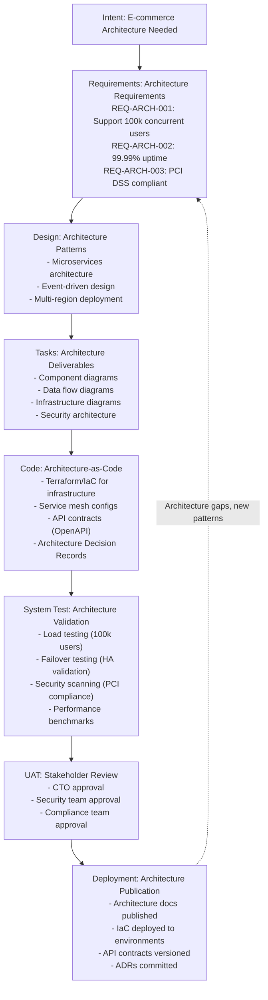

### **12.2.2 Key Characteristics**

* **Final Asset**: Technical Architecture (documented, code-defined, validated)
* **Requirements**: Architecture requirements (REQ-ARCH-*)
* **Code**: Architecture-as-Code (Terraform, K8s manifests, API specs)
* **Tests**: Architecture validation tests (load tests, HA tests, security scans)
* **UAT**: Architecture review and approval by technical stakeholders
* **Deployment**: Publishing architecture docs and deploying IaC to environments

### **12.2.3 Integration with Main SDLC**

The architecture SDLC runs **before the main code SDLC**:

```
Main SDLC Design Stage
  ↓
  Triggers: Architecture SDLC (sub-vector)
    Intent → REQ-ARCH-* → Design → Tasks → Code (IaC) → Test → UAT → Deploy
  ↓
  Produces: Architecture (REQ-ARCH-* assets)
  ↓
Main SDLC Code Stage (constrained by architecture)
```

### **12.2.4 Example Architecture Requirements**

**REQ-ARCH-SCALE-001**: "System must scale to 100k concurrent users"
- Type: architecture, Domain: scalability
- Acceptance criteria:
  - Load test demonstrates 100k concurrent users
  - Response time p95 < 500ms at peak load
  - Auto-scaling policies validated

**REQ-ARCH-HA-001**: "System must achieve 99.99% uptime"
- Type: architecture, Domain: high_availability
- Acceptance criteria:
  - Multi-region deployment active
  - Automated failover tested
  - RTO < 5 minutes, RPO < 1 minute

**REQ-ARCH-SEC-001**: "System must be PCI DSS compliant"
- Type: architecture, Domain: security
- Acceptance criteria:
  - Security architecture review approved
  - PCI compliance scans passing
  - Encryption at rest and in transit validated

---

## **12.3 Sub-Vector #2: UAT Test Development as Concurrent AI SDLC**

**Intent**: "We need comprehensive UAT test coverage for user authentication feature"

### **12.3.1 Overview**

UAT (User Acceptance Testing) is not just a gate at the end of the SDLC—it's a **development effort** that produces three types of assets:

1. **Manual UAT test cases**: Business-readable scenarios for human validation
2. **Automated UAT tests**: Executable BDD tests (e.g., Selenium, Playwright)
3. **Data validation tests**: Automated data quality checks (e.g., Great Expectations)

Because UAT test development involves creating complex test scenarios, test code, and data validation logic, it can be **structured as its own concurrent AI SDLC** that runs alongside the main code development.

**Key insight**: While the main SDLC develops the authentication feature, the UAT test SDLC simultaneously develops comprehensive tests to validate that feature.

---

### **12.3.2 Figure 12.3 – UAT Test Development as Concurrent SDLC**

**Diagram Title**: Concurrent Development of Application Code and UAT Tests

The diagram below shows two AI SDLCs running concurrently:
- **Left**: Main code SDLC develops the authentication feature
- **Right**: UAT test SDLC develops comprehensive test coverage for that feature
- **Connections**: Requirements and design from main SDLC inform the UAT test SDLC

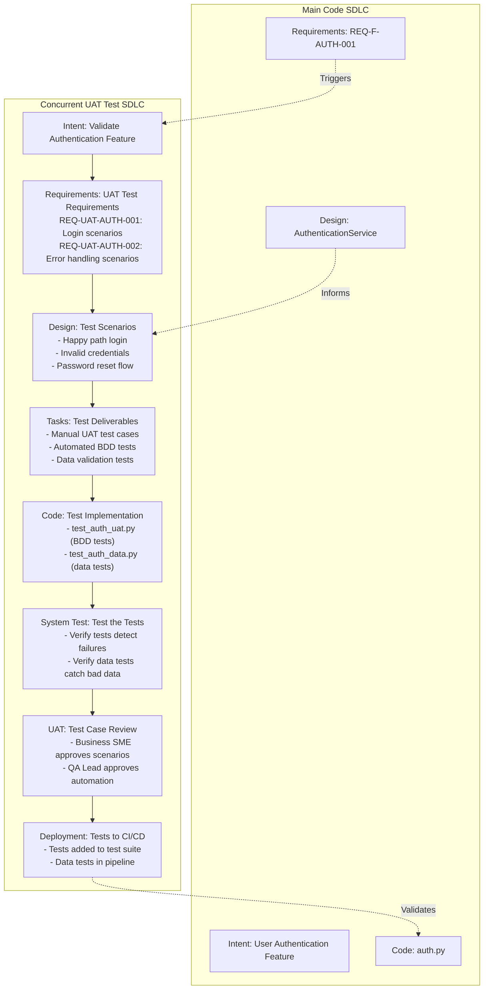

**How to read this diagram**:

1. **Main Code SDLC** (left): Develops the authentication feature from intent through to code
2. **Concurrent UAT Test SDLC** (right): Goes through a complete SDLC to develop comprehensive tests
3. **Dotted arrows**: Show how main SDLC informs UAT test SDLC
   - Main requirements **trigger** UAT test intent
   - Main design **informs** UAT test scenarios
   - Final UAT tests **validate** the main code
4. **UAT Test SDLC stages**:
   - **Requirements**: Define what UAT tests are needed (REQ-UAT-*)
   - **Design**: Design test scenarios (happy path, edge cases, error cases)
   - **Tasks**: Break down test deliverables (manual cases, automation, data tests)
   - **Code**: Implement test code (BDD tests, data validation scripts)
   - **System Test**: Meta-tests that verify the tests work correctly
   - **UAT**: Business SME and QA Lead review test scenarios
   - **Deployment**: Tests added to CI/CD pipeline

---

### **12.3.3 Key Characteristics**

**What does the UAT test SDLC produce?**

* **Final Assets**:
  - Manual UAT test cases (business-readable scenarios)
  - Automated UAT tests (executable BDD tests)
  - Automated data tests (data quality validation)
* **Requirements**: UAT test requirements (REQ-UAT-*)
* **Code**: Test code (test_*.py, feature files, data validation scripts)
* **Tests**: Meta-tests (tests that validate the UAT tests work correctly)
* **UAT**: Business SME and QA Lead review and approval
* **Deployment**: Tests added to CI/CD pipeline

**Why is this a separate SDLC?**

UAT test development is complex enough to warrant its own SDLC because:
- Test scenarios must be **designed** (not just written ad-hoc)
- Test code must be **implemented** and **tested** (meta-tests)
- Business SMEs must **review** test scenarios for completeness
- Tests must be **deployed** to CI/CD pipelines

---

### **12.3.4 Concurrent Development Pattern**

**How does concurrent development work in practice?**

In an **agentic AI SDLC**, a single developer manages multiple AI agents running concurrently:

**Concurrent execution flow**:
1. **Main code agent(s)**: Develop authentication feature (Requirements → Design → Code)
2. **UAT test agent(s)**: Simultaneously develop test coverage (Requirements → Design → Test Code)
3. **Synchronization points**:
   - Main requirements trigger UAT test requirements
   - Main design informs UAT test scenarios
   - UAT tests validate main code at UAT stage

**Developer orchestration**:
- Developer monitors both SDLCs through dashboard/status
- Agents coordinate through shared requirement keys
- Feedback loops operate independently for each SDLC
- Integration happens at natural synchronization points

**Concurrency principle**: When a common asset like Requirements exists, all dependent tasks can trigger and run concurrently. Any work that can run in parallel should run in parallel.

---

### **12.3.5 Example UAT Test Requirements**

**What do UAT test requirements look like?**

UAT test requirements (REQ-UAT-*) link back to main requirements (REQ-F-*, REQ-DATA-*) and define test deliverables:

**REQ-UAT-AUTH-001**: "UAT test cases for successful authentication flows"
- Type: uat_test, Domain: authentication
- Source requirement: REQ-F-AUTH-001
- Deliverables:
  - Manual test case: "User login with valid credentials"
  - Automated BDD test: test_user_login_success()
  - Data test: verify_user_credentials_in_db()

**REQ-UAT-AUTH-002**: "UAT test cases for authentication error handling"
- Type: uat_test, Domain: authentication
- Source requirement: REQ-F-AUTH-001
- Deliverables:
  - Manual test case: "User login with invalid credentials"
  - Automated BDD test: test_user_login_invalid_credentials()
  - Data test: verify_failed_login_logged()

**REQ-UAT-DATA-001**: "Data validation tests for customer data quality"
- Type: uat_test, Domain: data_quality
- Source requirement: REQ-DATA-CQ-001
- Deliverables:
  - Automated data test: test_customer_data_completeness()
  - Automated data test: test_customer_data_accuracy()
  - Data reconciliation test: test_customer_source_target_match()

### **12.3.6 UAT Test Traceability**

**How do UAT tests trace back to main requirements?**

Every UAT test requirement links back to the main requirement it validates, creating full traceability:

```
Traceability Chain:

Main Requirement → UAT Test Requirement → Test Cases → Test Code → Test Results

Example:
REQ-F-AUTH-001     →  REQ-UAT-AUTH-001    →  "Login with valid credentials"      →  test_user_login_success()      → ✅ Pass
(User Login)          (Login scenarios)      "Login with invalid credentials"    →  test_user_login_invalid()      → ✅ Pass
                                              "Password reset flow"               →  test_password_reset()          → ❌ Fail
                                                                                                                        ↓
                                                                                                              (Feedback to Main SDLC)
```

**Benefits of traceability**:
- Every test is linked to a requirement (no orphaned tests)
- Test failures trace back to the requirement they validate
- Coverage gaps are visible (requirements without UAT tests)
- Impact analysis: Which tests need updating when a requirement changes?

---

## **12.4 Sub-Vector #3: Data Pipeline as AI SDLC**

**Intent**: "We need a data pipeline to deliver customer analytics data product"

Data pipeline development can be structured as its own AI SDLC **running concurrently** with application development.

### **12.4.1 Figure 12.4 – Data Pipeline Development as AI SDLC**

**Diagram Title**: Data Pipeline as Independent AI SDLC Sub-Vector

The diagram below shows how data pipeline development follows the complete AI SDLC pattern:

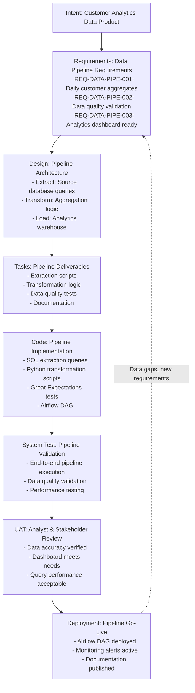

### **12.4.2 Key Characteristics**

* **Final Assets**:
  - Data extraction scripts
  - Transformation logic (SQL, Python)
  - Data quality tests
  - Pipeline orchestration (Airflow DAG)
  - Data product documentation
* **Requirements**: Data pipeline requirements (REQ-DATA-PIPE-*)
* **Code**: Pipeline code (SQL, Python, Airflow)
* **Tests**: Data quality tests, pipeline execution tests
* **UAT**: Analysts and stakeholders validate data accuracy and usability
* **Deployment**: Pipeline deployed with monitoring

### **12.4.3 Integration with Application SDLC**

The data pipeline SDLC can run:
- **Concurrently**: Pipeline development runs alongside application development
- **Integrated**: Application and pipeline share data requirements (REQ-DATA-*)
- **Coordinated**: Pipeline produces data products consumed by application

```
Application SDLC:
  Requirements (REQ-F-*) → Design → Code (app.py) → Test → UAT → Deploy

Data Pipeline SDLC (concurrent):
  Requirements (REQ-DATA-PIPE-*) → Design → Code (pipeline) → Test → UAT → Deploy

Shared Data Requirements (REQ-DATA-*):
  Used by both SDLCs, ensuring data consistency
```

### **12.4.4 Example Data Pipeline Requirements**

**REQ-DATA-PIPE-001**: "Daily customer aggregates for analytics"
- Type: data_pipeline, Domain: transformation
- Acceptance criteria:
  - Daily aggregates calculated by 6 AM
  - All customers from previous day included
  - Aggregates match source data validation

**REQ-DATA-PIPE-002**: "Data quality validation for customer data"
- Type: data_pipeline, Domain: quality
- Acceptance criteria:
  - No null values in required fields
  - No duplicate customer records
  - All foreign keys valid

**REQ-DATA-PIPE-003**: "Analytics dashboard data refresh"
- Type: data_pipeline, Domain: delivery
- Acceptance criteria:
  - Dashboard data refreshed daily
  - Query response time < 2 seconds
  - Data latency < 1 hour

---

## **12.5 Sub-Vector Patterns and Best Practices**

### **12.5.1 When to Use Sub-Vectors**

Use AI SDLC sub-vectors when:

1. **Complexity warrants decomposition**: Activity is complex enough to benefit from full lifecycle structure
2. **Independent delivery**: Sub-vector can deliver value independently (e.g., architecture docs, test suites, data pipelines)
3. **Concurrent development**: Sub-vector can run alongside main SDLC to accelerate delivery
4. **Separate concerns**: Different deliverables with distinct requirements (e.g., architecture, testing, data)

### **12.5.2 Sub-Vector Coordination**

Coordinate multiple AI SDLCs through:

1. **Requirement Keys**: Link requirements across SDLCs
   ```
   REQ-F-AUTH-001 (main SDLC)
     → REQ-UAT-AUTH-001 (UAT test SDLC)
     → REQ-ARCH-SEC-001 (architecture SDLC)
   ```

2. **Shared Context**: Use AI_SDLC_Context to share constraints, templates, standards
   - Coding standards referenced by all code sub-vectors
   - Data standards referenced by all data sub-vectors
   - Security policies referenced across all sub-vectors
   - Template libraries shared for consistency

3. **Synchronization Points**: Define dependencies and integration points
   ```
   Architecture SDLC (Deployment) → Blocks → Code SDLC (Code)
   Code SDLC (Design) → Triggers → UAT Test SDLC (Requirements)
   UAT Test SDLC (Deployment) → Validates → Code SDLC (UAT)
   ```

### **12.5.3 Benefits of Sub-Vectors**

1. **Concurrent Development**: Multiple AI agents develop coordinated lifecycles simultaneously under single developer oversight
2. **Specialization**: Each sub-vector can have specialized agents, contexts, and validation criteria
3. **Scalability**: Complex projects decompose into manageable sub-lifecycles
4. **Reusability**: Sub-vector patterns (architecture, testing, data) reusable across projects
5. **Traceability**: Requirement keys maintain traceability across all sub-vectors

---

# **13.0 Conclusion**

## **13.1 Summary**

The AI SDLC methodology provides a **closed-loop, intent-driven** framework that:

* Connects **real-world observations** to **system change**.
* Uses **CRUD work types** to structure intent (Create, Read, Update, Delete).
* Channels all work through the **Builder AI SDLC pipeline**.
* Maintains **Requirements** as a single, evolving source of truth.
* Ensures **continuous governance** through observation and evaluation.
* Provides **end-to-end traceability** through unique, immutable requirement keys.

---

## **13.2 Benefits**

* **Complete traceability** from intent to runtime behavior using unique requirement keys:
  - Forward traceability: Intent → Requirements → Design → Code → Tests → Deployment → Runtime
  - Backward traceability: Production issues → Code → Requirements → Intent
* Strong **governance** and auditability across the full software and data lifecycle.
* Clear **role responsibilities** and artifacts for AI agents, developers, and stakeholders.
* **Data as a first-class concern** throughout all stages, not an afterthought.
* Comprehensive **data quality and compliance** validation at every stage.
* **Requirement coverage analysis** at every stage (design, code, test, UAT).
* **Impact analysis** capabilities: "What will break if we change this requirement?"
* **Root cause analysis** from production issues back to originating requirements.
* **Recursive and composable**: AI SDLC sub-vectors enable concurrent and nested lifecycles for architecture, testing, and data pipelines.
* **Concurrent development**: UAT test development, architecture work, and data pipeline development can run concurrently with main code development under AI agent orchestration, accelerating delivery.
* **Future-ready for AI-generated applications**: Requirements provide deterministic control over probabilistic AI behavior, enabling automatic observer/evaluator generation and runtime assurance for on-demand AI-built applications.
* AI used responsibly as a **context-aware augmenter**.

---

## **13.3 Next Steps**

### **For Implementation:**

* **Configure AI_SDLC_Context**: Set up hierarchical context management with standards, templates, and constraints
* **Define AI agent orchestration**: Establish agent roles (Req-Agent, Design-Agent, Code-Agent, Test-Agent) and coordination patterns
* **Enable concurrent execution**: Configure agents to run sub-vectors concurrently when dependencies allow
* **Map concrete tools**: Integrate Jira (work visibility), Git (version control), CI/CD (deployment), and monitoring platforms
* **Establish requirement key schema**: Define naming conventions (REQ-F-*, REQ-NFR-*, REQ-DATA-*, etc.)

### **For Governance:**

* **Attach RACI matrices** to each stage to clarify human oversight responsibilities
* **Define quality gates** and approval workflows at stage boundaries
* **Configure observability**: Set up dashboards to monitor AI agent progress and SDLC status
* **Establish feedback loops**: Integrate runtime monitoring back to requirements for continuous improvement

---

# **Appendix A: The Fundamental Unit of Asset Creation**

## **A.1 Overview**

Every asset in the AI SDLC—whether a requirement document, design specification, code file, test suite, or deployment plan—is created using the same **fundamental building block pattern**:

```
Input (Intent + Context) → Synthesis → Asset → Observe → Evaluate → Feedback → Update Input/Context
```

This pattern is **recursive** and forms the basis for chaining assets together throughout the entire lifecycle. Understanding this building block is essential to understanding how the AI SDLC operates at all scales.

---

## **A.2 The Asset Creation Cycle**

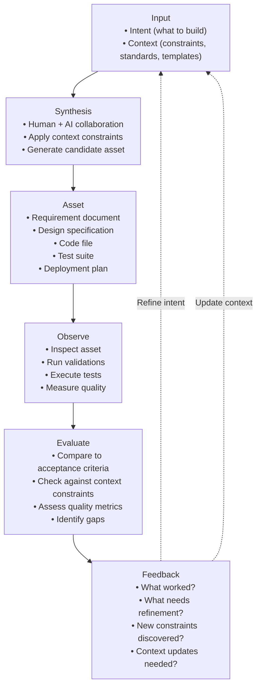

---

## **A.3 Component Breakdown**

### **A.3.1 Input: Intent + Context**

The input to asset creation consists of two components:

#### **Intent** (The "What" and "Why")
- **What** needs to be built or changed
- **Why** it's needed (business value, problem to solve)
- **Source**: Comes from the Requirements stage or upstream assets
- **Examples**:
  - "Implement user authentication" (REQ-F-AUTH-001)
  - "Design scalable architecture for 100k users" (REQ-ARCH-SCALE-001)
  - "Create UAT test cases for login flow" (REQ-UAT-AUTH-001)

#### **Context** (The "How" Constraints)
- **Constraints** that shape how the asset is created
- **Source**: Stored in AI_SDLC_Context as URI references
- **Types**:
  - **Stage-specific context**: Design patterns, coding standards, test frameworks
  - **Regulatory context**: Compliance requirements, data governance
  - **Technical context**: Tech stack, architecture constraints, performance targets
  - **Organizational context**: Templates, standards, approved libraries

**Example Context** (from AI_SDLC_Context):

**Code Stage Context:**
- **Coding standards**: `file://standards/coding/python_style_guide.md`
- **Security standards**: `file://standards/security/secure_coding.md`
- **Service template**: `file://templates/code/service_template.py`
- **Approved authentication libraries**: bcrypt, PyJWT, passlib

### **A.3.2 Synthesis: Creating the Asset**

**Synthesis** is the creative process of generating the asset:

- **Human + AI collaboration**: Developer works with AI assistant
- **Apply context constraints**: Use templates, follow standards, respect patterns
- **Generate candidate asset**: Create initial version of the asset
- **Iterative refinement**: Multiple synthesis rounds may occur

**Example Synthesis Process**:

**Intent**: REQ-F-AUTH-001 - Implement user authentication
**Context**: Python coding standards + security guidelines + service template

**Synthesis steps**:
1. **Start with template**: Load from `file://templates/code/service_template.py`
2. **Apply security context** (from `file://standards/security/secure_coding.md`):
   - Use approved library: bcrypt
   - Implement password hashing
   - Add rate limiting
3. **Follow coding standards** (from `file://standards/coding/python_style_guide.md`):
   - Type hints
   - Docstrings with requirement keys
   - Error handling

**Result**: `auth_service.py` (asset)

### **A.3.3 Asset: The Output**

The **asset** is the tangible output of synthesis:

- **Tagged with requirement keys**: Maintains traceability
- **Version controlled**: Git commit, document version
- **Documented**: Includes references to intent and context used
- **Types**:
  - Requirements: User stories, NFRs, data requirements
  - Design: Architecture diagrams, API specs, data models
  - Code: Application code, infrastructure-as-code, pipelines
  - Tests: Test cases, automated tests, data quality tests
  - Documentation: Runbooks, release notes, architecture decisions

**Example Asset Structure**:

**Asset**: `auth_service.py`
- **Implements**: REQ-F-AUTH-001 (User Authentication), REQ-NFR-SEC-001 (Secure Authentication)
- **Context used**:
  - `file://standards/coding/python_style_guide.md`
  - `file://standards/security/secure_coding.md`
  - `file://templates/code/service_template.py`
- **Structure**: `AuthenticationService` class with `authenticate()` method
- **Implementation**: Uses bcrypt (approved library) for password hashing

### **A.3.4 Observe: Inspecting the Asset**

**Observation** is the process of examining the asset:

- **Inspection techniques**:
  - Code review (peer review)
  - Linting and static analysis
  - Test execution (unit, integration, system)
  - Data quality checks
  - Security scanning
  - Performance benchmarking

- **Produces observable data**:
  - Test results (pass/fail)
  - Code coverage metrics
  - Lint errors/warnings
  - Security vulnerabilities
  - Performance measurements
  - Data quality scores

**Example Observation**:

**Observation results for auth_service.py**:
1. **Linting** (`pylint auth_service.py`): 9.5/10 score, 2 minor warnings
2. **Tests** (`pytest tests/test_auth_service.py -v`): 12 tests, 11 passed, 1 failed
3. **Security scan** (`bandit auth_service.py`): No high-severity issues
4. **Coverage** (`pytest --cov=auth_service tests/`): 85% coverage

### **A.3.5 Evaluate: Assessing Quality**

**Evaluation** compares observations against acceptance criteria:

- **Evaluation criteria**:
  - **Functional**: Does it implement the intent correctly?
  - **Context compliance**: Does it follow all context constraints?
  - **Quality gates**: Does it meet minimum quality thresholds?
  - **Requirement coverage**: Are all requirements addressed?

- **Evaluation outcomes**:
  - ✅ **Accept**: Asset meets all criteria, proceed to next stage
  - ⚠️ **Accept with conditions**: Minor issues, can be addressed later
  - ❌ **Reject**: Critical issues, must be fixed before proceeding

**Example Evaluation**:

**Evaluation Result for auth_service.py (REQ-F-AUTH-001):**

**Functional Correctness:**
- ✅ Implements login functionality
- ❌ Password reset flow missing (REQ-F-AUTH-002)

**Context Compliance:**
- ✅ Follows Python style guide
- ✅ Uses approved library (bcrypt)
- ⚠️ Missing docstring for one method

**Quality Gates:**
- ✅ Linting: 9.5/10 (threshold: 8.0)
- ❌ Test coverage: 85% (threshold: 90%)
- ✅ Security scan: No high issues
- ⚠️ Tests: 1 test failing

**Decision**: ❌ REJECT - Fix failing test and improve coverage

### **A.3.6 Feedback: Learning and Refinement**

**Key Principle**: Feedback closes the loop, enabling continuous improvement of both assets and context.

**Four types of feedback:**

1. **Refinement feedback**: Improve the current asset
   - Fix defects discovered during observation
   - Address quality gaps (coverage, documentation, performance)
   - Refine implementation details

2. **Intent feedback**: Clarify or update requirements
   - Requirement incomplete or ambiguous
   - New requirements discovered during implementation
   - Acceptance criteria need revision

3. **Context feedback**: Update constraints and standards for future assets
   - Missing standards discovered (e.g., token management policy)
   - Templates need enhancement (e.g., add logging best practices)
   - New patterns emerge that should be documented

4. **Process feedback**: Improve the development process itself
   - Workflow improvements (e.g., shift security scans earlier)
   - Tool changes (e.g., add new quality gates)
   - Stage ordering adjustments

**Feedback destinations:**

- **Current asset** (Refinement): Fix and improve before proceeding
- **Requirements** (Intent): Update requirement definitions
- **Context** (Standards): Add/update templates, standards, patterns
- **Process** (Workflow): Improve how work flows through stages
- **Next iteration** (Learning): Apply lessons to future assets

---

## **A.4 Chaining Assets: The Chain Reaction**

The power of this building block pattern is that **one asset's output becomes the next asset's input**:

```
Requirements Asset (REQ-F-AUTH-001)
  ↓ (Intent + Context)
Design Asset (AuthenticationService design)
  ↓ (Intent + Context)
Code Asset (auth_service.py)
  ↓ (Intent + Context)
Test Asset (test_auth_service.py)
  ↓ (Intent + Context)
Deployment Asset (release_plan_v2.5.md)
  ↓ (Intent + Context)
Runtime Metrics (auth_success_rate)
  ↓ (Feedback)
Updated Requirements (REQ-F-AUTH-001 v2)
```

### **A.4.1 Chain Example: From Requirement to Code**

**Diagram Title**: Asset Chaining Through Three SDLC Stages

This diagram shows how assets chain together, with each asset becoming input to the next:

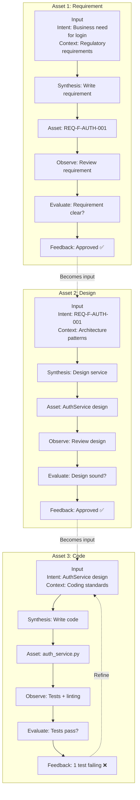

### **A.4.2 Context Evolution Through the Chain**

**Key Principle**: Context grows and evolves as assets move through the SDLC chain.

**How context evolves:**

1. **Stage-specific context adds constraints**: Each stage introduces new context relevant to that stage's work
   - Requirements stage: Regulatory requirements, business rules
   - Design stage: Architecture patterns, design standards
   - Code stage: Coding standards, security guidelines, templates
   - Test stage: Test frameworks, quality gates
   - Deployment stage: Deployment procedures, runbook templates

2. **Context inheritance**: Later stages inherit all context from earlier stages
   - Code stage has access to both Requirements and Design context
   - Test stage has access to Requirements, Design, and Code context
   - This ensures consistency across the entire SDLC

3. **Feedback updates context**: When gaps are discovered, context is updated for future use
   - Missing security policy discovered during code review → Add to security standards
   - New pattern emerges from design work → Add to architecture patterns
   - Test reveals compliance gap → Update regulatory requirements documentation

4. **Context becomes reusable**: Updated context benefits all future assets
   - Token management policy added once → Used by all future authentication code
   - New test template created → Used by all future test development
   - Architecture pattern documented → Applied to all future designs

---

## **A.5 Context Management Principles**

As shown in A.4, **context evolves** throughout the asset creation chain. Because context and requirements are what code is **derived from**, they require the same rigor and discipline as code maintenance itself.

### **A.5.1 Context as Code**

**Context and requirements replace traditional code as the primary artifacts requiring rigorous maintenance:**

- **Code is derived**: Code is synthesized from context + requirements
- **Context is foundational**: If context is wrong, all derived code will be wrong
- **Requirements drive intent**: Requirements define what to build; context defines how to build it

**Therefore**: Context and requirements must be treated with **at least the same rigor as source code**.

### **A.5.2 Version Control and Traceability**

**All context must be version controlled:**

- **Version everything**: Templates, standards, patterns, guidelines, constraints
- **Track changes**: Every context update should have a clear reason (linked to feedback)
- **Enable rollback**: If a context change causes problems, you can revert
- **Audit trail**: Know when, why, and by whom context was changed

**Example**: If a security standard is updated (e.g., "Minimum password length: 12 characters"), all future assets will use the new standard, while existing assets remain traceable to the old version.

### **A.5.3 Explicit Over Implicit**

**All constraints must be explicitly documented:**

- **No tribal knowledge**: "We always do it this way" is not sufficient
- **No implicit standards**: If it's not written down, it doesn't exist
- **No assumptions**: Context should be understandable by someone new to the team

**Anti-pattern**: Developer says "We use bcrypt for passwords" but there's no documented standard → New team member uses a different library

**Correct pattern**: Security standards document explicitly lists approved libraries → Everyone follows the same standard

### **A.5.4 Reusability and Consistency**

**Context should be reusable across projects and teams:**

- **Shared standards**: Coding standards apply to all projects (unless explicitly overridden)
- **Template reuse**: Service templates, test templates, design templates are shared
- **Organizational consistency**: All teams follow the same security guidelines, regulatory requirements

**Benefit**: New projects start with accumulated organizational knowledge, not from scratch.

### **A.5.5 Context Hierarchy and Inheritance**

**Context is organized hierarchically:**

- **Organization-level context**: Applies to all projects (e.g., regulatory requirements, security policies)
- **Team-level context**: Applies to all projects within a team (e.g., tech stack choices)
- **Project-level context**: Project-specific constraints (e.g., performance requirements)
- **Stage-level context**: Context specific to SDLC stages (e.g., coding standards for Code stage)

**Inheritance**: Lower levels inherit from higher levels but can add or override constraints.

**Example hierarchy**:
```
Organization Context (GDPR compliance)
  ↓ inherits
Team Context (Python tech stack, microservices architecture)
  ↓ inherits
Project Context (User authentication project, 100k user scale requirement)
  ↓ inherits
Stage Context (Code stage: Python style guide, security coding standards)
```

### **A.5.6 Feedback Updates Context**

**Context evolves based on feedback (A.3.6):**

- **Continuous improvement**: Each asset creation can improve context for future assets
- **Close the loop**: Feedback shouldn't just fix the current asset—it should update context
- **Learning organization**: Context becomes smarter over time

**Example feedback loop**:
1. Developer implements authentication service
2. Security scan reveals token expiration vulnerability
3. **Feedback**: Add token management policy to security standards
4. **Context update**: New standard added for all future authentication code
5. **Result**: Future authentication implementations automatically follow the new policy

### **A.5.7 Context Quality Gates**

**Context itself should have quality standards:**

- **Completeness**: Does context cover all necessary constraints?
- **Clarity**: Is context unambiguous and understandable?
- **Consistency**: Does new context conflict with existing context?
- **Testability**: Can compliance with context be objectively verified?

**Review process**: Just as code goes through code review, context updates should be reviewed by appropriate stakeholders (architects, security leads, compliance officers).

### **A.5.8 Separation of Content and Reference**

**Context should separate structure from content:**

- **Structure**: Configuration defining what context exists (templates, standards, patterns)
- **Content**: The actual documents, specifications, guidelines

**Benefit**: Large context documents don't need to be loaded until needed (lazy loading), improving performance and maintainability.

**Example**:
- Structure says: "Security standards exist at this location"
- Content: The actual 50-page secure coding guide
- Asset creation: Only loads the content when synthesizing a security-sensitive asset

### **A.5.9 Multi-Format Support**

**Context can exist in multiple formats:**

- **Text documents**: Markdown, plain text (for guidelines, patterns, principles)
- **Structured data**: YAML, JSON, XML (for configuration, approved lists)
- **Diagrams**: Architecture diagrams, flowcharts (for visual patterns)
- **Code**: Template files, reference implementations (for starting points)
- **External references**: URLs to external standards (ISO, OWASP, regulatory bodies)

**Principle**: Use the format that best communicates the constraint, not a one-size-fits-all approach.

### **A.5.10 Context Ownership and Governance**

**Context requires clear ownership:**

- **Coding standards**: Engineering leadership
- **Security standards**: Security team/CISO
- **Architecture patterns**: Architecture review board
- **Business rules**: Product management + domain experts
- **Regulatory requirements**: Compliance team + legal

**Governance process**:
- Owners maintain and update their context domains
- Changes go through appropriate review processes
- All stakeholders can propose context improvements (via feedback)

---

**Summary**: Context and requirements are the **source of truth** from which all code is derived. They must be maintained with the same rigor, version control, review processes, and quality standards as source code itself. Poor context → Poor code, no matter how good the synthesis process.

---

## **A.6 The Building Block at Every Scale**

The **same fundamental pattern** (Intent + Context → Synthesis → Asset → Observe → Evaluate → Feedback) works at **all levels of granularity**—from a single function to an entire product feature. This universality is what makes the pattern so powerful.

Think of it like **fractals**: the same structure repeats at different zoom levels.

### **A.6.1 Micro Scale: Single Function**

At the smallest level, you apply the pattern to write **individual functions**.

**Example: Implementing password hashing**

| **Step**       | **What Happens**                                                                 |
|----------------|----------------------------------------------------------------------------------|
| **Intent**     | "Implement password hashing for user authentication"                              |
| **Context**    | • Approved libraries: `bcrypt` (from security standards)<br>• Secure coding guide: Don't store plaintext passwords<br>• Python style guide: Use type hints |
| **Synthesis**  | Developer writes `hash_password()` function using `bcrypt`                        |
| **Asset**      | `hash_password()` function in `auth_service.py`                                   |
| **Observe**    | Run unit tests: `test_hash_password_creates_valid_hash()`, `test_hash_password_is_deterministic()` |
| **Evaluate**   | ✅ Tests pass<br>✅ Follows security standards<br>✅ Type hints present              |
| **Feedback**   | Function approved, proceed to next function                                       |

**Key insight**: Even a single function goes through the full cycle.

---

### **A.6.2 Meso Scale: Service Implementation**

At the module level, you apply the pattern to create **classes or services**.

**Example: Building an Authentication Service**

| **Step**       | **What Happens**                                                                 |
|----------------|----------------------------------------------------------------------------------|
| **Intent**     | REQ-F-AUTH-001: "User Authentication" (login, logout, token management)           |
| **Context**    | • Coding standards (Python style guide)<br>• Security guidelines (secure coding.md)<br>• Service template (service_template.py)<br>• Approved libraries: bcrypt, PyJWT |
| **Synthesis**  | Developer writes `AuthenticationService` class with methods for login, logout, token validation |
| **Asset**      | `auth_service.py` containing `AuthenticationService` class                        |
| **Observe**    | • Run unit tests (12 tests)<br>• Run integration tests (3 tests)<br>• Security scan with Bandit<br>• Measure test coverage |
| **Evaluate**   | ✅ Linting: 9.5/10<br>❌ Test coverage: 85% (threshold: 90%)<br>⚠️ 1 test failing: `test_authenticate_with_expired_token`<br>✅ Security scan: No high issues |
| **Feedback**   | **Refinement needed**:<br>• Fix failing test for expired token handling<br>• Add edge case tests to reach 90% coverage<br><br>**Context update**:<br>• Missing token expiration policy in security standards → Add `token_management.md` |

**Key insight**: A service is more complex than a function, so the **Observe** and **Evaluate** steps involve multiple checks. Feedback can trigger both **asset refinement** and **context updates**.

---

### **A.6.3 Macro Scale: Complete Feature**

At the feature level, you apply the pattern across the **entire SDLC** (Requirements → Design → Code → Test → UAT → Deployment).

**Example: Building a User Authentication Feature**

| **Step**       | **What Happens**                                                                 |
|----------------|----------------------------------------------------------------------------------|
| **Intent**     | "Users need to securely log in to access their accounts"                         |
| **Context**    | • All stage contexts:<br>&nbsp;&nbsp;- Requirements: Business rules, regulatory requirements (GDPR)<br>&nbsp;&nbsp;- Design: Architecture patterns (OAuth2), API design standards<br>&nbsp;&nbsp;- Code: Coding standards, security guidelines, service templates<br>&nbsp;&nbsp;- Test: Test frameworks (pytest), test case templates<br>&nbsp;&nbsp;- UAT: UAT test plans, acceptance criteria<br>&nbsp;&nbsp;- Deployment: Deployment checklist, runbook template |
| **Synthesis**  | **Full SDLC execution**:<br>1. Requirements: Write REQ-F-AUTH-001 (user story)<br>2. Design: Design `AuthenticationService` API<br>3. Code: Implement `auth_service.py`<br>4. Test: Write unit + integration tests<br>5. UAT: Create UAT test cases, run with business SMEs<br>6. Deploy: Create release plan, deploy to production |
| **Asset**      | **Complete feature** including:<br>• Requirements doc (REQ-F-AUTH-001)<br>• Design spec (API spec)<br>• Code (auth_service.py)<br>• Tests (test_auth_service.py)<br>• UAT test cases<br>• Deployment plan<br>• Runbook |
| **Observe**    | • System tests in staging environment<br>• UAT validation with business users<br>• Production metrics: login success rate, latency, error rate |
| **Evaluate**   | ✅ UAT approved by business SMEs<br>✅ Production metrics healthy (99.9% success rate)<br>✅ All stage gates passed                       |
| **Feedback**   | **Feature successful**.<br><br>**Learnings for next iteration**:<br>• Password reset flow is missing → New requirement: REQ-F-AUTH-002<br>• Production monitoring revealed slow response times for MFA → Add performance requirement: REQ-NFR-PERF-003 |

**Key insight**: At this scale, the **Asset** is not a single file but a **complete feature** spanning all SDLC stages. The **Observe** step includes production runtime metrics, and **Feedback** informs future requirements.

---

### **A.6.4 Meta Scale: Sub-Vector SDLC**

At the meta level, you apply the pattern to build **the infrastructure itself**—like test frameworks or CI/CD pipelines.

**Example: Building a UAT Test Automation Framework**

| **Step**       | **What Happens**                                                                 |
|----------------|----------------------------------------------------------------------------------|
| **Intent**     | "We need an automated UAT test framework so business SMEs can validate features without manual testing" |
| **Context**    | • Test frameworks: pytest, Selenium, BDD (Behave)<br>• Data quality standards: Great Expectations<br>• CI/CD integration: Jenkins, GitHub Actions<br>• Business-readable test format: Gherkin (Given/When/Then) |
| **Synthesis**  | **Complete UAT Test SDLC** (see Section 12.3):<br>1. Requirements: Define UAT test framework requirements<br>2. Design: Design test framework architecture (BDD + Selenium)<br>3. Code: Implement test framework (`uat_framework/`)<br>4. Test: Test the test framework (meta-tests)<br>5. UAT: Validate framework with business SMEs<br>6. Deploy: Integrate into CI/CD pipeline |
| **Asset**      | **UAT Test Framework** including:<br>• Test framework code (Python + Selenium)<br>• BDD step definitions<br>• Test templates (Gherkin templates)<br>• CI/CD integration<br>• Documentation for business SMEs |
| **Observe**    | • Run meta-tests: Does the framework detect failures correctly?<br>• Business SMEs write sample tests using the framework<br>• Measure: Test coverage of main application features |
| **Evaluate**   | ✅ Test framework detects 95% of known bugs<br>✅ Business SMEs can write tests without developer help<br>✅ Tests run in CI/CD pipeline successfully |
| **Feedback**   | **Test framework accelerates delivery**:<br>• UAT cycle time reduced from 2 weeks to 3 days<br>• Business confidence improved<br><br>**Context update**:<br>• Add UAT framework documentation to AI_SDLC_Context → `file://testing/frameworks/uat_framework_guide.md` |

**Key insight**: At this scale, you're building the **testing infrastructure itself** using the same pattern. This is a **meta-level SDLC** (a sub-vector)—building the tools that will be used to test future features. The framework becomes part of the **Context** for future asset creation.

---

## **A.7 Key Principles**

### **A.7.1 Immutable Intent, Evolving Context**

- **Intent** (requirements) should be **stable** and **immutable** (versioned if changed)
- **Context** (constraints, templates, standards) **evolves** based on feedback
- This separation enables continuous improvement without breaking traceability

### **A.7.2 Context is Explicit, Not Implicit**

- All context constraints are **explicitly documented** in AI_SDLC_Context
- No "tribal knowledge" or undocumented standards
- Context is **reusable** across projects and teams

### **A.7.3 Feedback Improves Context, Not Just Assets**

- Feedback doesn't just fix the current asset
- Feedback **updates context** for future assets
- This creates a **learning organization** where each asset creation improves the system

### **A.7.4 AI as Context-Aware Augmenter**

- AI assistants use **both intent and context** to generate better assets
- Context makes AI output **consistent** and **compliant**
- Human remains in control: validates, evaluates, and provides feedback

---

## **A.8 Summary**

The **fundamental unit of asset creation** is:

```
Input (Intent + Context) → Synthesis → Asset → Observe → Evaluate → Feedback
```

**Key takeaways**:

1. **Every asset** in the AI SDLC is created using this pattern
2. **Assets chain together**: One asset's output becomes the next asset's input
3. **Context evolves**: Feedback updates context for future asset creation
4. **AI_SDLC_Context**: Stores all context as URI references, loaded lazily
5. **Scalable**: Pattern works at all scales (function → service → feature → system)
6. **Traceable**: Requirement keys flow through the entire chain
7. **Learning**: Each cycle improves both assets and context

This building block is the **atomic unit** of the AI SDLC, and understanding it is key to understanding how the entire methodology operates.
