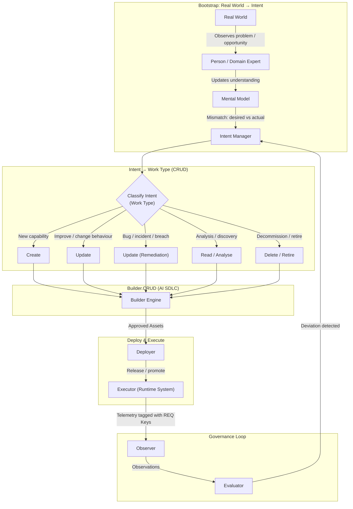
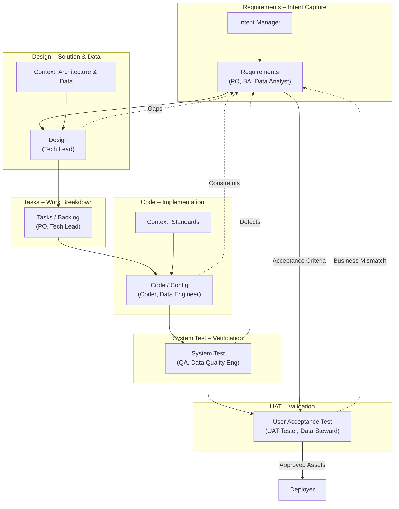
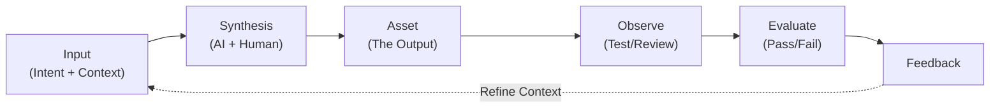
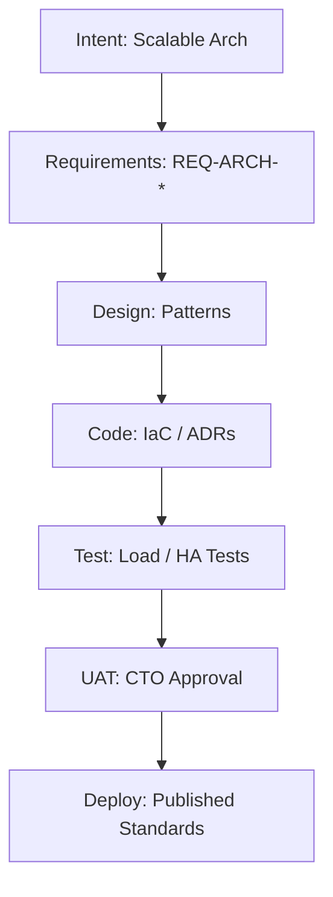
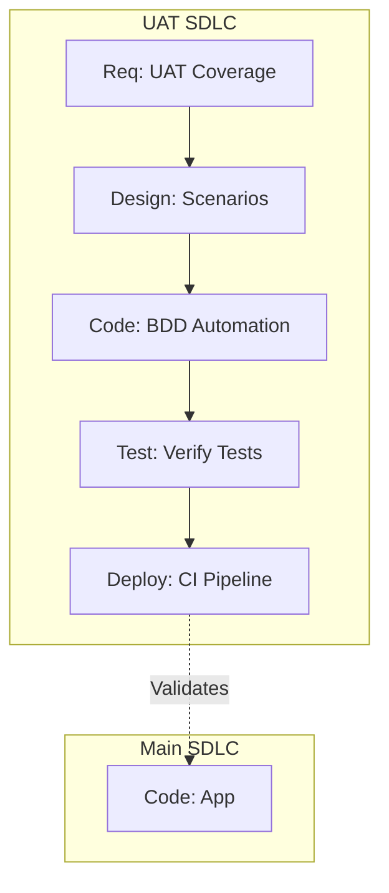
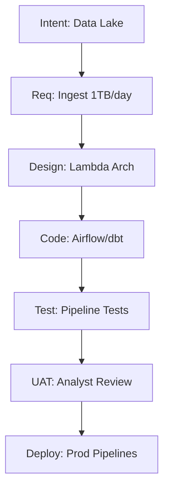

# **AI SDLC Methodology Document**

*A Unified Intent-Driven Software & Data Development Framework for AI-Augmented Delivery*

-----

# **1.0 Introduction**

## **1.1 Purpose**

### **1.1.1 Definition**

This document defines the **AI-Augmented Software Development Lifecycle (AI SDLC)**. It is a unified, intent-driven methodology for designing, building, validating, and deploying digital assets (software and data) with **human-in-the-loop AI**.

### **1.1.2 Goals**

The methodology aims to preserve:

  * **Traceability** – from real-world intent through to deployed system state.
  * **Iterability** – every stage can be revisited and refined.
  * **Context preservation** – across personas, artifacts, and tools.
  * **Governance & safety** – through continuous observation, evaluation, and feedback.

## **1.2 Core Principles**

### **1.2.1 Intent First**

All change originates in **intent**, triggered when observed reality diverges from an internal mental model. We do not code without intent.

### **1.2.2 Data as a First-Class Citizen**

Data engineering, quality, and governance are not afterthoughts. They are integrated into every stage of the lifecycle alongside application development.

### **1.2.3 Requirements as the Signal Source**

Requirements are the **single source of truth**. They contain the full signal of *what* needs to be built. Every downstream stage transforms this signal through the lens of stage-specific **Context**.

### **1.2.4 AI as Context-Aware Augmenter**

AI agents accelerate workflows but do not remove human accountability. They operate by synthesizing **Intent** (from Requirements) and **Context** (from the repository) to produce **Assets**.

-----

# **2.0 The AI SDLC Model (The Map)**

## **2.1 Macro View: Intent to Runtime**

This section describes the high-level flow. Change begins in the **Real World**, is classified into **CRUD Work Types**, flows through the **Builder Engine**, and executes in **Runtime**.

### **Figure 2.1 – End-to-End Intent Lifecycle**



**Intent Classification (CRUD):**

  * **Create:** Build something new (CapEx).
  * **Update:** Change existing functionality (OpEx).
  * **Remediate:** Fix risks/bugs (Non-discretionary).
  * **Read:** Analysis/Spikes (Information gathering).
  * **Delete:** Decommissioning (Tech debt reduction).

-----

## **2.2 Micro View: The Builder Pipeline**

This is the internal engine of the **Builder** block above. It depicts the linear flow of stages, the personas involved, and the feedback loops.

### **Figure 2.2 – The AI SDLC Builder Pipeline**



-----

# **3.0 Core Concepts (The Physics)**

Before detailing the stages, we must define the three fundamental mechanisms that power the AI SDLC: **The Fundamental Unit**, **The Context Framework**, and **The Traceability System**.

## **3.1 The Fundamental Unit of Asset Creation**

Every asset in this lifecycle (whether a requirement, a design doc, or a code file) is created using a recursive cybernetic loop. This is the "engine" that runs inside every stage.



### **3.1.1 The Cycle Components**

1.  **Input (Intent + Context):**
      * **Intent:** The "Why" and "What" (e.g., "Build a login page").
      * **Context:** The "How" constraints loaded from the repository (e.g., "Use React, use OAuth2").
2.  **Synthesis:** The collaborative act of creation.
      * *AI Role:* Generates the initial asset based on Input.
      * *Human Role:* Guides the AI, refines prompts, and reviews initial output.
3.  **Asset:** The tangible output (e.g., `auth_service.py`, `design_spec.md`).
4.  **Observe:** Validating the asset.
      * *Techniques:* Linting, compiling, unit testing, static analysis.
5.  **Evaluate:** Comparing observation against expectations.
      * *Criteria:* Does it meet the Intent? Does it adhere to Context?
6.  **Feedback:**
      * *Loop:* If evaluation fails, feedback updates the Input or Context for the next Synthesis cycle.

## **3.2 The Context Framework**

**Context** is the set of constraints, templates, and knowledge that guides the Synthesis step. In the AI SDLC, context is **explicit**, **versioned**, and stored in the `AI_SDLC_Context` repository.

### **3.2.1 Context Configuration Schema**

Context is loaded lazily by stage. The repository structure maps directly to the SDLC stages.

```yaml
# Example: AI_SDLC_Context/context/stages/code.yml
code_stage:
  standards:
    python: "file://standards/coding/python_style_guide.md"
    security: "file://standards/security/secure_coding.md"
  templates:
    service: "file://templates/code/service_template.py"
  data_governance:
    pii_rules: "file://context/data/pii_handling.md"
  governance:
    approval_threshold: 2
    required_checks: ["lint", "test", "security_scan"]
```

## **3.3 The Traceability System (Requirement Keys)**

To ensure governance, every requirement is assigned a **Unique Immutable Key**. This key must be tagged on every downstream asset.

### **3.3.1 Key Structure**

`REQ-{TYPE}-{DOMAIN}-{SEQUENCE}`

  * **Examples:**
      * `REQ-F-AUTH-001`: Functional Requirement, Auth Domain.
      * `REQ-DATA-CQ-001`: Data Quality Requirement.
      * `REQ-NFR-PERF-005`: Performance NFR.

### **3.3.2 The Golden Thread**

> **Intent** $\to$ **Requirement** (`REQ-001`) $\to$ **Design** (tags `REQ-001`) $\to$ **Code** (tags `REQ-001`) $\to$ **Test** (verifies `REQ-001`) $\to$ **Runtime Log** (emits `REQ-001`).

-----

# **4.0 Requirements Stage**

## **4.1 Overview**

The Requirements stage is the **Signal Source**. It transforms raw intent into structured, traceable keys. It is the nexus for all feedback loops.

## **4.2 The Workflow**

  * **Personas:**
      * **Product Owner (PO):** Owns business value and prioritization.
      * **Business Analyst (BA):** Formalizes rules and scenarios.
      * **Data Analyst:** Identifies data requirements and quality expectations.
  * **Input:** Intent from Intent Manager + Discovery results.
  * **Synthesis:**
      * **AI Role (Req-Agent):** Parses raw intent to draft user stories, identifies conflicting requirements, and suggests acceptance criteria.
      * **Human Role:** Refines value, approves requirements.

## **4.3 Context Configuration**

  * **Regulatory Context:** GDPR, HIPAA, Compliance rules.
  * **Business Context:** Strategic goals, market analysis.
  * **Templates:** User Story Template, NFR Template.

## **4.4 Assets Produced**

| Asset Type | Description | Key Type |
|:---|:---|:---|
| **User Stories** | Functional capabilities | `REQ-F-*` |
| **NFRs** | Performance, Security, Constraints | `REQ-NFR-*` |
| **Data Requirements** | Quality, Retention, Lineage, PII | `REQ-DATA-*` |
| **Business Rules** | Domain invariants | `REQ-BR-*` |
| **BDD Scenarios** | Executable specifications (Gherkin) | Linked to Keys |

## **4.5 Governance & Quality Gates**

  * [ ] All requirements have unique `REQ` keys.
  * [ ] All requirements have clear Acceptance Criteria.
  * [ ] Data requirements reviewed by Data Steward.
  * [ ] Compliance/Security requirements reviewed by Risk Officer.
  * [ ] BDD Scenarios cover positive, negative, and edge cases.

-----

# **5.0 Design Stage**

## **5.1 Overview**

The Design stage transforms Requirements into an **implementable technical and data solution**. It applies architectural constraints to the intent.

## **5.2 The Workflow**

  * **Personas:**
      * **Tech Lead:** Solution architecture and integration patterns.
      * **Data Architect:** Data modeling, storage, and flow design.
  * **Input:** Requirements (Keys) + BDD Scenarios.
  * **Synthesis:**
      * **AI Role (Design-Agent):** Proposes component diagrams, API contracts, and data schemas based on patterns. Checks for NFR compliance.
      * **Human Role:** Validates trade-offs (Cost vs. Perf), approves architecture.

## **5.3 Context Configuration**

  * **Architecture Context:** Tech stack, approved patterns (Microservices, Event-driven).
  * **Data Context:** Data modeling standards, storage technologies, privacy controls.
  * **Templates:** Design Doc Template, ADR Template, ERD Template.

## **5.4 Assets Produced**

| Asset Type | Description | Traceability |
|:---|:---|:---|
| **Component Design** | Service boundaries, interactions | Maps to `REQ-F-*` |
| **Data Model** | Conceptual/Logical/Physical ERDs | Maps to `REQ-DATA-*` |
| **API Specifications** | OpenAPI/GraphQL contracts | Maps to `REQ-F-*` |
| **Data Flow Diagrams** | Lineage and transformation logic | Maps to `REQ-DATA-*` |
| **Traceability Matrix** | Maps Design Elements $\to$ Req Keys | - |

## **5.5 Governance & Quality Gates**

  * [ ] Design adheres to Architecture Context (patterns/stack).
  * [ ] All components mapped to specific `REQ` keys.
  * [ ] Data models meet Data Architecture standards.
  * [ ] Security and Privacy (PII) controls explicitly defined.
  * [ ] Cost estimates fall within budget context.

-----

# **6.0 Tasks Stage**

## **6.1 Overview**

Converts the Design into actionable work items. This is the bridge between "What we will build" and "Who will build it."

## **6.2 The Workflow**

  * **Personas:** Product Owner (Prioritization), Tech Lead (Feasibility).
  * **Input:** Design Assets.
  * **Synthesis:** Breakdown of Design into Epics, Stories, and Sub-tasks.

## **6.3 Context Configuration**

  * **Capacity Context:** Team velocity, available skills.
  * **Dependency Context:** External blockers, sequencing.
  * **Templates:** Jira/Issue Templates.

## **6.4 Assets Produced**

  * **Epics:** High-level features.
  * **User Stories:** Implementation-ready tickets.
  * **Data Tasks:** Pipeline/Schema tickets.
  * **Tagging:** Every ticket **MUST** reference the `REQ-*` keys it implements.

## **6.5 Governance & Quality Gates**

  * [ ] All tasks linked to `REQ` keys.
  * [ ] All tasks estimated.
  * [ ] Dependencies identified and sequenced.
  * [ ] Capacity validated against demand.

-----

# **7.0 Code Stage**

## **7.1 Overview**

The Code stage creates the executable artifacts. This stage integrates **Test-Driven Development (TDD)** to ensure code is born tested.

## **7.2 The Workflow**

  * **Personas:**
      * **Application Developer:** App logic and APIs.
      * **Data Engineer:** Pipelines and transformations.
  * **Input:** Tasks + Design Specs.
  * **Synthesis (The TDD Loop):**
    1.  **Red:** AI/Human writes a failing unit test for the task.
    2.  **Green:** AI/Human writes minimal code to pass the test.
    3.  **Refactor:** Optimize and clean up.

## **7.3 Context Configuration**

  * **Coding Standards:** Style guides, linting rules.
  * **Security Context:** Secure coding (OWASP), approved libraries.
  * **Data Standards:** SQL style, schema naming conventions.
  * **Templates:** Service Class, ETL Job, Config File.

## **7.4 Assets Produced**

| Asset Type | Description | Tagging |
|:---|:---|:---|
| **App Code** | Classes, Functions, APIs | `@implements REQ-F-*` |
| **Data Pipeline** | ETL, SQL, Streaming jobs | `@implements REQ-DATA-*` |
| **IaC** | Terraform, K8s Manifests | `@implements REQ-NFR-*` |
| **Unit Tests** | TDD Artifacts | `@verifies REQ-*` |
| **Config** | Env vars, Feature flags | Linked to `REQ-*` |

## **7.5 Governance & Quality Gates**

  * [ ] Code passes all linting and style checks.
  * [ ] Unit test coverage meets threshold (e.g., \>80%).
  * [ ] Security scan passes (no critical vulns).
  * [ ] All `REQ` keys documented in code annotations.
  * [ ] Code review approved by $\ge$ 2 reviewers.

-----

# **8.0 System Test Stage**

## **8.1 Overview**

Verifies the integrated system works across components and validates data quality.

## **8.2 The Workflow**

  * **Personas:**
      * **QA Engineer:** Functional and Integration testing.
      * **Data Quality Engineer:** Data validation and compliance.
  * **Input:** Built Code, BDD Scenarios (from Requirements).
  * **Synthesis:**
      * **AI Role (Test-Agent):** Generates "Glue Code" to automate the BDD scenarios. Generates Data Quality expectations (e.g., Great Expectations).
      * **Human Role:** Exploratory testing, Edge case definition.

## **8.3 Context Configuration**

  * **Test Strategy:** Tools (pytest, Selenium), environments.
  * **Data Quality Context:** Completeness/Accuracy thresholds.
  * **Compliance:** Regulatory test requirements.
  * **Templates:** Test Plan, Test Case.

## **8.4 Assets Produced**

  * **Automated Regression Suite:** Executable BDD scenarios.
  * **Data Quality Suite:** Null checks, schema validation, referential integrity.
  * **Performance Tests:** Load/Stress scripts.
  * **Coverage Report:** Mapping of Tests $\to$ `REQ` Keys.

## **8.5 Governance & Quality Gates**

  * [ ] Requirement Coverage $\ge$ 95%.
  * [ ] Data Quality Tests pass with $\ge$ 95% accuracy.
  * [ ] No critical/high defects open.
  * [ ] Performance tests meet NFR targets.

-----

# **9.0 User Acceptance Test (UAT)**

## **9.1 Overview**

Validates that the system solves the business problem. This relies on the **BDD Scenarios** defined in Chapter 4.

## **9.2 The Workflow**

  * **Personas:**
      * **UAT Tester:** Validates business functionality.
      * **Business Data Steward:** Validates data accuracy and meaning.
  * **Input:** Working System, Acceptance Criteria.
  * **Synthesis:**
      * **AI Role (UAT-Agent):** Executes automated BDD scenarios and summarizes results in plain English.
      * **Human Role:** Manual validation of UX, Data Steward sign-off on data accuracy.

## **9.3 Context Configuration**

  * **Business Context:** Real-world workflows.
  * **Data Validation Context:** Business rules for data correctness.
  * **Templates:** UAT Script, Sign-off Form.

## **9.4 Assets Produced**

  * **UAT Results:** Pass/Fail per BDD Scenario.
  * **Data Acceptance:** Confirmation of data usability/accuracy.
  * **Sign-Off:** Formal acceptance of specific `REQ` keys.
  * **Feedback:** Rejection triggers loops back to Requirements or Code.

## **9.5 Governance & Quality Gates**

  * [ ] All critical business scenarios passed.
  * [ ] Data Steward sign-off obtained.
  * [ ] Deployment Readiness Checklist complete.

-----

# **10.0 Deployment & Runtime (The Feedback Loop)**

## **10.1 Deployment**

Deployment is handled by external CI/CD but is governed by the AI SDLC.

### **10.1.1 Constraint**

Deployment Manifests must list the `REQ` keys contained in the release.

```yaml
Release: v2.5.0
Requirements:
  - REQ-F-AUTH-001 (v1)
  - REQ-DATA-001 (v1)
```

## **10.2 Runtime & Observability**

The system enters the **Governance Loop**.

### **10.2.1 Telemetry**

Logs and metrics must be tagged with `REQ` keys to enable backward traceability.

  * *Bad:* `Error in main.py`
  * *Good:* `Error in Auth Module [REQ-F-AUTH-001]: Rate limit exceeded`

### **10.2.2 Closing the Loop**

  * **Operational Deviations (Incidents):** Become **Remediation Intent** $\to$ Intent Manager.
  * **Usage Insights (Analytics):** Become **Update/Create Intent** $\to$ Intent Manager.
  * **Data Quality Drifts:** Become **Data Remediation Intent**.

-----

# **11.0 Advanced Patterns (Sub-Vectors)**

The AI SDLC is fractal. Complex activities within a stage can spawn their own full lifecycle.

## **11.1 Sub-Vector 1: Architecture as SDLC**

**Trigger:** High complexity/Risk in Design Phase.
**Concept:** The "Architecture" becomes the product.



## **11.2 Sub-Vector 2: UAT Test Development**

**Trigger:** Parallel development.
**Concept:** While Coder builds App, QA builds Test Harness.



## **11.3 Sub-Vector 3: Data Platform**

**Trigger:** Need for underlying data infrastructure.
**Concept:** Independent SDLC to build the Data Lake/Warehouse.



-----

# **12.0 Conclusion**

This methodology provides the **blueprint for the `AI_SDLC_Context` repository**. By defining the **Fundamental Unit** (Input $\to$ Synthesis $\to$ Asset), structuring **Context** as explicit configurations, and enforcing **Traceability** via Requirement Keys, we create a system where AI agents can safely and effectively augment human engineering.

## **Next Steps**

1.  **Repository Setup:** Initialize the `AI_SDLC_Context` folder structure (per Section 3.2).
2.  **Traceability:** Define the `REQ` key format for your project.
3.  **Agent Configuration:** Configure the `Code-Agent` and `Req-Agent` system prompts to obey the Fundamental Unit loop.
4.  **Sub-Vectors:** Identify if Architecture or Data Platform sub-vectors are needed immediately.