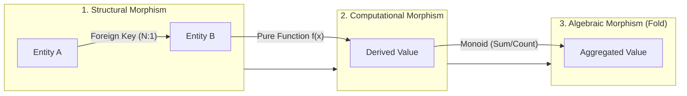
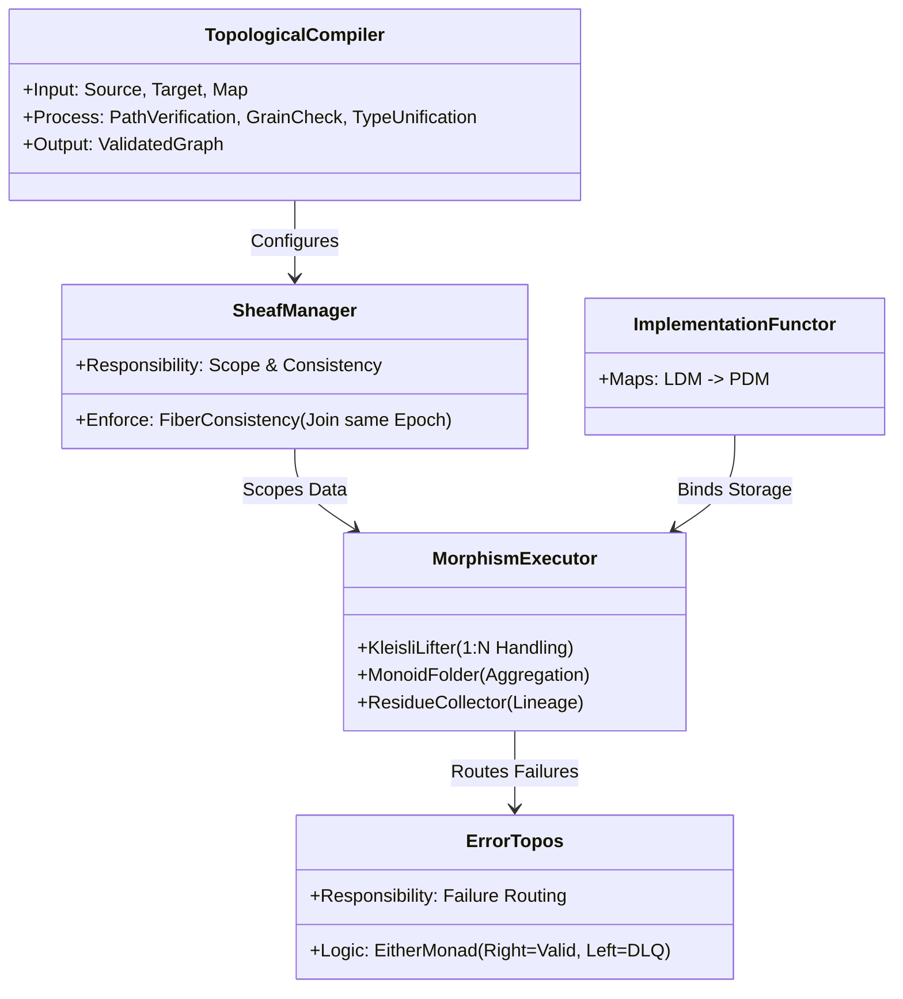
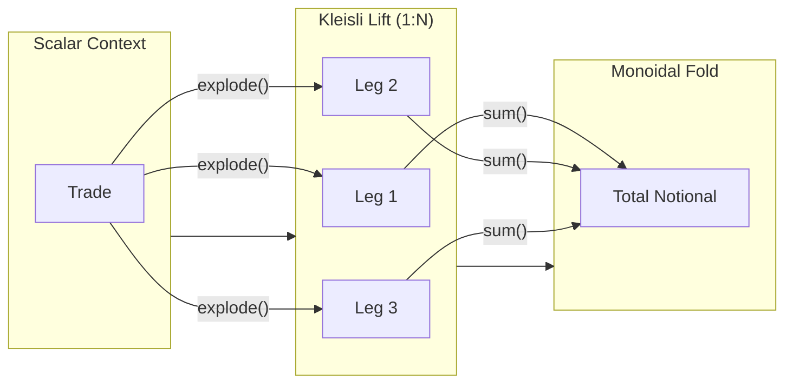
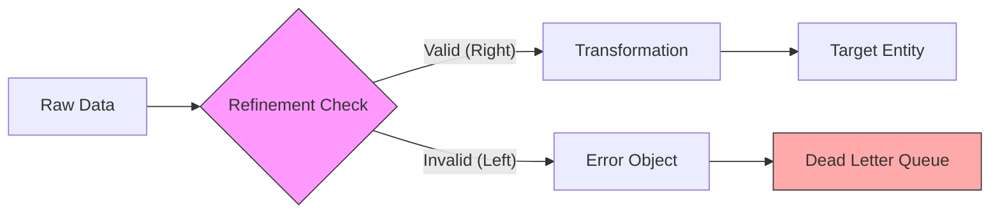
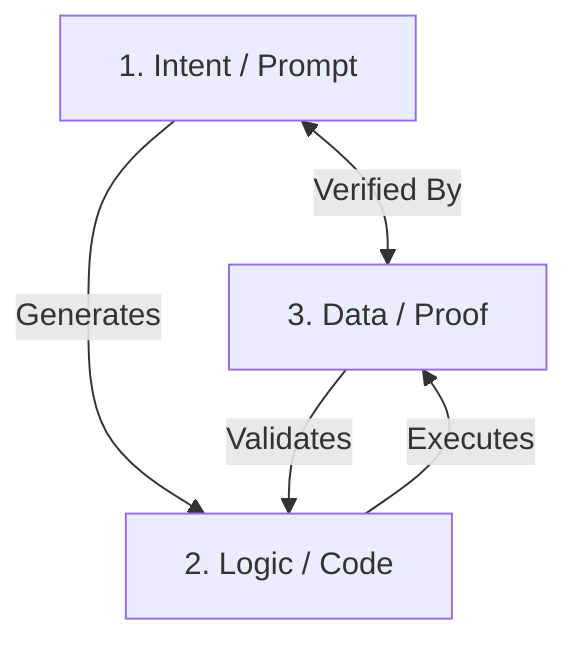

# Product Specification: Categorical Data Mapping & Computation Engine (CDME)

**Version:** 6.1
**Status:** Approved for Architecture Design
**Context:** First-Principles Data Engineering / Category Theory

-----

## 1. Executive Summary & Intent

The objective is to build a data mapping and computation engine from first principles, utilizing **Category Theory** to eliminate the "impedance mismatch" between logical business requirements and physical data execution.

Unlike traditional ETL tools that treat data as "buckets of bytes," the CDME treats **Schemas as Topologies** and **Transformations as Continuous Maps (Functors)**. This provides a mathematical guarantee that if a mapping definition is valid, the resulting pipeline is topologically correct, lineage is preserved, and granularities are respected.

**Universal Applicability:** While primarily described as a "Data Mapper," this architecture applies equally to **Computational Engines** (e.g., Cashflow Generators, Regulatory Calculators, Risk Engines). Whether the morphism is a simple field rename or a Monte Carlo simulation, the topological constraints (Lineage, Typing, Sheaf Consistency) remain identical.

**Strategic Value:** This strict topological enforcement positions the CDME as a critical **AI Assurance Layer**. As organizations adopt AI-generated pipelines, this engine serves as the deterministic compiler that prevents AI hallucinations, verifying that AI-generated code is mathematically sound before execution.

## 2. Core Philosophy (The Axioms)

1.  **Schema is a Topology:** A logical data model is a Category of Objects (Entities) and Morphisms (Relationships).
2.  **Separation of Concerns:**
      * **LDM (Logical Data Model):** The invariant topology (The "What").
      * **PDM (Physical Data Model):** The implementation detail (The "Where").
      * **Binding:** A Functor mapping the LDM to the PDM.
3.  **Transformations are Paths:** Deriving a value is the result of traversing a specific path in the graph and applying morphisms.
4.  **Data is a Sheaf:** Data exists only within a specific Context (Epoch/Batch). Transformations must respect these boundaries.
5.  **Grain is a Dimension:** Granularity is a formal property of an entity. Mixing grains without explicit aggregation is topologically forbidden.
6.  **Lookups are Arguments:** Reference data and decision logic are input parameters to the transformation function. They must be versioned and immutable within an execution context.
7.  **Types are Contracts:** A data type is not just a storage format (e.g., `int`), but a semantic guarantee (e.g., `PositiveInteger`). Data that violates the contract is topologically "Null" or "Error" and cannot propagate.
8.  **Topology is the Guardrail:** The engine prioritizes **Verification over Generation**. Whether a mapping is written by a human or an AI, it must satisfy the topological constraints. AI hallucinations (invalid paths) are rejected at the definition stage.
9.  **Calculations are Morphisms:** Any computation, no matter how complex (e.g., `GenerateCashflows(Trade)`), is treated as a standard Morphism in the topology. It consumes a Domain (Input Entity) and produces a Codomain (Output Entity), subject to the same traceability and type safety rules as simple data mappings.
10. **Failures are Data:** Errors (Type Failures, Constraint Violations) are not exceptions to be logged and forgotten; they are valid Objects in the **Error Topology**. The pipeline must explicitly map failed records to these objects (Dead Letter Queues).

-----

## 3. The Logical Ontology (The Meta-Model)

This section defines the rigorous "Universe of Discourse" for the system. It specifies the fundamental building blocks that constitute a valid pipeline.

### 3.1. The Objects (Entities)

An **Object** in the ontology is not just a table; it is a **Typed Set** existing at a specific **Grain**.

  * **Structure:** $E = \{ (Name, Type) \}$ (A set of typed attributes).
  * **Identity:** Every object must have a morphism $Id_E: E \to E$.
  * **Grain Property:** Every object carries a **Grain Metadata** tag (e.g., `Atomic`, `DailySnapshot`). This is a formal property used to validate composition, not just documentation.

### 3.2. The Morphisms (Relationships & Logic)

A **Morphism** $f: A \to B$ represents *any* directed connection. The ontology classifies them into three distinct types that chain together to form processing pipelines.

1.  **Structural Morphisms (Edges):**
      * Represent topological connections (Foreign Keys).
      * Types: $1:1$ (Iso), $N:1$ (Function), $1:N$ (Kleisli).
2.  **Computational Morphisms (Synthesis):**
      * Represent derivations (Formulas).
      * Example: $f(Trade) \to Cashflow$.
      * Constraint: Must be **Pure** and **Total** (defined for all inputs or explicitly returning `Option`).
3.  **Algebraic Morphisms (Folds):**
      * Represent grain reduction.
      * Constraint: Must form a **Monoid** $(M, \cdot, e)$ where operation $\cdot$ is associative.

-----

## 4. Terminology Dictionary

To align Data Architects (ER-Modelers) with the Engineering Team (CT-Implementers):

| Category Theory Term | Data Architect Term | Definition |
| :--- | :--- | :--- |
| **Category / Topology** | **Bounded Context** | The scope of the domain (e.g., Trading, Risk). |
| **Object** | **Entity** | A node in the graph (e.g., Trade, Counterparty). |
| **Morphism** | **Relationship / Calc** | A directed edge (e.g., Trade `belongs_to` Portfolio OR Trade `generates` Cashflow). |
| **Functor** | **Physical Binding** | The mapping of Logical Entities to Tables/Files. |
| **Kleisli Arrow** | **One-to-Many** | A relationship that expands cardinality (List context). |
| **Fibration / Epoch** | **System Boundary** | The logical grouping of continuous data (e.g., Daily Batch). |
| **Synthesis / Fold** | **Aggregation** | Reducing a List context back to a Scalar context. |
| **Natural Transformation** | **Lookup / Reference Data** | Auxiliary data mapped into the primary context (e.g., Tax Rates). |
| **Refinement Type** | **Data Quality Rule** | A basic type restricted by a predicate (e.g., `String` where `len > 0`). |
| **Writer Monad** | **Telemetry / Logs** | A side-channel for metadata (row counts, latency) attached to the data flow. |
| **Either Monad** | **Error Handling** | The branching logic that separates Valid Data (Right) from Failed Data (Left). |

-----

## 5. Logical Architecture (The Abstract Machine)

This describes the functional components of the system as an **Abstract Machine**. These components enforce the Ontology defined in Section 3.

### 5.1. The Topological Compiler (The Control Plane)

Responsible for **Validating** the user's request against the Ontology *before* any data processing occurs.

  * **Path Verification:** Checks if path $A \to B \to C$ exists in the graph.
  * **Grain Check:** Checks if composition implies an illegal grain mix (Atomic + Aggregate).
  * **Type Unification:** Checks if output types of Source $f(x)$ match input types of Target $g(x)$.

### 5.2. The Sheaf Context Manager

Manages the "Scope" of execution.

  * **The Sheaf:** Defines the **Local Section** of data (e.g., "Trades for Date T").
  * **Consistency Enforcement:** Ensures that when two streams join, they belong to the same **Fiber** (Context). Rejects joins between "Live Data" and "Stale Reference Data" unless an explicit **Temporal Morphism** is applied.

### 5.3. The Morphism Executor (The Data Plane)

The engine that applies the functions.

  * **Kleisli Lifter:** Automatically wraps scalar functions into list-processing functions when traversing $1:N$ edges.
  * **Monoid Folder:** Automatically applies the associative reduction logic when collapsing Lists.
  * **Residue Collector:** A side-channel observer that captures the metadata of the transformation (Inputs -> Outputs) for lineage.

### 5.4. The Error Topos (Failure Handling)

Defines a dedicated "Space" for errors.

  * **The Fork:** Every operation potentially bifurcates the stream into $Valid$ (Right) and $Error$ (Left).
  * **The Sink:** Errors flow into a dedicated Ontology (The "DLQ Schema") rather than being discarded.

-----

## 6. Functional Requirements
V
### 6.1. The Logical Topology (LDM)

  * **REQ-LDM-01 (Strict Graph):** The LDM must be defined as a directed multigraph.
  * **REQ-LDM-02 (Cardinality Types):** Every edge must define its categorical type:
      * `1:1` (Isomorphism/Bijection)
      * `N:1` (Standard Function)
      * `1:N` (Kleisli Arrow/List Monad)
  * **REQ-LDM-03 (Strict Dot Hierarchy):** A path `a.b.c` is valid *if and only if* the composition of morphisms $a \to b$ and $b \to c$ is valid within the topology.
  * **REQ-LDM-04 (Algebraic Aggregation):** Any function defined for an Aggregation/Fold operation must satisfy the **Monoid Laws** (Associativity). The system must reject non-associative aggregates (e.g., "First Value" without a deterministic sort order) to guarantee distributed consistency and re-aggregation safety.
  * **REQ-LDM-05 (Topological Access Control):** The LDM must support **Role-Based Access Control (RBAC)** on the morphisms themselves.
  * **REQ-LDM-06 (Grain & Type Metadata):** Every Entity in the LDM must be explicitly tagged with its **Grain** (e.g., Atomic, Aggregate) and its attributes must be typed using the Extended Type System (REQ-TYP-01).

### 6.2. Physical Binding & System Boundaries (PDM)

  * **REQ-PDM-01 (Functorial Mapping):** The system must abstract physical storage. Re-pointing a Logical Entity from one storage medium to another (e.g., File to Table) must not require changing any business logic / LDM definitions.
  * **REQ-PDM-02 (Generation Grain):** The PDM must declare the "Physics" of the source system:
      * **Continuous/Event:** Data is generated instantly.
      * **Snapshot:** Data is a state at a specific time.
  * **REQ-PDM-03 (Boundary Definition):** The PDM must define how continuous flow is "sliced" into processing epochs.
  * **REQ-PDM-04 (Lookup Binding):** The PDM must support binding **Reference Data** (Lookups) as either Data-Backed or Logic-Backed.
  * **REQ-PDM-05 (Temporal Binding):** The PDM must support **Temporal Binding**, allowing a single Logical Entity to map to different Physical Tables/Schemas based on the Data Epoch.

### 6.3. The Traversal Engine & The "Deficit"

  * **REQ-TRV-01 (Context Lifting):** When traversing a `1:N` edge, the engine must "lift" the execution context from Scalar to List (implementing proper flattening or explosion operations).

  * **REQ-TRV-02 (Grain Safety):** The engine must block operations that combine attributes from incompatible grains without explicit aggregation.
  * **REQ-TRV-03 (Boundary Alignment):** The engine must detect if a traversal crosses a System Boundary (e.g., joining "Live Data" to "Prior Day Reference Data") and apply the configured "As-Of" or "Latest" logic.
  * **REQ-TRV-04 (Operational Telemetry / Writer Monad):** The execution context must implement a **Writer Effect** (Accumulator) to capture row counts, quality metrics, and latency stats at every node traversal.
  * **REQ-TRV-05 (Deterministic Reproducibility & Audit Traceability):** Because all transformations and lookups are immutable and versioned, the system must guarantee that any target value is **deterministically derivable** from the source inputs.
  * **REQ-TRV-06 (Computational Cost Governance):** The engine must implement a **Cost Estimation Functor**. Before executing a plan, the system must estimate the Cardinality Explosion and block execution if it exceeds the budget.

### 6.4. Integration & Synthesis

  * **REQ-INT-01 (Isomorphic Synthesis):** Users can define new attributes via Pure Functions.
  * **REQ-INT-02 (Subsequent Aggregation):** The system must support rolling up data that is *already* aggregated, provided the topology permits it.
  * **REQ-INT-03 (Traceability):** The system must provide full lineage, mapping every target value back to the specific Source Epoch and Entity that generated it.
  * **REQ-INT-04 (Complex Business Logic):** The system must support **Advanced Formulations** within the synthesis map (Conditional Logic, Prioritization, Multi-Table Inputs).
  * **REQ-INT-05 (Multi-Grain Formulation):** The system must allow formulas that mix grains *provided* an aggregation function is explicitly supplied for the finer-grained element.
  * **REQ-INT-06 (Versioned Lookups):** All Reference Data usage in transformations must be **Explicitly Versioned**.
  * **REQ-INT-07 (Identity Synthesis):** The system must support **Deterministic Key Generation** (hashing/surrogate keys).
  * **REQ-INT-08 (External Computational Morphisms):** The system must support the registration of **Black Box Calculators** (e.g., compiled Cashflow Engines) as standard Morphisms.

### 6.5. Advanced Typing, Quality & Hierarchical Failure Handling

  * **REQ-TYP-01 (Extended Type System):** The LDM must support a Rich Type System (Primitives, Sum Types, Product Types).
  * **REQ-TYP-02 (Refinement Types):** The system must support **Refinement Types** (Type + Predicate).
  * **REQ-TYP-03 (Error Topology & Hierarchical Qualifiers):** The system must handle failures via a strict **Either Monad** strategy (Railway Oriented Programming), splitting the flow into Success and Failure tracks.

  * **REQ-TYP-04 (Idempotency of Failure):** The error handling logic must be **Idempotent**.
  * **REQ-TYP-05 (Semantic Casting):** Implicit casting is forbidden unless an explicit Morphism is defined.

### 6.6. AI Assurance & Automated Governance

  * **REQ-AI-01 (Topological Validity Check):** The engine must reject AI-generated mappings that contain hallucinated relationships or cardinality violations.
  * **REQ-AI-02 (Triangulation of Assurance):** The system must support the linkage of Intent, Logic, and Proof for real-time verification.

  * **REQ-AI-03 (Real-Time Dry Run):** The system must support a "Dry Run" mode for immediate assurance signals.

-----

## 7. Regulatory Compliance Drivers

This architecture is specifically designed to meet the following regulatory standards:

### 7.1. BCBS 239 (Risk Data Aggregation & Reporting)

  * **Principle 3 (Accuracy and Integrity):** Satisfied by **REQ-TYP-01/02** and **REQ-TRV-05**.
  * **Principle 4 (Completeness):** Satisfied by **REQ-LDM-03**.
  * **Principle 6 (Adaptability):** Satisfied by **REQ-PDM-01**.

### 7.2. FRTB (Fundamental Review of the Trading Book)

  * **Requirement:** Granular attribution of risk factors.
  * **Solution:** **REQ-INT-03** and **REQ-TRV-05**.

### 7.3. GDPR / CCPA (Data Privacy)

  * **Requirement:** Right to be Forgotten.
  * **Solution:** **REQ-INT-07** (Deterministic Identity).

### 7.4. EU AI Act (Artificial Intelligence Act)

  * **Requirement (Article 14 - Human Oversight):** Satisfied by **REQ-AI-01** and **REQ-TRV-05**.
  * **Requirement (Article 15 - Robustness):** Satisfied by topological strictness preventing hallucinations.

-----

## 8. Architectural Constraints & Artifacts

### 8.1. Configuration Artifacts

The solution must accept three distinct structural definitions.

1.  **The Topology Artifact (LDM):** Defines Entities, Relationships, and Hierarchical Grain. **Includes Type Definitions.**
2.  **The Implementation Artifact (PDM):** Defines Storage locations, Join Logic, and System Boundary definitions.
3.  **The Logic Artifact (Mapping):** Defines the Source $\to$ Target paths, synthesis formulas, and lookup version requirements.

### 8.2. Implementation Constraints

  * **Functional Paradigm:** Immutability and pure functions.
  * **Distributed Compute:** Capable of executing on distributed frameworks.
  * **Type Safety:** Strongly typed internal representation.
  * **Observability Standards:** OpenLineage API support.

-----

## 9. Success Criteria

The system is considered "Green" when:

1.  A Source LDM is defined with atomic event grain.
2.  A Target LDM is defined with daily aggregate grain.
3.  A `1:N` path (Kleisli arrow) is mapped.
4.  A System Boundary is defined.
5.  **Result:** The engine generates an **Execution Plan** that correctly joins, handles cardinality expansion (`1:N`), calculates, aggregates, and produces the Target Report without manual query intervention.
6.  **Complex Logic Validation:** The engine correctly executes a mapping requiring a conditional priority selection.
7.  **Reference Integrity:** The engine ensures lookup results match the specified version.
8.  **Quality Enforcement:** The engine successfully blocks/tags a row failing a Refinement Type.
9.  **Full Traceability:** An OpenLineage event is emitted upon completion.
10. **Regulatory Audit Package:** The system generates a verifiable export bundle.
11. **AI Hallucination Rejection:** Rejects generated mappings with non-existent relationships.
12. **Computation as Topology:** Successfully registers and executes an external Cashflow Engine binary.
13. **Idempotent Partial Failure:** Re-running a job with partial errors produces bit-identical output.

